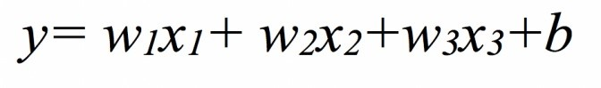
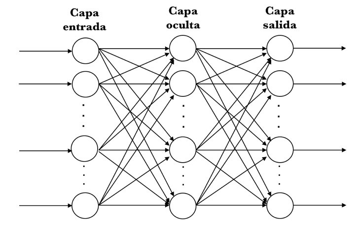
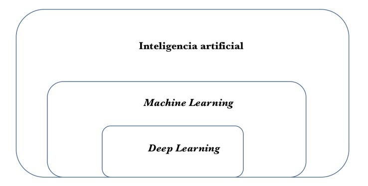

name: inverse
layout: true
class: center, middle, inverse
---
template: inverse

# Introducción
***
---
layout: false
# Introducción
***
## Los cambios producidos por la inteligencia artificial

- Deep Learning es el motor de la industria 4.0.

- Cambios generados por la Inteligencia Artificial:
 - Reconocimiento de voz
 - La transcripción de voz a texto
 - Interacción con nuestros dispositivos
 - Procesamiento del lenguaje natural (Google Translate)
 - Visión por computador
 - Mejoras en robótica

.footnote[.red["el impacto de la inteligencia artificial en la historia de la humanidad es comparable con la electricidad y el fuego" (Sundar Pichai, CEO de Google)]]

???
- Se está considerando la [inteligencia artificial](https://torres.ai/que-es-la-inteligencia-artificial) como la nueva revolución industrial, corazón de lo que algunos llaman industria 4.0. Pues bien, Deep Learning es el motor de este proceso.

- Vertiginosos avances en la calidad y prestaciones de una amplia gama de tecnologías cotidianas: en el caso del reconocimiento de voz, la transcripción de voz a texto ha experimentado avances increíbles, y ya está disponible en diferentes dispositivos.

- Estamos interactuando cada vez más con nuestros ordenadores (y todo tipo de dispositivo) simplemente hablando con ellos.

- También ha habido avances espectaculares en el procesamiento del lenguaje natural. Por ejemplo, simplemente haciendo clic en el símbolo de micro de Google Translate, el sistema transcribirá a otro idioma lo que está dictando. Google Translate ya permite convertir oraciones de una lengua a otra en 32 pares de idiomas, y ofrece traducción de texto para más de 100.

- A su vez, los avances en la visión por computador también son enormes: ahora nuestros ordenadores, por ejemplo, pueden reconocer imágenes y generar descripciones textuales de su contenido en segundos.

- Estas tres áreas son cruciales para dar rienda suelta a las mejoras en robótica, drones o automóviles sin conductor, estando la inteligencia artificial en el corazón de toda esta innovación tecnológica, que últimamente avanza tan rápidamente gracias a Deep Learning.

- Y todo ello a pesar de que la inteligencia artificial todavía no se ha desplegado ampliamente y es difícil hacerse una idea del gran impacto que tendrá, al igual que en 1995 lo era el imaginarse el impacto futuro de internet. En aquel entonces, la mayoría de la gente no veía cómo internet era relevante para ellos y cómo iba a cambiar sus vidas.

- Personas como Sundar Pichai, CEO de Google dicen que "el impacto de la inteligencia artificial en la historia de la humanidad es comparable con la electricidad y el fuego\[1\]". Para él, la inteligencia artificial es una de las cosas más importantes en las que la humanidad está trabajando y que al igual que la gente aprendió a utilizar el fuego para los beneficios de la humanidad, también necesitó superar sus desventajas.

---

#  Inteligencia artificial, Machine Learning y Deep Learning

Antes de continuar veamos qué entendemos por **inteligencia artificial**, **Machine Learning** y **Deep
Learning**.

##  Inteligencia artificial

### ¿A qué nos referimos cuando hablamos de inteligencia artificial?

- De manera simple:
 - *Inteligencia que muestran las máquinas*.

- De manera general:
 - *El esfuerzo para automatizar tareas intelectuales normalmente realizadas por humanos*.
 - *Áreas del conocimiento relacionadas con el aprendizaje automático*.

???
- Una aproximación generalista puede aceptar una definición simple en la que por inteligencia artificial nos referimos a aquella inteligencia que muestran las máquinas, en contraste con la inteligencia natural de los humanos.

- En este sentido, una posible definición concisa y general de inteligencia artificial podría ser el esfuerzo para automatizar tareas intelectuales normalmente realizadas por humanos.

- Como tal, el área de inteligencia artificial es un campo muy amplio que abarca muchas áreas del conocimiento relacionadas con el aprendizaje automático; incluso se incluyen muchos más enfoques no siempre catalogados como aprendizaje automático.

- A lo largo del tiempo, a medida que los computadores han sido cada vez más capaces de "hacer cosas", se han ido cambiando las tareas o tecnologías consideradas como "inteligentes".

- Desde los años 50, la inteligencia artificial ha experimentado varias oleadas de optimismo, seguidas por la decepción y la pérdida de financiación e interés, seguidas de nuevos enfoques, éxito y financiación.

- Durante la mayor parte de su historia, la investigación en inteligencia artificial se ha dividido en subcampos basados en consideraciones técnicas o herramientas matemáticas concretas y con comunidades de investigación que no se comunicaban suficientemente entre sí.
---
#  Inteligencia artificial, Machine Learning y Deep Learning

## Machine Learning

- Soporte de los avances como el reconocimiento de voz, el procesado de lenguaje natural o la visión por computador.

- Un gran campo de investigación y desarrollo.

- Subcampo de la inteligencia artificial que proporciona a los ordenadores la capacidad de aprender sin ser explícitamente programados.

- "Algoritmo" de predicción para un caso de uso particular

- Algoritmos clasificados como: aprendizaje supervisado, aprendizaje no supervisado y Reinforcement Learning.

???
- Como decíamos en el anterior apartado, avances como el reconocimiento de voz, el procesado de lenguaje natural o la visión por computador son cruciales para desencadenar mejoras en robótica, drones, coches que se conducen solos, entre muchas otras áreas que están cambiando el futuro próximo.

- Muchos de estos avances han sido posibles gracias a una familia de técnicas conocida popularmente como Deep Learning, del que hablaremos extensamente. Pero antes creo que es interesante para hacernos una imagen global correcta especificar que Deep Learning es una subparte de una de las áreas de la inteligencia artificial conocida como Machine Learning.

- Machine Learning, en general traducido al castellano como "aprendizaje automático", es en sí mismo un gran campo de investigación y desarrollo.

- En concreto, Machine Learning se podría definir como el subcampo de la inteligencia artificial que proporciona a los ordenadores la capacidad de aprender sin ser explícitamente programados, es decir, sin que necesiten que el programador indique las reglas que debe seguir para lograr su tarea sino que las hace automáticamente.

- Generalizando, podemos decir que Machine Learning consiste en desarrollar para cada problema un "algoritmo" de predicción para un caso de uso particular.

- Estos algoritmos aprenden de los datos con el fin de encontrar patrones o tendencias para comprender qué nos dicen los datos y de esta manera construir un modelo para predecir y clasificar los elementos.

- Dada la madurez del área de investigación en Machine Learning, existen muchos enfoques bien establecidos para el aprendizaje automático por parte de máquinas. Cada uno de ellos utiliza una estructura algorítmica diferente para optimizar las predicciones basadas en los datos recibidos.

- Machine Learning es un amplio campo con una compleja taxonomía de algoritmos que se agrupan, en general, en tres grandes categorías: aprendizaje supervisado, aprendizaje no supervisado y Reinforcement Learning.

---
#  Inteligencia artificial, Machine Learning y Deep Learning

## Machine Learning

- **Aprendizaje es supervisado:** regresión lineal, la regresión logística, support vector machines, decision trees, random forest y redes neuronales.

- **Aprendizaje no supervisado:** clustering (K-means) o principal component analysis (PCA).

- **Reinforcement Learning:** o aprendizaje por refuerzo basado en agentes, prueba y error, recompensas y penalizaciones.

???
- **Aprendizaje es supervisado:** cuando los datos que usamos para el entrenamiento incluyen la solución deseada, llamada "etiqueta" (label). Algunos de los algoritmos más populares de Machine Learning en esta categoría son la regresión lineal, la regresión logística, support vector machines, decision trees, random forest y redes neuronales.

- **Aprendizaje no supervisado:** los datos de entrenamiento no incluyen las etiquetas, y será el algoritmo el que intentará clasificar la información por sí mismo. Algunos de los algoritmos más conocidos de esta categoría son clustering (K-means) o principal component analysis (PCA).

- **Reinforcement Learning:** (o "aprendizaje por refuerzo", traducción de algunos autores)
 - El modelo se implementa en forma de un agente que deberá explorar un espacio desconocido y determinar las acciones a llevar a cabo mediante prueba y error: aprenderá por sí mismo gracias a las recompensas y penalizaciones que obtiene de sus acciones.
 - El agente debe crear la mejor estrategia posible (políticas) para obtener la mayor recompensa en tiempo y forma. Este aprendizaje permite ser combinado con otros tipos, y está ahora mismo muy de moda puesto que el mundo real presenta muchos de estos escenarios.
---
# Inteligencia artificial, Machine Learning y Deep Learning

## Machine Learning

### Terminología básica de Machine Learning

- Label o etiqueta.

- Variable o feature

- Un modelo (model en inglés)

- Fase de training o "entrenamiento"o "aprendizaje".

- Fase de inference o "inferencia" o "predicción".

???
- En Machine Learning nos referimos a label (que también traduciremos por "etiqueta") a lo que estamos intentando predecir con un modelo.

- En cambio, a una variable de entrada la llamaremos feature (lo traduciremos como "característica" o "variable" de un ejemplo o dato de entrada).

- Un modelo (model en inglés) define la relación entre features y labels y tiene dos fases claramente diferenciadas para el tema que nos ocupa:
 - Fase de training (que traduciremos también por "entrenamiento"o "aprendizaje"), que es cuando se crea o se "aprende" el modelo, mostrándole los ejemplos de entrada que se tienen etiquetados; de esta manera se consigue que el modelo aprenda iterativamente las relaciones entre las features y labels de los ejemplos.
 - Fase de inference (que traduciremos por "inferencia" o "predicción"), que se refiere al proceso de hacer predicciones mediante la aplicación del modelo ya entrenado a ejemplos no etiquetados.

---
# Inteligencia artificial, Machine Learning y Deep Learning

## Machine Learning

### Terminología básica de Machine Learning

Consideremos un ejemplo simple:

???
Consideremos un ejemplo simple de modelo que expresa una relación lineal entre features y labels. El modelo podría expresarse de la siguiente forma:

Donde:
- **y** es la label o etiqueta de un ejemplo de entrada. **x** la feature de ese ejemplo de entrada.
- **w** es la pendiente de la recta y que en general le llamaremos "peso" (o weight en inglés) y es uno de los dos parámetros que se tienen que aprender el modelo durante el proceso de entrenamiento para poder usarlo luego para inferencia.
- **b** es el punto de intersección de la recta en el eje y que llamamos "sesgo" (o bias en inglés). Este es el otro de los parámetros que deben ser aprendidos por el modelo.

- Aunque en este modelo simple que hemos representado solo tenemos una feature de entrada, en el caso de Deep Learning veremos que tenemos muchas variables de entrada, cada una con su peso wi.

---
# Inteligencia artificial, Machine Learning y Deep Learning

## Machine Learning

### Terminología básica de Machine Learning

Un modelo basado en tres features (x1, x2, x3) puede expresarse de la siguiente manera:

De manera más general, se puede expresar como:

???
Por ejemplo, un modelo basado en tres features (x1, x2, x3) puede expresarse de la siguiente manera:

O, de manera más general, se puede expresar como:

- Expresa el sumatorio del producto escalar entre los dos vectores (X y W) y luego suma el sesgo.
- El parámetro sesgo b, para facilitar la formulación, a veces se expresa como el parámetro w0 (asumiendo una entrada adicional fija de x0=1).

En la fase de entrenamiento de un modelo se aprenden los valores ideales para los parámetros del modelo (los pesos wi y el sesgo b). En el aprendizaje supervisado, la manera de conseguirlo es aplicar un algoritmo de aprendizaje automático que obtenga el valor de estos parámetros examinando muchos ejemplos etiquetados e intentar determinar unos valores para estos parámetros del modelo que minimicen lo que llamamos loss (hay traducciones como "error" en castellano).

Loss es un concepto central en Deep Learning que representa la penalización de una mala predicción. Es decir, la loss es un número que indica cuan mala ha sido una predicción en un ejemplo concreto (si la predicción del modelo es perfecta, la loss es cero). Para determinar este valor, como veremos más adelante, en el proceso de entrenamiento aparecerá el concepto de función de loss, y que de momento podemos ver como la función matemática que agrega las loss individuales obtenidas de los ejemplos de entrada al modelo.

En este contexto, por ahora podemos considerar que la fase de entrenamiento de un modelo consiste básicamente en ajustar los parámetros (los pesos wi y el sesgo b) de tal manera que el resultado de la función de loss retorna el valor mínimo posible.

Finalmente, nos queda avanzar el concepto de overfitting (al que también referenciaremos por su traducción de "sobreajuste") de un modelo, que se produce cuando el modelo obtenido se ajusta tanto a los ejemplos etiquetados de entrada que no puede realizar las predicciones correctas como en ejemplos de datos nuevos que nunca ha visto antes.

---
# Inteligencia artificial, Machine Learning y Deep Learning

## Redes neuronales artificiales y Deep Learning
???
Un caso especial de algoritmos de Machine Learning son las redes neuronales artificiales. Si les ayuda, para visualizar su estructura pueden considerar que los algoritmos son similares a las neuronas humanas y su capacidad para la obtención de resultados, como habrán oído en alguna ocasión, aunque en la actualidad creo que poco tiene que ver.

En el caso concreto de Deep Learning (que en castellano se traduce a veces como "aprendizaje profundo", aunque usaré la versión en inglés), las estructuras algorítmicas antes mencionadas permiten modelos que están compuestos de múltiples capas de procesamiento para aprender representaciones de datos, con múltiples niveles de abstracción que realizan una serie de transformaciones lineales y no lineales que a partir de los datos de entrada generen una salida próxima a la esperada (label). El aprendizaje supervisado, en este caso, consiste en obtener los parámetros de esas transformaciones (los pesos wi y el sesgo b), y consigue que esas transformaciones sean óptimas, es decir, que la salida producida y la esperada difieran muy poco.

Una aproximación gráfica simple a una red neuronal Deep Learning es

{width="2.6194444444444445in"
height="1.6402777777777777in"}

En concreto, aquí representamos una red neuronal artificial con 3 capas:
una de entrada (input layer) que recibe los datos de entrada y una de
salida (output layer) que devuelve la predicción realizada. Las capas
que tenemos en medio se llaman capas ocultas (hidden layers) y podemos
tener muchas, cada una con distinta cantidad de neuronas. Veremos más
adelante que las neuronas, representadas por los círculos, estarán
interconectadas unas con otras de diferente manera entre las neuronas de
las distintas capas.

En general, hoy en día estamos manejando redes neuronales artificiales
con muchísimas capas, que literalmente están apiladas una encima de la
otra; de aquí el concepto de deep (profundidad de la red), donde cada
una de ellas está a su vez compuesta por muchísimas neuronas, cada una
con sus parámetros (los pesos wi y el sesgo b) que, a su vez, realizan
una transformación simple de los datos que reciben de neuronas de la
capa anterior para pasarlos a las de la capa posterior. La unión de
todas permite descubrir patrones complejos.

Como veremos en detalle más adelante, los avances en Deep Learning han
mejorado drásticamente el estado de la técnica en reconocimiento de voz,
reconocimiento de objetos visuales, detección de objetos y muchos otros
dominios, siendo una de las técnicas que han puesto la inteligencia
artificial en el foco de interés de las empresas y de aquí el gran
interés que ahora mismo suscitan.

Pero aunque Deep Learning a menudo se presenta envuelto de una cierta
mística, con referencias a algoritmos que "funcionan como el cerebro",
que "piensan" o "entienden", a mi entender la realidad aún dista
bastante de este sueño de ciencia ficción. Además, creo que sus
conceptos básicos pueden ser explicados de manera relativamente fácil a
lectores con una base de conocimiento en informática y sobre todo ganas
de aprender, siendo este el propósito de este libro.

Antes de acabar, me gustaría dar una magnitud del problema que conlleva
programar en estos momentos los algoritmos de Deep Learning:

diferentes capas sirven para diferentes propósitos, y cada parámetro e
hiperparámetro importa mucho en el resultado final; esto lo hace
extremadamente complicado a la hora de intentar afinar la programación
de un modelo de red neuronal, pareciendo más un arte que una ciencia
para los que se adentran por primera vez en el área. Pero esto no
implica que sea algo misterioso, si bien es cierto que queda mucho por
investigar, sino que simplemente hace falta muchas horas de aprendizaje
y práctica.

La siguiente figura resume visualmente la idea intuitiva de que Deep
Learning es solo una parte de la inteligencia artificial, aunque en
estos momentos quizás es la más dinámica y la que está haciendo
realmente vibrar a la comunidad científica. Y de la misma manera que
antes les mencionaba la obra de Stuart Rusell y Peter Novig como libro
base de inteligencia artificial, para Deep Learning nos encontramos con
un excelente libro, titulado Deep Learning\[6\], realizado por Ian
Goodfellow, Yoshua Bengio y Aaron Corville que es el "campamento base"
en estos momentos para el aprendizaje del tema en más profundidad.

{width="2.3333333333333335in"
height="1.1819444444444445in"}

---
## ¿Por qué ahora?
???
En tan solo diez años\[7\], cuatro de las cinco empresas más grandes del
mundo por capitalización de mercado han cambiado: Exxon Mobil, General
Electric, Citigroup y Shell Oil están fuera y Apple, Alphabet (la
compañía matriz de Google), Amazon y Facebook han tomado su lugar. Solo
Microsoft mantiene su posición. Ya se han percatado que todas ellas
dominan la nueva era digital en que nos encontramos inmersos. Estamos
hablando de empresas que basan su poderío en inteligencia artificial en
general, y en particular Deep Learning.

John McCarthy acuñó el término [inteligencia
artificial](https://torres.ai/que-es-la-inteligencia-artificial) en la
década de los 50 y fue uno de los padres fundadores de la inteligencia
artificial junto con Marvin Minsky. También en 1958 Frank Rosenblatt
construyó un prototipo de red neuronal, que llamó el Perceptron. Además,
las ideas clave de las redes neuronales Deep Learning para la visión por
computador ya se conocían en 1989; también los algoritmos fundamentales
de Deep Learning para series temporales como LSTM (que trataremos más
adelante), ya fueron desarrollados en 1997, por poner algunos ejemplos.
Entonces, ¿por qué este boom de la inteligencia artificial?

Sin duda, la computación disponible ha sido el principal desencadenante,
como ya hemos presentado anteriormente. Sin embargo, otros factores han
contribuido a desencadenar el potencial de la inteligencia artificial y
las tecnologías relacionadas. A continuación vamos a hablar de algunos
de ellos.

---
## Los datos, el combustible para la inteligencia artificial
???
La inteligencia artificial requiere grandes conjuntos de datos para el
entrenamiento de sus modelos aunque, afortunadamente, la creación y
disponibilidad de datos ha crecido exponencialmente gracias el enorme
decrecimiento de coste e incremento de fiabilidad de la generación de
datos: fotos digitales, sensores más baratos y precisos, etc. Además,
las mejoras en el hardware de almacenamiento de los últimos años,
asociado a los espectaculares avances en técnica para su gestión con
bases de datos NoSQL\[8\], han permitido disponer de enormes conjuntos
de datos para entrenar a los modelos de inteligencia artificial.

Más allá de los aumentos en la disponibilidad de datos que ha propiciado
internet y sus múltiples aplicaciones, los recursos de datos
especializados han catalizado el progreso del área. Muchas bases de
datos abiertas han apoyado el rápido desarrollo de algoritmos de
inteligencia artificial. Un ejemplo ImageNet\[9\], la base de datos, de
la que ya hemos hablado, disponible libremente con más de 10 millones de
imágenes etiquetadas a mano.

Pero lo que hace ImageNet especial no es precisamente su tamaño, sino la
competición que anualmente realiza, siendo una excelente manera de
motivar a investigadores e ingenieros.

Mientras que en los primeros años las propuestas se basaban en
algoritmos de visión por computador tradicionales, en el 2012 Alex
Krizhevsky usó una red neuronal Deep Learning, ahora conocida por
AlexNet, que redujo el ratio de error a menos de la mitad de lo que se
estaba consiguiendo por aquel entonces. Ya en el 2015, el algoritmo
ganador rivalizó con las capacidades humanas, y a día de hoy los
algoritmos de Deep Learning superan con creces los ratios de error en
esta competición de los que tienen los humanos.

Pero ImageNet solo es una de las bases de datos disponibles que se han
usado para entrenar redes Deep Learning durante estos últimos años;
muchas otras han sido populares, como MNIST\[10\], CIFAR\[11\], SVHN
\[12\], STL\[13\] o IMDB\[14\]. Hablaremos de ellas más adelante.
También es importante mencionar aquí Kaggle\[15\], una plataforma que
aloja competiciones de análisis de datos donde compañías e
investigadores aportan sus datos mientras ingenieros de datos de todo el
mundo compiten por crear los mejores modelos de predicción o
clasificación.

---
## Democratización de la computación
???
Ahora bien, ¿qué pasa si uno no dispone de esta capacidad de computación
en su empresa? La inteligencia artificial hasta ahora ha sido
principalmente el juguete de las grandes compañías de tecnología como
Amazon, Baidu, Google o Microsoft, así como algunas nuevas empresas que
disponían de estas capacidades. Para muchos otros negocios y partes de
la economía, los sistemas de inteligencia artificial hasta ahora han
sido demasiado costosos y demasiado difíciles de implementar por
completo. Estamos hablando de Cloud Computing\[16\].

Pero ahora estamos entrando en otra era de democratización de la
computación, y las empresas pueden disponer de acceso a grandes centros
de procesado de datos de más de 28 000 metros cuadrados (cuatro veces el
campo del Barça), con cientos de miles de servidores dentro.

Cloud Computing ha revolucionado la industria mediante la
democratización de la computación y ha cambiado completamente la manera
de operar de los negocios. Y ahora es el turno de cambiar el escenario
de la inteligencia artificial y Deep Learning, ofreciendo una gran
oportunidad para las pequeñas y medianas empresas que no pueden
construir este tipo de infraestructuras, pero en cambio Cloud Computing
sí se lo puede ofrecer; de hecho, ofrece acceso a una capacidad de
computación que antes solo estaba disponible para grandes organizaciones
o gobiernos.

Además, los proveedores de Cloud están ahora ofreciendo lo que se conoce
como Artificial Intelligence algorithms as a Service (AI-as-a-Service),
servicios de inteligencia artificial a través de Cloud que pueden
entrelazarse y trabajar conjuntamente con aplicaciones internas de las
empresas a través de simples API REST\[17\].

Esto implica que está al alcance de casi todos, ya que se trata de un
servicio que solo se paga por el tiempo utilizado. Esto es disruptivo,
porque ahora mismo permite a los desarrolladores de software usar y
poner prácticamente cualquier algoritmo de inteligencia artificial en
producción en un santiamén.

Amazon, Microsoft, Google e IBM están liderando esta oleada de servicios
AIaaS que permiten desde entrenamientos a puestas en producción de
manera rápida. En el momento de escribir este libro, Amazon AIaaS estaba
disponible a dos niveles: analíticas predictivas con Amazon Machine
Learning\[18\] y la herramienta SageMaker\[19\] para la construcción y
despliegue rápido de modelos. Microsoft ofrece sus servicios a través de
su Azure

Machine Learning que puede ser dividido en dos categorías principales
también: Azure Machine Learning Studio\[20\] y Azure Intelligence
Gallery\[21\]. Google ofrece Prediction API\[22\] y el Google ML
Engine\[23\]. IBM ofrece servicios AIaaS a través de su Watson
Analytics\[24\]. Y no olvidemos soluciones que ya vienen de startups,
como PredicSis\[25\] and BigML\[26\].

Sin duda, la inteligencia artificial liderará la próxima revolución. Su
éxito dependerá en gran medida de la creatividad de las empresas y no
tanto de la tecnología hardware en parte gracias a Cloud Computing.
---
## Un mundo open-source para la comunidad Deep Learning
???
Hace algunos años, Deep Learning requería experiencia en lenguajes como
C++ y CUDA; hoy en día, con habilidades básicas de Python es suficiente.
Esto ha sido posible gracias al gran número de frameworks de software de
código abierto que han ido apareciendo, como Keras, central en nuestro
libro. Estos frameworks facilitan enormemente la creación y
entrenamiento de los modelos y permiten abstraer las peculiaridades del
hardware al diseñador del algoritmo para acelerar los procesos de
entrenamiento.

Puestos a destacar algunos, les propongo que se queden con TensorFlow,
Keras y PyTorch, pues son los más dinámicos en estos momentos si nos
basamos en los contributors y commits o starts de estos proyectos en
GitHub\[27\].

En concreto, recientemente ha tomado mucho impulso TensorFlow\[28\] y
sin duda es el dominante. Fue originalmente desarrollado por
investigadores e ingenieros del grupo de Google Brain en Google. El
sistema fue diseñado para facilitar la investigación en Machine Learning
y hacer más rápido la transición de un prototipo de investigación a un
sistema de producción. Si miramos en su página de Gihub\[29\] veremos
que tenemos, a fecha de escribir este libro, más de 30 000 commits, más
de 1 400 contributors y casi 100 000 starts. Nada desdeñable.

Le sigue Keras\[30\] con una API de alto nivel para redes neuronales,
que lo convierte en el entorno perfecto para iniciarse en el tema. El
código se especifica en Python, y en estos momentos es capaz de
ejecutarse encima de tres entornos destacados: TensorFlow, CNTK o
Theano. En principio, el usuario puede cambiar el motor de ejecución sin
cambiar su código de Keras. Ahora mismo, Keras cuenta con más de 4 500
commits, más de 650 contributors y más de 27 000 starts.

PyTorch y Torch\[31\] son dos entornos de Machine Learning implementados
en C, usando OpenMP\[32\] y CUDA para sacar provecho de infraestructuras
altamente paralelas. PyTorch es la versión más focalizada para Deep
Learning y basada en Python, desarrollado por Facebook. Es un entorno
popular en mi campo de investigación puesto que permite mucha
flexibilidad en la construcción de las redes neuronales y tiene tensores
dinámicos, entre otras cosas. En el momento de escribir este libro,
Pytorch cuenta con más de 10 500 commits, alrededor de 600 contributors
y más de 13 000 starts.

Finalmente, y aunque no es entorno exclusivo de Deep Learning, es
importante mencionar Scikit-learn\[33\] que se usa muy a menudo en la
comunidad de Deep Learning para el preprocesado de los datos\[34\].
Scikit-learn cuenta con más de 22 500 commits, más de 1 000 contributors
y más de 27 000 starts.

Pero como ya he avanzado, hay muchísimos otros frameworks orientados a
Deep Learning. Los que destacaríamos son Theano\[35\] (Montreal
Institute of Learning Algortithms), Caffe\[36\] (Universidad de
Berkeley), Caffe2\[37\] (Facebook Research), CNTK\[38\] (Microsoft),
MXNET\[39\] (soportado por Amazon entre otros), Deeplearning4j\[40\],
Chainer\[41\] , DIGITS\[42\] (Nvidia), Kaldi\[43\], Lasagne\[44\],
Leaf\[45\], MatConvNet\[46\], OpenDeep\[47\], Minerva\[48\] y
SoooA\[49\] , entre muchos otros.

---
## Una cultura de publicación abierta
???
En estos últimos años, en esta área de investigación, en contraste con
otros campos científicos, se ha generado una cultura de publicación
abierta, en la que muchos investigadores publican sus resultados
inmediatamente(sin esperar la aprobación de la revisión por pares
habitual en los congresos) en bases de datos como por ejemplo la
arxiv.org de la Universidad de Cornell (arXiv)\[50\]. Esto conlleva que
haya mucho software disponible en open source asociado a estos artículos
que permiten que este campo de investigación se mueva tremendamente
rápido, puesto que cualquier nuevo hallazgo está inmediatamente a
disposición para toda la comunidad para verlo y, si es el caso,
construir encima.

Esto supone una gran oportunidad para los usuarios de estas técnicas.
Los motivos para publicar sus últimos avances abiertamente por parte de
los grupos de investigación pueden ser diversos; por ejemplo Google, al
publicar los resultados, consolida su reputación como líder en el
sector, atrayendo la siguiente ola de talento, que como comentaremos, es
uno de los principales obstáculos para el avance del tema.

---
## Mejoras en los algoritmos
???
Gracias a la mejora del hardware que ya hemos presentado y al disponer
de más capacidad de computación por parte de los científicos que
investigaban en el área, se ha podido avanzar de manera espectacular en
el diseño de nuevos algoritmos que han permitido superar importantes
limitaciones detectadas en los mismos. Por ejemplo, hasta no hace muchos
años era muy difícil entrenar redes de muchas capas desde un punto de
vista del algoritmo. Pero en este último decenio ha habido
impresionantes avances con mejoras en las funciones de activación, uso
de redes preentrenadas, mejoras en algoritmos de optimización del
entrenamiento, etc. Hoy, algorítmicamente hablando, podemos entrenar
modelos de centenares de capas sin ningún problema. Otra cosa es si
tenemos los recursos de computación para hacerlo realidad.

---
---
template: inverse

# El entorno de trabajo
***
---
# El entorno de trabajo

Antes de continuar, les recomiendo que tengan el entorno de desarrollo
instalado en su ordenador para ir probando lo que se va explicando en
cada capítulo, pues recuerden el enfoque del libro de learn by doing.

---
### Jupyter notebook
???
Debido a que Keras es básicamente una librería de Python, requerimos
hacer un uso completo del intérprete de Python. Nuestra propuesta es
usar Jupyter\[51\], puesto que es un entorno de desarrollo muy extendido
que permite sacar partido a la interactividad de Python y, a la vez,
proporciona una gran versatilidad para compartir parte de códigos con
anotaciones a través de la comodidad e independencia de plataforma que
ofrece un navegador web.

Por este motivo, los notebook son usados a menudo para desarrollar redes
neuronales en la comunidad de científicos e ingenieros de datos. Un
notebook es un fichero generado por Jupyter Notebook o Jupyter Lab que
se puede editar desde un navegador web, permitiendo mezclar la ejecución
de código Python con anotaciones.

Si no tienen instalado Jupyter pueden seguir las indicaciones de su
página oficial\[52\]. El código de este libro está disponible en forma
de notebooks en el GitHub\[53\] del libro, aunque este se puede ejecutar
como un programa normal en Python si así lo desea el lector.

---
## Keras
???
Para la instalación de la librería de Keras en un ordenador personal, el
lector se puede dirigir a su página oficial, donde encontrará una
versión actualizada de los pasos a seguir para la instalación de la
última versión de la librería\[54\]. En esta página podemos ver la
indicación de tener previamente instalado uno de los backend que
necesita, y nos recomienda usar TensorFlow (yo también se lo
recomiendo). Para ello pueden visitar la página de instalación de
Tensorflow\[55\] y seleccionar la versión de acuerdo a su sistema
operativo. A continuación, para instalar Keras solo les queda seguir las
instrucciones de su página de instalación.

Una instalación con solo una CPU nos será suficiente para seguir el
libro. Pero como veremos a la que nos adentramos en redes neuronales
convolucionales, nos puede ser útil tener potencia de cálculo basada en
general en GPU si no queremos que nuestras ejecuciones para entrenar
redes tarden muchas horas. En este caso, si el lector dispone de este
hardware, en la misma página de instalación de Keras encontrará las
instrucciones para la instalación de la versión de la librería para GPU.

---
## Docker
???
Una alternativa que les propongo es usar una imagen de docker que he
preparado para una de mis asignaturas. Docker\[56\] es un proyecto de
código abierto que se ha hecho muy popular entre la comunidad de
programadores ya que permite automatizar el despliegue de programas
usando un contenedor software que permite aislar las aplicaciones entre
sí. De esta manera podemos preparar docker con todo el software que
necesitamos para ejecutar el código que usamos en este libro y
simplificar el proceso de instalación. Si deciden ir por esta opción,
les indico los pasos a seguir para poder usar la imagen del docker.

Primero tenemos que instalar docker en nuestro ordenador. Para las
plataformas Windows 10 Pro, Windows 10 Enterprise, MacOS o Linux podemos
dirigirnos a Docker Store\[57\]. Para otras versiones de Windows, a
Docker Toolbox\[58\].

A continuación debemos descargar y ejecutar la imagen de docker. Para
ello abriremos un terminal (en Mac/Linux), cmd o powershell (en Windows
10 Pro) o Docker CLI (para otras versiones de Windows) y luego podemos
ejecutar:

docker pull jorditorresbcn/dl

Los usuarios de MacOS y Windows tienen que tener el programa docker
abierto para poder ejecutar el comando docker. Esta imagen está basada
en Ubuntu 16.04 con el siguiente software instalado: Python3.5, Keras,
TensorFlow, nano, htop, iPython, Jupyter, matplotlib, NLTK y git.

Para ejecutar la imagen de docker por primera vez deben abrir un nuevo
terminal y ejecutar:

docker run -it -p 8888:8888 jorditorresbcn/dl:latest

En el caso que queramos usar una imagen del docker anteriormente usada y
la queremos reabrir podemos hacerlo de esta manera:

docker ps -a docker ps -a docker start -i

Para clonar el repositorio en GitHub del libro dentro del contenedor
podemos ejecutar el siguiente comando:

git clone
https://github.com/jorditorresBCN/Deep-Learning-Introduccion-practica-con-Keras.git

Para lanzar el Jupyter Notebook dentro del contenedor podemos ejecutar
el siguiente comando:

jupyter notebook \--ip=0.0.0.0 \--allow-root ---no-brower

Ahora solo nos queda abrir en nuestro ordenador el navegador e ir a
**http://localhost:8888**. El password es dl. En el caso de usuarios
Windows que experimenten problemas de conectividad, pueden visitar este
enlace\[59\].

Para asegurar que todo funciona correctamente les propongo que creen un
nuevo notebook y ejecuten un código como el siguiente, que muestra una
gráfica con 50 puntos aleatorios:

\%matplotlib inline from matplotlib import pyplot as plt import numpy as
np N = 50 x = np.random.rand(N) y = np.random.rand(N) plt.scatter(x, y)
plt.show()

---
## Cloud
???
Si queremos usar una GPU, y no disponemos de ello, podemos considerar
usar los servicios que hay disponibles a través de Cloud que ofrecen
diferentes proveedores. Pero dada la diversidad de plataformas y el
cambio constante en las API que proporcionan los proveedores de Cloud en
relación al acceso al hardware GPU (que van incorporando a sus servicios
últimamente), he considerado que era arriesgado aquí concretar más las
indicaciones de los pasos a seguir para ejecutar un Jupyter en Cloud sin
el riesgo que las instrucciones indicadas queden obsoletas antes de
incluso

ver la luz el libro.

Por ello les propongo que en el momento de leer estas líneas vean las
posibilidades del mercado. Como punto de partida por defecto les
propongo que visiten la página Documentación de las AMI de aprendizaje
profundo de AWS \[60\] donde Amazon mantiene la última versión de manual
en PDF y HTML para ayudarnos a ejecutar un Jupyter Notebook en su Cloud
usando una instancia p2.xlarge que permite acceso a GPU por un coste
económico muy razonable, incluso hay un periodo gratuito suficiente para
probar los notebooks de este libro.

Otra opción es la que ofrece Google con Colaboratory\[61\]. Se trata de
un proyecto de investigación de Google creado para ayudar a diseminar la
educación e investigación del Machine Learning. Es un entorno de
notebook Jupyter que no requiere configuración y se ejecuta
completamente en Cloud permitiendo usar Keras, TensorFlow y PyTorch. Los
notebooks se almacenan en Google Drive y se pueden compartir tal como lo
haría con Google Docs. Este entorno es de uso gratuito que solo requiere
tener una cuenta en Google. Además ente entorno permite el uso de una
GPU K80 de NVIDIA gratuitamente.

Pero nuevamente, quiero recordar que si el lector no dispone de GPU ni
de Cloud, porque simplemente se encuentra disfrutando de la lectura de
este libro en medio de la montaña sin acceso a internet, no hay
problema. Adjunto al código del libro que se puede descargar de GitHub
localmente a su portátil, y también podrá descargarse los ficheros que
contienen los pesos de las redes neuronales ya entrenadas para aquellas
que requieren muchos recursos de computación (en la segunda parte del
libro).
