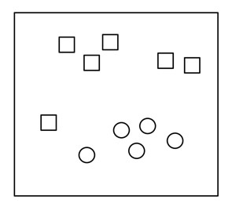

+-----------------------------------------------------------------------+
| **Content** \[hide\]                                                  |
|                                                                       |
| Portada, créditos y dedicatoria (pdf)                                 |
|                                                                       |
| Índice de contenidos (pdf)                                            |
|                                                                       |
| Prólogo                                                               |
|                                                                       |
| Prefacio: la pasión por enseñar                                       |
|                                                                       |
| Acerca de este libro                                                  |
|                                                                       |
| 1.  INTRODUCCIÓN: la supercomputación, corazón de Deep Learning       |
|                                                                       |
| 2.  ANTE UNA NUEVA TECNOLOGÍA DISRUPTIVA                              |
|                                                                       |
| La inteligencia artificial está cambiando nuestras vidas Inteligencia |
| artificial, Machine Learning y Deep Learning                          |
|                                                                       |
| ¿Por qué ahora?                                                       |
|                                                                       |
| Preparar el entorno de trabajo                                        |
|                                                                       |
| 3.  REDES NEURONALES DENSAMENTE CONECTADAS                            |
|                                                                       |
| Caso de estudio: reconocimiento de dígitos                            |
|                                                                       |
| Perceptron                                                            |
|                                                                       |
| Función de activación softmax                                         |
|                                                                       |
| Datos para alimentar una red neuronal                                 |
|                                                                       |
| Redes densamente conectadas en Keras                                  |
|                                                                       |
| Pasos para implementar una red neuronal en Keras                      |
|                                                                       |
| 4.  CÓMO SE ENTRENA UNA RED NEURONAL Proceso de aprendizaje de una    |
|     red neuronal                                                      |
|                                                                       |
| Funciones de activación                                               |
|                                                                       |
| Elementos del backpropagation                                         |
|                                                                       |
| Parametrización de los modelos                                        |
|                                                                       |
| Practicando con una clasificación binaria                             |
|                                                                       |
| 5.  REDES NEURONALES CONVOLUCIONALES                                  |
|                                                                       |
| Introducción a las redes neuronales convolucionales                   |
|                                                                       |
| Componentes básicos de una red neuronal convolucional                 |
|                                                                       |
| Implementación de un modelo básico en Keras                           |
|                                                                       |
| Hiperparámetros de la capa convolucional                              |
|                                                                       |
| Redes neuronales convolucionales con nombre propio                    |
|                                                                       |
| 6.  CLAUSURA: se avecinan cambios                                     |
|                                                                       |
| Fe de erratas                                                         |
+-----------------------------------------------------------------------+

Esta es una obra introductoria, basada en unos apuntes para dar soporte
a mi docencia en la UPC a alumnos y alumnas de ingeniería informática
pero con pocos o ningún conocimiento de Machine Learning y
[**inteligencia
artificial**](https://torres.ai/que-es-la-inteligencia-artificial). Pero
a su vez, considero que el resultado de este libro puede ser también
útil a ingenieros e ingenieras que ya dejaron las aulas y se encuentran
trabajando pero requieren, o simplemente les apetece, aprender

[**Portada, créditos y
de**](http://torres.ai/wp-content/uploads/2019/03/Portada-creditos-dedicatoria.pdf)

sobre este tema. Por este motivo lo comparto en esta página a todos
ellos y ellas.

[**Índice de contenidos
(**](http://torres.ai/wp-content/uploads/2019/03/Indice-libro-deeplearning.pdf)

Lo que encontrarán a continuación es la primera parte del libro Deep
Learning -- Introducción práctica con Keras que estoy escribiendo
durante el tiempo libre que me deja mi actividad académica y de
investigación. Mi ilusión era poder terminar la obra entera antes de
verano, pero debo ser realista y aceptar que no podrá ser así, y sin
duda necesitaré muchísimos más meses para poder terminarla. Calculo que
a hasta principios del año próximo no será posible. Y si no lo consigo
espero que me disculpen, pero ahora debo centrarme en la documentación
(en inglés) para otra asignatura del curso de otoño-invierno, que si
queda una obra autocontenido, también me encantaría compartir con
ustedes en esta página personal web.

Por tanto, dado que va para largo acabar la obra completa y ya tengo
finalizada la primera mitad del libro, he decidido avanzar su
publicación para ofrecer a la comunidad interesada un primer contacto
con esta tecnología y permitirle iniciarse por su cuenta en la
programación de Deep Learningsin tener que esperar a tener la obra
completa. Esta primera parte es la más básica del tema (la que yo llamo
Hello world!) que es autocontenida y la que he usando en mis clases de
este curso de primavera-verano. Si el lector prefiere disponer de este
libro en formato kindle, ebook(pdf) o papel, puede obtenerlo en los
portales de compra que les indico.

{width="1.3909722222222223in"
height="0.9069444444444444in"} [**Acceso a la versión en inglés y a la
SEGUNDA PARTE**](https://torres.ai/deeplearning)

1.  Prólogo

{width="1.4895833333333333in"
height="1.9479166666666667in"}En 1953, Isaac Asimov publicó Segunda
Fundación, el tercer libro de la saga de la Fundación(o el decimotercero
según otras fuentes, este es un tema de debate). En Segunda
Fundaciónaparece por primera vez Arkady Darell, uno de los principales
personajes de la parte final de la saga. En su primera escena, Arkady,
que tiene 14 años, esta haciendo sus tareas escolares. En concreto, una
redacción que lleva por título "El Futuro del Plan Sheldon". Para hacer
la redacción, Arkady está utilizando un "transcriptor",un dispositivo
que convierte su voz en palabras escritas. Este tipo de dispositivo, que
para Isaac Asimov era ciencia ficción en 1953, lo tenemos al alcance de
la mano en la mayoría de nuestros smartphones, y el Deep Learning es uno
de los responsables de que ya tengamos este tipo de aplicaciones, siendo
la tecnología otro de ellos.En la actualidad disponemos de GPUs
(Graphics Processor Units), que solo cuestan alrededor de 100 euros, que
estarían en la lista del Top500 hace unos pocos años (compitiendo con
máquinas que costaron millones de dólares). Las GPUs estaban pensadas
para facilitar la programación de videojuegos, pero una combinación de
pequeños cambios (shadersunificados, memoria compartida, instrucciones
de acceso a memoria, Tensor Cores... ¡quizá no sean tan pequeños!), y la
aparición de nuevas herramientas de programación (CUDA, OpenCL,
OpenACC), han facilitado el uso eficiente de GPUs en aplicaciones de
propósito general, entre ellas Deep Learning. Además, teniendo en cuenta
que cada año se venden más de 1 000 millones de smartphones(todos llevan
una GPU), y que el negocio de los videojuegos es muy atractivo, tenemos
garantizado que la mejora tecnológica de las GPUs va a continuar durante
mucho tiempo.

Conozco a Jordi desde hace más de 30 años; siempre ha estado muy
preocupado por los últimos avances tecnológicos, no solo en nuestra área
de conocimiento (Arquitectura y Tecnología de Computadores), sino en
temas más amplios que podríamos englobar en lo que se conoce en el mundo
anglosajón como Computer Science. Jordi está pensando en la
investigación, pero también en transferir esos conocimientos a nuestros
estudiantes (este, y no otro, es el fin último de la investigación en la
universidad). Teniendo en cuenta esto, no es de extrañar que se haya
embarcado en publicar una serie de libros dedicados a Deep Learning.
Estas herramientas están cambiando la forma de encarar los problemas de
computación y están abriendo el espectro de qué cosas puede hacer un
computador. ¿Y qué nos depara el futuro? Para estar mejor informados,
podemos empezar leyendo este libro, pero en los próximos años vamos a
tener una serie de aplicaciones revolucionarias muy relacionados con
Deep Learning: coches autónomos, tratamiento de lenguaje natural,
traducción automática... Quien lo va a tener difícil serán los
escritores de ciencia ficción, a quienes se les [[complica el imaginar
nuevos dispositivos que no hayan sido ya diseñados por ingenieros
actuales.]{.underline} Agustín Fernández[,]{.underline} Vicerrector de
Transformación Digital de la Universitat Politècnica de Catalunya
(UPC)](https://www.upc.edu/ca/media/la-upc/govern-i-representacio/consell-de-direccio/agustin-fernandez-vicerector-web.jpg/view)

2.  Prefacio: la pasión por enseñar

Education is the most powerful weapon which you can use to change the
world. -- Nelson Mandela

Una actividad que realmente me estimula en estos momentos es contribuir
a ser una chispa que despierte las mentes, por así decirlo, con el fin
de estar preparados para los cambios que se nos avecinan en nuestra
sociedad a raíz del impacto de tecnologías como la inteligencia
artificial en general y Deep Learning en particular. Siempre me ha
interesado la tecnología de próxima generación y su impacto, y por ello
desde hace un tiempo ha captado mi interés la inteligencia artificial y
su relación con tecnologías como Cloud Computing, Big Data o la
supercomputación (high performance computing), áreas en las que llevo
investigando e impartiendo docencia desde hace 30 años. Sin duda, los
avances tecnológicos en [inteligencia
artificial](https://torres.ai/que-es-la-inteligencia-artificial), junto
con el resto de tecnologías mencionadas, ya están aquí; eso nos permite
construir una sociedad que mejora la vida de las personas, aunque
también es cierto que la perspectiva del futuro cercano de estas
tecnologías presenta alguna que otra incertidumbre. Sin embargo, estoy
convencido de que podemos conseguir, a medida que nos vayamos
encontrando con nuevos problemas debido a estas nuevas tecnologías,
encontrar como sociedad sus soluciones. Para ello, es clave que todos y
cada uno de los que ya trabajamos en el mundo tecnológico consigamos una
mejor comprensión de estos nuevos temas que están revolucionando la
informática y podamos darle el uso correcto, además de saber
explicarlos. Esta obra es la primera parte del libro Deep Learning --
Introducción práctica con Keras que estoy escribiendo durante el tiempo
libre que me deja mi actividad académica y de investigación. Mi ilusión
era poder terminar la obra entera antes de verano, pero debo ser
realista y aceptar que no podrá ser así, y sin duda necesitaré
muchísimas más horas (meses ) para poder terminarla. Pero como ya está
finalizada la primera mitad del libro, siendo esta la parte más básica
del tema (la que yo llamo Hello world!) y la estoy usando para dar
soporte a mis clases en la Facultat d'Informàtica de Barcelona de la
Universitat Politècnica de Catalunya -- Barcelona Tech (UPC), he
decidido avanzar su publicación de forma abierta en mi página web
personal www.https://torres.ai/DeepLearning para ofrecer a la comunidad
interesada un primer contacto con esta tecnología y permitirle iniciarse
por su cuenta en la programación de Deep Learning sin tener que esperar
a tener la obra completa. Si el lector prefiere acceder a este contenido
en formato ebook o papel, puede obtenerlo en sus portales de compra.
Como reza el título, este libro que estoy preparando solo pretende ser
una introducción práctica a Deep Learning, una de las áreas más activas
actualmente en el ámbito de la [inteligencia
artificial](https://torres.ai/que-es-la-inteligencia-artificial), no un
tratado exhaustivo sobre el tema, pues está dirigido a un lector que
dispone de conocimientos en programación pero que aún no ha tenido la
oportunidad de iniciarse a estos nuevos conceptos claves en la
informática, y quiere descubrir algunos de los aspectos más de
vanguardia de esta tecnología. Ya les avanzo que el libro será una
invitación a usar el teclado de su ordenador mientras va aprendiendo:
nosotros lo llamamos learn by doing, y mi experiencia como profesor en
la UPC me indica que es una aproximación que funciona muy bien entre
ingenieros e ingenieras que tratan de iniciarse en un nuevo tema. Por
esta razón, el libro tendrá un carácter eminentemente práctico, y por
ello se reducirá todo lo posible la parte teórico-matemática, aunque es
estrictamente necesario recurrir a ciertos detalles teóricos para
ofrecer un conocimiento sólido al lector. Esto conlleva que en sus
páginas se irán intercalando conocimientos teóricos y prácticos,
complementarios en el proceso de aprendizaje. Espero con ello aportar mi
granito de arena en este mundo de la formación que tanto me apasiona;
deseo también que sirva de guía a cualquier navegante interesado en
empezar su aventura en este campo tan interesante. Déjenme decirles:
¡gracias por estar leyendo este libro! El simple hecho me reconforta y
justifica mi esfuerzo en escribirlo. Aquellos que me conocen saben que
la docencia (y la formación en general) es una de mis pasiones, y me
mantiene con vigor y energía. Como me recuerda a veces mi querida madre,
cuando era pequeño decía que de mayor quería enseñar, ser maestro. Pues
aquí me tienen, ¡Sueño cumplido!

Jordi Torres i Viñals, a 27 de mayo de 2018.

3.  Acerca de este libro

En este libro el lector encontrará una guía para adentrarse de manera
práctica a Deep Learning con la ayuda de la librería Keras, la cual
aprenderá a usar con el objetivo de desarrollar y evaluar modelos Deep
Learning. Aunque Deep Learning se sustenta en fascinantes matemáticas,
estas no son estrictamente necesarias para poder iniciarse, ni siquiera
para crear proyectos que generen valor a la empresa gracias a librerías
Python como Keras. Por ello, este libro se centrará en temas prácticos y
concretos para descubrir al lector el apasionante mundo que se abre con
el uso de Deep Learning, teniendo siempre en mente que solo podremos
examinar una pequeña parte, pues es imposible mostrar su alcance total
en un único libro; tan solo mantenerse al día de las últimas
investigaciones, tecnologías o herramientas que van apareciendo es casi
misión imposible, o como diría un amigo inglés, "like drinking from a
fire hose",como beber de una manguera contra incendios.

1.  A quién va dirigido el libro

Esta es una obra introductoria, ideada inicialmente para dar soporte a
mi docencia en la UPC a alumnos y alumnas de ingeniería informática pero
con pocos o ningún conocimiento de Machine Learning. Pero a su vez, este
libro puede ser también útil a ingenieros e ingenieras que ya dejaron
las aulas y se encuentran trabajando pero requieren, o simplemente les
apetece, aprender sobre este tema. Por ello el libro está escrito en
forma de "distancia corta", por así decirlo, con el lector, como si
estuviéramos en una de mis clases en la UPC. Para facilitarlo,
introduciré los conocimientos y conceptos en forma lineal, intentando
involucrar al lector al requerirle que esté en todo momento con el
teclado delante y probando lo que le voy contando. No obstante, esta no
es una obra para todo el mundo, y es importante que el lector calibre
bien sus expectativas; aquí no va a encontrarse explicaciones sobre la
teoría fundamental de redes neuronales artificiales, ni se ofrecen
detalles de cómo funcionan internamente los algoritmos relacionados con
el tema. Por tanto, no es recomendable a quienes ya estén programando
redes neuronales en algún otro entorno que no sea Keras, y si fuese esta
librería su campo de interés, quizá este es un camino demasiado largo
para conocerla.

2.  Organización del libro

El libro se organiza en capítulos que deben ser leídos en orden, ya que
van guiando al lector y lo introducen gradualmente a los conocimientos
imprescindibles para seguir los ejemplos prácticos, intentando ir al
grano y ser lo más conciso posible. Al ser un libro introductorio,
considero que es mucho más útil este enfoque que no uno más formal. A
pesar de todo, he intentado que el índice del libro exprese un mapa
razonablemente ordenado de los principales conceptos del área. El
borrador del libro completo está compuesto en estos momentos por ocho
capítulos que mezclan el contenido teórico y práctico, creando un viaje
donde se repasan conceptos de las tres familias de arquitecturas de
redes neuronales con las que el lector acabará estando familiarizado:
redes neuronales densamente conectadas (densely connected networks),
redes neuronales convolucionales (convolutional neural networks)y,
finalmente, redes neuronales recurrentes (recurrent neural networks).
Para ser una herramienta de soporte adaptada a mi docencia, la
organización del libro está concebida para intentar equilibrar la carga
de trabajo que se requiere para aprender los conceptos teóricos y
prácticos que se proponen en cada capítulo. En alguno de ellos se dedica
más tiempo a "teoría" y en algún otro a "práctica", pero la idea es que
en global queden compensados. El libro contiene claramente dos partes:
una más básica, que sigue la fórmula del libro que escribí sobre
TensorFlow, [Hello World en
TensorFlow](http://www.jorditorres.org/TensorFlow), en enero del 2016 y
que tuvo gran aceptación. Por tanto, he decidido seguir parcialmente su
planteamiento. Esta es la parte que encontrarán en este avance de
publicación de la primera mitad del libro. Antes de empezar con el
primer capítulo me he permitido introducir cómo empecé a investigar en
este tema y el porqué considero que el desencadenante principal de esta
resurrección de la inteligencia artificial se debe a la
supercomputación. El primer capítulo contiene una motivación al tema y
las instrucciones para preparar el entorno de trabajo para poder seguir
los detalles de código que se irán presentando a continuación. En el
segundo capítulo, a partir de un caso de estudio, se explican los
conceptos básicos de una red neuronal. Luego introducimos las redes
neuronales densamente conectadas y mostramos su implementación con
Keras. En el tercer capítulo presentamos cómo se realiza el proceso de
aprendizaje de una red neuronal, adentrándonos en algunos de sus
componentes más importantes. La segunda parte del capítulo invita al
lector a que practique los conocimientos adquiridos con TensorFlow
playground. En el capítulo cuarto, ya preparado el lector con una base
importante de cómo son las redes neuronales, presentamos e implementamos
las redes neuronales convolucionales, una de las familias de redes
neuronales más populares en estos momentos. La segunda parte del libro
abarca una introducción a todos los conceptos que actualmente se tratan
en Deep Learning para que el lector al acabar el libro completo tenga
una visión general del tema y pueda empezar por su cuenta a profundizar
en aquellos aspectos que crea que le aportan más valor. Espero que esta
parte de la obra pueda ver la luz en pocos meses. Por favor, ¡crucen los
dedos conmigo!. En estos momentos, el borrador del quinto capítulo
describe cómo se pueden obtener los datos y cómo se preprocesan, con
especial atención en el caso de ser texto cuando se quiere entrenar una
red neuronal. A continuación analizamos desde un punto de vista
absolutamente práctico cómo puede ser la prevención del sobreajuste
(overfitting) de los modelos a los datos. El capítulo sexto lo
centraremos en uno de los problemas más habituales en Deep Learning en
el mundo real, como es el no tener suficientes datos para entrenar
nuestras redes. Se explicarán varias técnicas frecuentemente utilizadas
en estos momentos en proyectos reales (transfer learning, data
augmentation, etc.). En el séptimo capítulo se introducen las redes
neuronales recurrentes, que a pesar de tener requerimientos de
computación importantes se están popularizando mucho en la industria. Y,
finalmente, en el capítulo octavo vamos a presentar la API funcional de
Keras que permite implementar arquitecturas más complejas, e
introducimos algunas de las que actualmente gozan de gran populariodad,
como las GAN entre otras. El libro acaba con una clausura donde me
permitiré hacer unas reflexiones sobre el tema y su impacto. En esta
edición de la primera parte del libro he incluido una versión preliminar
de esta clausura. Este libro va acompañado de un repositorio de código
en el GitHub donde el lector puede encontrar los ejemplos presentados en
el mismo. Muchos de los ejemplos usados están inspirados en los que
François Chollet ha compartido en el GitHub de su último libro, Deep
Learning with Python\[1\]. ¡Gracias, François!

3.  Requisitos para seguir el libro

Como hemos mencionado con frecuencia, esta obra pretende ser una
introducción; por ello, no es necesario que el lector sea un experto en
Python, solo ha de tener, evidentemente, conocimientos de programación e
interés en aprender por su cuenta detalles del lenguaje cuando no los
entienda. Tampoco se necesita ser un experto en Machine Learning, pero
está claro que puede ser muy útil conocer unos primeros conceptos sobre
el tema. Solo se suponen los conocimientos básicos en matemáticas de
cualquier estudiante (de bachillerato de la rama científico-técnica). A
partir de ellos, a lo largo de los capítulos se repasan muy brevemente
los conceptos más importantes de Machine Learning que se puedan
requerir. Asumimos que el lector, antes de empezar a leer, tiene
instalado Python y el paquete de Keras en su ordenador, portátil o su
instancia de máquina virtual en Cloud. Es importante remarcar que todos
los códigos que se proponen al lector en esta primera parte del libro
para que los pruebe en su ordenador pueden ser ejecutados en una
plataforma que solo tenga CPU; no es un requisito tener una GPU\[2\].
Pero sí que es cierto que en la versión final del libro se propondrán
códigos que requieren entrenamientos de redes que en plataformas con
solo CPU pueden tardar horas. En este caso, y si el lector le apetece,
les propondremos que cancelen el proceso de cálculo de aprendizaje de
los parámetros y sigan las instrucciones para descargar los resultados
(de una versión ya entrenada) de una ejecución que hemos realizado
nosotros con la ayuda de una GPU y que contendrá los mismos valores que
el lector llegaría a conseguir en su ordenador. ¡Pero lo más importante,
en cuanto a prerrequisitos, es tener interés por aprender!

**¿Por qué Keras?**

Keras\[3\]es la librería recomendada para beginners, puesto que su curva
de aprendizaje es muy suave en comparación con otras, a la vez que es,
sin duda, una de las herramientas para implementar redes neuronales de
mayor popularidad en el momento después de TensorFlow. Keras es una
librería de Python que proporciona, de una manera sencilla, la creación
de una gran gama de modelos de Deep Learning usando como backendotras
librerías como TensorFlow, Theano o CNTK. Fue desarrollado y es
mantenido por François Chollet\[4\], ingeniero de Google, y su código ha
sido liberado bajo la licencia permisiva del MIT. Personalmente, valoro
la austeridad y simplicidad que presenta este modelo de programación,
sin adornos y maximizando la legibilidad; permite expresar redes
neuronales de una manera muy modular, considerando un modelo como una
secuencia (o un grafo si se trata de modelos más avanzados que
trataremos en el capítulo 8). Por último, pero no menos importante, creo
que es un gran acierto haberse decantado por usar el lenguaje de
programación Python; por todo ello, he considerado usar Keras en este
libro. Keras en estos momentos se encuentra incluido en Tensorflow, pero
además se puede usar como una librería de Python. Para iniciarse en el
tema considero que esta segunda opción es la más adecuada y para ello mi
propuesta será usar Jupyter\[5\], puesto que es un entorno de desarrollo
muy extendido y muy fácil de usar. Más adelante presentaremos cómo poder
poner a punto nuestro entorno de trabajo.

Referencias: \[1\]Véase GithHub Companion Jupyter notebooks for the book
"Deep Learning with Python" by François Chollet Accesible en:

https://github.com/fchollet/deep-learning-with-python-notebooks
\[2\]Para aquellos que no conozcan a que nos referimos por GPU, no se
preocupen, las presentaremos más adelante. \[3\]Véase más en las páginas
de documentación de Keras disponibles en: https://keras.io \[4\]Remito
aquí la cuenta de Twitter del creador: https://twitter.com/fchollet, que
verán que es una persona muy activa en twitter. \[5\]Véase
https://jupyter.org

**1. INTRODUCCIÓN: la supercomputación, corazón de Deep Learning**

(El contenido de este capítulo corresponde al post [la supercomputación
corazón de Deep
Learning](https://torres.ai/supercomputacion-corazon-de-deep-learning/))

4.  2\. ANTE UNA NUEVA TECNOLOGÍA DISRUPTIVA

Se está considerando la [inteligencia
artificial](https://torres.ai/que-es-la-inteligencia-artificial) como la
nueva revolución industrial, corazón de lo que algunos llaman indústria
4.0. Pues bien, Deep Learning es el motor de este proceso y en los
siguientes capítulos hablaremos extensamente de ello. Pero en este vamos
primero a situar el tema, ver porqué la inteligencia artificial está ya
aquí y por qué ha venido para quedarse.

4.  La inteligencia artificial está cambiando nuestras vidas

Nos encontramos ante vertiginosos avances en la calidad y prestaciones
de una amplia gama de tecnologías cotidianas: en el caso del
reconocimiento de voz, la transcripción de voz a texto ha experimentado
avances increíbles, y ya está disponible en diferentes dispositivos.
Estamos interactuando cada vez más con nuestros ordenadores (y todo tipo
de dispositivo) simplemente hablando con ellos.

También ha habido avances espectaculares en el procesamiento del
lenguaje natural. Por ejemplo, simplemente haciendo clic en el símbolo
de micro de Google Translate, el sistema transcribirá a otro idioma lo
que está dictando. Google Translate ya permite convertir oraciones de
una lengua a otra en 32 pares de idiomas, y ofrece traducción de texto
para más de 100.

A su vez, los avances en la visión por computador también son enormes:
ahora nuestros ordenadores, por ejemplo, pueden reconocer imágenes y
generar descripciones textuales de su contenido en segundos.

Estas tres áreas son cruciales para dar rienda suelta a las mejoras en
robótica, drones o automóviles sin conductor, estando la inteligencia
artificial en el corazón de toda esta innovación tecnológica, que
últimamente avanza tan rápidamente gracias a Deep Learning.

Y todo ello a pesar de que la inteligencia artificial todavía no se ha
desplegado ampliamente y es difícil hacerse una idea del gran impacto
que tendrá, al igual que en 1995 lo era el imaginarse el impacto futuro
de internet. En aquel entonces, la mayoría de la gente no veía cómo
internet era relevante para ellos y cómo iba a cambiar sus vidas.

Personas como Sundar Pichai, CEO de Google dicen que "el impacto de la
inteligencia artificial en la historia de la humanidad es comparable con
la electricidad y el fuego\[1\]". Para él, la inteligencia artificial es
una de las cosas más importantes en las que la humanidad está trabajando
y que al igual que la gente aprendió a utilizar el fuego para los
beneficios de la humanidad, también necesitó superar sus desventajas.

Quiero creerme que Pichai es muy optimista respecto a la inteligencia
artificial y que está convencido que podría usarse para ayudar a
resolver algunos de los retos que tenemos la humanidad encima de la
mesa. Quizás esta comparativa es una exageración, eso solo lo sabremos
con el tiempo; pero yo de ustedes le tendría puesto el ojo a la
inteligencia artificial, porque algo está cambiando, y a todos nos
conviene estar atentos a lo que se avecina.

5.  Inteligencia artificial, Machine Learning y Deep Learning

Creo que antes de continuar estaría bien que concretáramos un poco qué
entendemos por inteligencia artificial, Machine Learning y Deep
Learning, tres términos que aparecerán muy a menudo a lo largo del
libro.

1.  Inteligencia artificial

¿A qué nos referimos cuando hablamos de [inteligencia
artificial](https://torres.ai/que-es-la-inteligencia-artificial)? Una
extensa y precisa definición (y descripción de sus ámbitos) se encuentra
en el libro de Stuart Rusell\[2\] y Peter Norvig\[3\] titulado
Artificial Intelligence, a modern approach**\[4\]**, el texto sobre
inteligencia artificial más popular en el mundo universitario y, sin
duda para mí, el mejor punto de partida para tener una visión global del
tema. Pero intentando hacer una aproximación más generalista (propósito
de este libro), podríamos aceptar una definición simple en la que por
inteligencia artificial nos referimos a aquella inteligencia que
muestran las máquinas, en contraste con la inteligencia natural de los
humanos. En este sentido, una posible definición concisa y general de
inteligencia artificial podría ser el esfuerzo para automatizar tareas
intelectuales normalmente realizadas por humanos.

Como tal, el área de inteligencia artificial (Artificial Intelligence en
inglés) es un campo muy amplio que abarca muchas áreas del conocimiento
relacionadas con el aprendizaje automático; incluso se incluyen muchos
más enfoques no siempre catalogados como aprendizaje automático por mis
colegas universitarios expertos en el tema. Además, a lo largo del
tiempo, a medida que los computadores han sido cada vez más capaces de
"hacer cosas", se han ido cambiando las tareas o tecnologías
consideradas como "inteligentes".

Esto explica el porqué desde los años 50, la inteligencia artificial ha
experimentado varias oleadas de optimismo, seguidas por la decepción y
la pérdida de financiación e interés (épocas conocidas como AI
winter\[5\]), seguidas de nuevos enfoques, éxito y financiación. Además,
durante la mayor parte de su historia, la investigación en inteligencia
artificial se ha dividido en subcampos basados en consideraciones
técnicas o herramientas matemáticas concretas y con comunidades de
investigación que no se comunicaban suficientemente entre sí.

2.  Machine Learning

Como decíamos en el anterior apartado, avances como el reconocimiento de
voz, el procesado de lenguaje natural o la visión por computador son
cruciales para desencadenar mejoras en robótica, drones, coches que se
conducen solos, entre muchas otras áreas que están cambiando el futuro
próximo. Muchos de estos avances han sido posibles gracias a una familia
de técnicas conocida popularmente como Deep Learning, del que hablaremos
extensamente. Pero antes creo que es interesante para hacernos una
imagen global correcta especificar que Deep Learning es una subparte de
una de las áreas de la inteligencia artificial conocida como Machine
Learning.

Machine Learning, en general traducido al castellano como "aprendizaje
automático" (aunque yo voy a mantener su nombre en inglés en este
libro), es en sí mismo un gran campo de investigación y desarrollo. En
concreto, Machine Learning se podría definir como el subcampo de la
inteligencia artificial que proporciona a los ordenadores la capacidad
de aprender sin ser explícitamente programados, es decir, sin que
necesiten que el programador indique las reglas que debe seguir para
lograr su tarea sino que las hace automáticamente.

Generalizando, podemos decir que Machine Learning consiste en
desarrollar para cada problema un "algoritmo" de predicción para un caso
de uso particular. Estos algoritmos aprenden de los datos con el fin de
encontrar patrones o tendencias para comprender qué nos dicen los datos
y de esta manera construir un modelo para predecir y clasificar los
elementos.

Dada la madurez del área de investigación en Machine Learning, existen
muchos enfoques bien establecidos para el aprendizaje automático por
parte de máquinas. Cada uno de ellos utiliza una estructura algorítmica
diferente para optimizar las predicciones basadas en los datos
recibidos.

Machine Learning es un amplio campo con una compleja taxonomía de
algoritmos que se agrupan, en general, en tres grandes categorías:
aprendizaje supervisado, aprendizaje no supervisado y Reinforcement
Learning.

Nos referimos a que el "aprendizaje es supervisado" cuando los datos que
usamos para el entrenamiento incluyen la solución deseada, llamada
"etiqueta" (label). Algunos de los algoritmos más populares de Machine
Learning en esta categoría son la regresión lineal, la regresión
logística, support vector machines, decision trees, random forest y
redes neuronales.

En cambio, cuando nos referimos a un "aprendizaje no supervisado" los
datos de entrenamiento no incluyen las etiquetas, y será el algoritmo el
que intentará clasificar la información por sí mismo. Algunos de los
algoritmos más conocidos de esta categoría son clustering (K-means) o
principal component analysis (PCA).

También hablamos de Reinforcement Learning (o "aprendizaje por
refuerzo", traducción de algunos autores) cuando el modelo se implementa
en forma de un agente que deberá explorar un espacio desconocido y
determinar las acciones a llevar a cabo mediante prueba y error:
aprenderá por sí mismo gracias a las recompensas y penalizaciones que
obtiene de sus acciones. El agente debe crear la mejor estrategia
posible (políticas) para obtener la mayor recompensa en tiempo y forma.
Este aprendizaje permite ser combinado con otros tipos, y está ahora
mismo muy de moda puesto que el mundo real presenta muchos de estos
escenarios.

3.  Terminología básica de Machine Learning

En este punto vamos a avanzar terminología básica de Machine Learning
que nos permitirá mantener un guion de presentación de los conceptos de
Deep Learning de manera más cómoda y gradual a lo largo del libro.

En general nos decantamos por usar el término en inglés, aunque en los
casos en que la traducción facilite la comprensión del texto usaremos
las diversas opciones que se indicaran a continuación.

En Machine Learning nos referimos a label (que también traduciremos por
"etiqueta") a lo que estamos intentando predecir con un modelo. En
cambio, a una variable de entrada la llamaremos feature (lo traduciremos
como "característica" o "variable" de un ejemplo o dato de entrada). Un
modelo (model en inglés) define la relación entre features y labels y
tiene dos fases claramente diferenciadas para el tema que nos ocupa:

Fase de training (que traduciremos también por "entrenamiento"o
"aprendizaje"), que es cuando se crea o se "aprende" el modelo,
mostrándole los ejemplos de entrada que se tienen etiquetados; de esta
manera se consigue que el modelo aprenda iterativamente las relaciones
entre las features y labels de los ejemplos.

Fase de inference (que traduciremos por "inferencia" o "predicción"),
que se refiere al proceso de hacer predicciones mediante la aplicación
del modelo ya entrenado a ejemplos no etiquetados.

Consideremos un ejemplo simple de modelo que expresa una relación lineal
entre features y labels. El modelo podría expresarse de la siguiente
forma:

{width="1.1041666666666667in"
height="0.17708333333333334in"}

Donde:

**y** es la label o etiqueta de un ejemplo de entrada. **x** la feature
de ese ejemplo de entrada.

**w** es la pendiente de la recta y que en general le llamaremos "peso"
(o weight en inglés) y es uno de los dos parámetros que se tienen que
aprender el modelo durante el proceso de entrenamiento para poder usarlo
luego para inferencia.

**b** es el punto de intersección de la recta en el eje y que llamamos
"sesgo" (o bias en inglés). Este es el otro de los parámetros que deben
ser aprendidos por el modelo.

Aunque en este modelo simple que hemos representado solo tenemos una
feature de entrada, en el caso de Deep Learning veremos que tenemos
muchas variables de entrada, cada una con su peso wi. Por ejemplo, un
modelo basado en tres features (x1, x2, x3) puede expresarse de la
siguiente manera:

{width="1.1194444444444445in"
height="0.16666666666666666in"}

O, de manera más general, se puede expresar como:

{width="1.1402777777777777in"
height="0.20347222222222222in"}

que expresa el sumatorio del producto escalar entre los dos vectores (X
y W) y luego suma el sesgo.

El parámetro sesgo b, para facilitar la formulación, a veces se expresa
como el parámetro w0 (asumiendo una entrada adicional fija de x0=1).

En la fase de entrenamiento de un modelo se aprenden los valores ideales
para los parámetros del modelo (los pesos wi y el sesgo b). En el
aprendizaje supervisado, la manera de conseguirlo es aplicar un
algoritmo de aprendizaje automático que obtenga el valor de estos
parámetros examinando muchos ejemplos etiquetados e intentar determinar
unos valores para estos parámetros del modelo que minimicen lo que
llamamos loss (hay traducciones como "error" en castellano).

Como veremos a lo largo del libro, la loss es un concepto central en
Deep Learning que representa la penalización de una mala predicción. Es
decir, la loss es un número que indica cuan mala ha sido una predicción
en un ejemplo concreto (si la predicción del modelo es perfecta, la loss
es cero). Para determinar este valor, como veremos más adelante, en el
proceso de entrenamiento aparecerá el concepto de función de loss, y que
de momento podemos ver como la función matemática que agrega las loss
individuales obtenidas de los ejemplos de entrada al modelo.

En este contexto, por ahora podemos considerar que la fase de
entrenamiento de un modelo consiste básicamente en ajustar los
parámetros (los pesos wi y el sesgo b) de tal manera que el resultado de
la función de loss retorna el valor mínimo posible.

Finalmente, nos queda avanzar el concepto de overfitting (al que también
referenciaremos por su traducción de "sobreajuste") de un modelo, que se
produce cuando el modelo obtenido se ajusta tanto a los ejemplos
etiquetados de entrada que no puede realizar las predicciones correctas
como en ejemplos de datos nuevos que nunca ha visto antes.

4.  Redes neuronales artificiales y Deep Learning

Un caso especial de algoritmos de Machine Learning son las redes
neuronales artificiales. Si les ayuda, para visualizar su estructura
pueden considerar que los algoritmos son similares a las neuronas
humanas y su capacidad para la obtención de resultados, como habrán oído
en alguna ocasión, aunque en la actualidad creo que poco tiene que ver.

En el caso concreto de Deep Learning (que en castellano se traduce a
veces como "aprendizaje profundo", aunque usaré la versión en inglés),
las estructuras algorítmicas antes mencionadas permiten modelos que
están compuestos de múltiples capas de procesamiento para aprender
representaciones de datos, con múltiples niveles de abstracción que
realizan una serie de transformaciones lineales y no lineales que a
partir de los datos de entrada generen una salida próxima a la esperada
(label). El aprendizaje supervisado, en este caso, consiste en obtener
los parámetros de esas transformaciones (los pesos wi y el sesgo b), y
consigue que esas transformaciones sean óptimas, es decir, que la salida
producida y la esperada difieran muy poco.

Una aproximación gráfica simple a una red neuronal Deep Learning es

{width="2.6194444444444445in"
height="1.6402777777777777in"}

En concreto, aquí representamos una red neuronal artificial con 3 capas:
una de entrada (input layer) que recibe los datos de entrada y una de
salida (output layer) que devuelve la predicción realizada. Las capas
que tenemos en medio se llaman capas ocultas (hidden layers) y podemos
tener muchas, cada una con distinta cantidad de neuronas. Veremos más
adelante que las neuronas, representadas por los círculos, estarán
interconectadas unas con otras de diferente manera entre las neuronas de
las distintas capas.

En general, hoy en día estamos manejando redes neuronales artificiales
con muchísimas capas, que literalmente están apiladas una encima de la
otra; de aquí el concepto de deep (profundidad de la red), donde cada
una de ellas está a su vez compuesta por muchísimas neuronas, cada una
con sus parámetros (los pesos wi y el sesgo b) que, a su vez, realizan
una transformación simple de los datos que reciben de neuronas de la
capa anterior para pasarlos a las de la capa posterior. La unión de
todas permite descubrir patrones complejos.

Como veremos en detalle más adelante, los avances en Deep Learning han
mejorado drásticamente el estado de la técnica en reconocimiento de voz,
reconocimiento de objetos visuales, detección de objetos y muchos otros
dominios, siendo una de las técnicas que han puesto la inteligencia
artificial en el foco de interés de las empresas y de aquí el gran
interés que ahora mismo suscitan.

Pero aunque Deep Learning a menudo se presenta envuelto de una cierta
mística, con referencias a algoritmos que "funcionan como el cerebro",
que "piensan" o "entienden", a mi entender la realidad aún dista
bastante de este sueño de ciencia ficción. Además, creo que sus
conceptos básicos pueden ser explicados de manera relativamente fácil a
lectores con una base de conocimiento en informática y sobre todo ganas
de aprender, siendo este el propósito de este libro.

Antes de acabar, me gustaría dar una magnitud del problema que conlleva
programar en estos momentos los algoritmos de Deep Learning:

diferentes capas sirven para diferentes propósitos, y cada parámetro e
hiperparámetro importa mucho en el resultado final; esto lo hace
extremadamente complicado a la hora de intentar afinar la programación
de un modelo de red neuronal, pareciendo más un arte que una ciencia
para los que se adentran por primera vez en el área. Pero esto no
implica que sea algo misterioso, si bien es cierto que queda mucho por
investigar, sino que simplemente hace falta muchas horas de aprendizaje
y práctica.

La siguiente figura resume visualmente la idea intuitiva de que Deep
Learning es solo una parte de la inteligencia artificial, aunque en
estos momentos quizás es la más dinámica y la que está haciendo
realmente vibrar a la comunidad científica. Y de la misma manera que
antes les mencionaba la obra de Stuart Rusell y Peter Novig como libro
base de inteligencia artificial, para Deep Learning nos encontramos con
un excelente libro, titulado Deep Learning\[6\], realizado por Ian
Goodfellow, Yoshua Bengio y Aaron Corville que es el "campamento base"
en estos momentos para el aprendizaje del tema en más profundidad.

{width="2.3333333333333335in"
height="1.1819444444444445in"}

**¿Por qué ahora?**

En tan solo diez años\[7\], cuatro de las cinco empresas más grandes del
mundo por capitalización de mercado han cambiado: Exxon Mobil, General
Electric, Citigroup y Shell Oil están fuera y Apple, Alphabet (la
compañía matriz de Google), Amazon y Facebook han tomado su lugar. Solo
Microsoft mantiene su posición. Ya se han percatado que todas ellas
dominan la nueva era digital en que nos encontramos inmersos. Estamos
hablando de empresas que basan su poderío en inteligencia artificial en
general, y en particular Deep Learning.

John McCarthy acuñó el término [inteligencia
artificial](https://torres.ai/que-es-la-inteligencia-artificial) en la
década de los 50 y fue uno de los padres fundadores de la inteligencia
artificial junto con Marvin Minsky. También en 1958 Frank Rosenblatt
construyó un prototipo de red neuronal, que llamó el Perceptron. Además,
las ideas clave de las redes neuronales Deep Learning para la visión por
computador ya se conocían en 1989; también los algoritmos fundamentales
de Deep Learning para series temporales como LSTM (que trataremos más
adelante), ya fueron desarrollados en 1997, por poner algunos ejemplos.
Entonces, ¿por qué este boom de la inteligencia artificial?

Sin duda, la computación disponible ha sido el principal desencadenante,
como ya hemos presentado anteriormente. Sin embargo, otros factores han
contribuido a desencadenar el potencial de la inteligencia artificial y
las tecnologías relacionadas. A continuación vamos a hablar de algunos
de ellos.

5.  Los datos, el combustible para la inteligencia artificial

La inteligencia artificial requiere grandes conjuntos de datos para el
entrenamiento de sus modelos aunque, afortunadamente, la creación y
disponibilidad de datos ha crecido exponencialmente gracias el enorme
decrecimiento de coste e incremento de fiabilidad de la generación de
datos: fotos digitales, sensores más baratos y precisos, etc. Además,
las mejoras en el hardware de almacenamiento de los últimos años,
asociado a los espectaculares avances en técnica para su gestión con
bases de datos NoSQL\[8\], han permitido disponer de enormes conjuntos
de datos para entrenar a los modelos de inteligencia artificial.

Más allá de los aumentos en la disponibilidad de datos que ha propiciado
internet y sus múltiples aplicaciones, los recursos de datos
especializados han catalizado el progreso del área. Muchas bases de
datos abiertas han apoyado el rápido desarrollo de algoritmos de
inteligencia artificial. Un ejemplo ImageNet\[9\], la base de datos, de
la que ya hemos hablado, disponible libremente con más de 10 millones de
imágenes etiquetadas a mano.

Pero lo que hace ImageNet especial no es precisamente su tamaño, sino la
competición que anualmente realiza, siendo una excelente manera de
motivar a investigadores e ingenieros.

Mientras que en los primeros años las propuestas se basaban en
algoritmos de visión por computador tradicionales, en el 2012 Alex
Krizhevsky usó una red neuronal Deep Learning, ahora conocida por
AlexNet, que redujo el ratio de error a menos de la mitad de lo que se
estaba consiguiendo por aquel entonces. Ya en el 2015, el algoritmo
ganador rivalizó con las capacidades humanas, y a día de hoy los
algoritmos de Deep Learning superan con creces los ratios de error en
esta competición de los que tienen los humanos.

Pero ImageNet solo es una de las bases de datos disponibles que se han
usado para entrenar redes Deep Learning durante estos últimos años;
muchas otras han sido populares, como MNIST\[10\], CIFAR\[11\], SVHN
\[12\], STL\[13\] o IMDB\[14\]. Hablaremos de ellas más adelante.
También es importante mencionar aquí Kaggle\[15\], una plataforma que
aloja competiciones de análisis de datos donde compañías e
investigadores aportan sus datos mientras ingenieros de datos de todo el
mundo compiten por crear los mejores modelos de predicción o
clasificación.

6.  Democratización de la computación

Ahora bien, ¿qué pasa si uno no dispone de esta capacidad de computación
en su empresa? La inteligencia artificial hasta ahora ha sido
principalmente el juguete de las grandes compañías de tecnología como
Amazon, Baidu, Google o Microsoft, así como algunas nuevas empresas que
disponían de estas capacidades. Para muchos otros negocios y partes de
la economía, los sistemas de inteligencia artificial hasta ahora han
sido demasiado costosos y demasiado difíciles de implementar por
completo. Estamos hablando de Cloud Computing\[16\].

Pero ahora estamos entrando en otra era de democratización de la
computación, y las empresas pueden disponer de acceso a grandes centros
de procesado de datos de más de 28 000 metros cuadrados (cuatro veces el
campo del Barça), con cientos de miles de servidores dentro.

Cloud Computing ha revolucionado la industria mediante la
democratización de la computación y ha cambiado completamente la manera
de operar de los negocios. Y ahora es el turno de cambiar el escenario
de la inteligencia artificial y Deep Learning, ofreciendo una gran
oportunidad para las pequeñas y medianas empresas que no pueden
construir este tipo de infraestructuras, pero en cambio Cloud Computing
sí se lo puede ofrecer; de hecho, ofrece acceso a una capacidad de
computación que antes solo estaba disponible para grandes organizaciones
o gobiernos.

Además, los proveedores de Cloud están ahora ofreciendo lo que se conoce
como Artificial Intelligence algorithms as a Service (AI-as-a-Service),
servicios de inteligencia artificial a través de Cloud que pueden
entrelazarse y trabajar conjuntamente con aplicaciones internas de las
empresas a través de simples API REST\[17\].

Esto implica que está al alcance de casi todos, ya que se trata de un
servicio que solo se paga por el tiempo utilizado. Esto es disruptivo,
porque ahora mismo permite a los desarrolladores de software usar y
poner prácticamente cualquier algoritmo de inteligencia artificial en
producción en un santiamén.

Amazon, Microsoft, Google e IBM están liderando esta oleada de servicios
AIaaS que permiten desde entrenamientos a puestas en producción de
manera rápida. En el momento de escribir este libro, Amazon AIaaS estaba
disponible a dos niveles: analíticas predictivas con Amazon Machine
Learning\[18\] y la herramienta SageMaker\[19\] para la construcción y
despliegue rápido de modelos. Microsoft ofrece sus servicios a través de
su Azure

Machine Learning que puede ser dividido en dos categorías principales
también: Azure Machine Learning Studio\[20\] y Azure Intelligence
Gallery\[21\]. Google ofrece Prediction API\[22\] y el Google ML
Engine\[23\]. IBM ofrece servicios AIaaS a través de su Watson
Analytics\[24\]. Y no olvidemos soluciones que ya vienen de startups,
como PredicSis\[25\] and BigML\[26\].

Sin duda, la inteligencia artificial liderará la próxima revolución. Su
éxito dependerá en gran medida de la creatividad de las empresas y no
tanto de la tecnología hardware en parte gracias a Cloud Computing.

7.  Un mundo open-source para la comunidad Deep Learning

Hace algunos años, Deep Learning requería experiencia en lenguajes como
C++ y CUDA; hoy en día, con habilidades básicas de Python es suficiente.
Esto ha sido posible gracias al gran número de frameworks de software de
código abierto que han ido apareciendo, como Keras, central en nuestro
libro. Estos frameworks facilitan enormemente la creación y
entrenamiento de los modelos y permiten abstraer las peculiaridades del
hardware al diseñador del algoritmo para acelerar los procesos de
entrenamiento.

Puestos a destacar algunos, les propongo que se queden con TensorFlow,
Keras y PyTorch, pues son los más dinámicos en estos momentos si nos
basamos en los contributors y commits o starts de estos proyectos en
GitHub\[27\].

En concreto, recientemente ha tomado mucho impulso TensorFlow\[28\] y
sin duda es el dominante. Fue originalmente desarrollado por
investigadores e ingenieros del grupo de Google Brain en Google. El
sistema fue diseñado para facilitar la investigación en Machine Learning
y hacer más rápido la transición de un prototipo de investigación a un
sistema de producción. Si miramos en su página de Gihub\[29\] veremos
que tenemos, a fecha de escribir este libro, más de 30 000 commits, más
de 1 400 contributors y casi 100 000 starts. Nada desdeñable.

Le sigue Keras\[30\] con una API de alto nivel para redes neuronales,
que lo convierte en el entorno perfecto para iniciarse en el tema. El
código se especifica en Python, y en estos momentos es capaz de
ejecutarse encima de tres entornos destacados: TensorFlow, CNTK o
Theano. En principio, el usuario puede cambiar el motor de ejecución sin
cambiar su código de Keras. Ahora mismo, Keras cuenta con más de 4 500
commits, más de 650 contributors y más de 27 000 starts.

PyTorch y Torch\[31\] son dos entornos de Machine Learning implementados
en C, usando OpenMP\[32\] y CUDA para sacar provecho de infraestructuras
altamente paralelas. PyTorch es la versión más focalizada para Deep
Learning y basada en Python, desarrollado por Facebook. Es un entorno
popular en mi campo de investigación puesto que permite mucha
flexibilidad en la construcción de las redes neuronales y tiene tensores
dinámicos, entre otras cosas. En el momento de escribir este libro,
Pytorch cuenta con más de 10 500 commits, alrededor de 600 contributors
y más de 13 000 starts.

Finalmente, y aunque no es entorno exclusivo de Deep Learning, es
importante mencionar Scikit-learn\[33\] que se usa muy a menudo en la
comunidad de Deep Learning para el preprocesado de los datos\[34\].
Scikit-learn cuenta con más de 22 500 commits, más de 1 000 contributors
y más de 27 000 starts.

Pero como ya he avanzado, hay muchísimos otros frameworks orientados a
Deep Learning. Los que destacaríamos son Theano\[35\] (Montreal
Institute of Learning Algortithms), Caffe\[36\] (Universidad de
Berkeley), Caffe2\[37\] (Facebook Research), CNTK\[38\] (Microsoft),
MXNET\[39\] (soportado por Amazon entre otros), Deeplearning4j\[40\],
Chainer\[41\] , DIGITS\[42\] (Nvidia), Kaldi\[43\], Lasagne\[44\],
Leaf\[45\], MatConvNet\[46\], OpenDeep\[47\], Minerva\[48\] y
SoooA\[49\] , entre muchos otros.

8.  Una cultura de publicación abierta

En estos últimos años, en esta área de investigación, en contraste con
otros campos científicos, se ha generado una cultura de publicación
abierta, en la que muchos investigadores publican sus resultados
inmediatamente(sin esperar la aprobación de la revisión por pares
habitual en los congresos) en bases de datos como por ejemplo la
arxiv.org de la Universidad de Cornell (arXiv)\[50\]. Esto conlleva que
haya mucho software disponible en open source asociado a estos artículos
que permiten que este campo de investigación se mueva tremendamente
rápido, puesto que cualquier nuevo hallazgo está inmediatamente a
disposición para toda la comunidad para verlo y, si es el caso,
construir encima.

Esto supone una gran oportunidad para los usuarios de estas técnicas.
Los motivos para publicar sus últimos avances abiertamente por parte de
los grupos de investigación pueden ser diversos; por ejemplo Google, al
publicar los resultados, consolida su reputación como líder en el
sector, atrayendo la siguiente ola de talento, que como comentaremos, es
uno de los principales obstáculos para el avance del tema.

9.  Mejoras en los algoritmos

Gracias a la mejora del hardware que ya hemos presentado y al disponer
de más capacidad de computación por parte de los científicos que
investigaban en el área, se ha podido avanzar de manera espectacular en
el diseño de nuevos algoritmos que han permitido superar importantes
limitaciones detectadas en los mismos. Por ejemplo, hasta no hace muchos
años era muy difícil entrenar redes de muchas capas desde un punto de
vista del algoritmo. Pero en este último decenio ha habido
impresionantes avances con mejoras en las funciones de activación, uso
de redes preentrenadas, mejoras en algoritmos de optimización del
entrenamiento, etc. Hoy, algorítmicamente hablando, podemos entrenar
modelos de centenares de capas sin ningún problema. Otra cosa es si
tenemos los recursos de computación para hacerlo realidad.

6.  Preparar el entorno de trabajo

Antes de continuar, les recomiendo que tengan el entorno de desarrollo
instalado en su ordenador para ir probando lo que se va explicando en
cada capítulo, pues recuerden el enfoque del libro de learn by doing.

10. Jupyter notebook

Debido a que Keras es básicamente una librería de Python, requerimos
hacer un uso completo del intérprete de Python. Nuestra propuesta es
usar Jupyter\[51\], puesto que es un entorno de desarrollo muy extendido
que permite sacar partido a la interactividad de Python y, a la vez,
proporciona una gran versatilidad para compartir parte de códigos con
anotaciones a través de la comodidad e independencia de plataforma que
ofrece un navegador web.

Por este motivo, los notebook son usados a menudo para desarrollar redes
neuronales en la comunidad de científicos e ingenieros de datos. Un
notebook es un fichero generado por Jupyter Notebook o Jupyter Lab que
se puede editar desde un navegador web, permitiendo mezclar la ejecución
de código Python con anotaciones.

Si no tienen instalado Jupyter pueden seguir las indicaciones de su
página oficial\[52\]. El código de este libro está disponible en forma
de notebooks en el GitHub\[53\] del libro, aunque este se puede ejecutar
como un programa normal en Python si así lo desea el lector.

11. Keras

Para la instalación de la librería de Keras en un ordenador personal, el
lector se puede dirigir a su página oficial, donde encontrará una
versión actualizada de los pasos a seguir para la instalación de la
última versión de la librería\[54\]. En esta página podemos ver la
indicación de tener previamente instalado uno de los backend que
necesita, y nos recomienda usar TensorFlow (yo también se lo
recomiendo). Para ello pueden visitar la página de instalación de
Tensorflow\[55\] y seleccionar la versión de acuerdo a su sistema
operativo. A continuación, para instalar Keras solo les queda seguir las
instrucciones de su página de instalación.

Una instalación con solo una CPU nos será suficiente para seguir el
libro. Pero como veremos a la que nos adentramos en redes neuronales
convolucionales, nos puede ser útil tener potencia de cálculo basada en
general en GPU si no queremos que nuestras ejecuciones para entrenar
redes tarden muchas horas. En este caso, si el lector dispone de este
hardware, en la misma página de instalación de Keras encontrará las
instrucciones para la instalación de la versión de la librería para GPU.

12. Docker

Una alternativa que les propongo es usar una imagen de docker que he
preparado para una de mis asignaturas. Docker\[56\] es un proyecto de
código abierto que se ha hecho muy popular entre la comunidad de
programadores ya que permite automatizar el despliegue de programas
usando un contenedor software que permite aislar las aplicaciones entre
sí. De esta manera podemos preparar docker con todo el software que
necesitamos para ejecutar el código que usamos en este libro y
simplificar el proceso de instalación. Si deciden ir por esta opción,
les indico los pasos a seguir para poder usar la imagen del docker.

Primero tenemos que instalar docker en nuestro ordenador. Para las
plataformas Windows 10 Pro, Windows 10 Enterprise, MacOS o Linux podemos
dirigirnos a Docker Store\[57\]. Para otras versiones de Windows, a
Docker Toolbox\[58\].

A continuación debemos descargar y ejecutar la imagen de docker. Para
ello abriremos un terminal (en Mac/Linux), cmd o powershell (en Windows
10 Pro) o Docker CLI (para otras versiones de Windows) y luego podemos
ejecutar:

docker pull jorditorresbcn/dl

Los usuarios de MacOS y Windows tienen que tener el programa docker
abierto para poder ejecutar el comando docker. Esta imagen está basada
en Ubuntu 16.04 con el siguiente software instalado: Python3.5, Keras,
TensorFlow, nano, htop, iPython, Jupyter, matplotlib, NLTK y git.

Para ejecutar la imagen de docker por primera vez deben abrir un nuevo
terminal y ejecutar:

docker run -it -p 8888:8888 jorditorresbcn/dl:latest

En el caso que queramos usar una imagen del docker anteriormente usada y
la queremos reabrir podemos hacerlo de esta manera:

docker ps -a docker ps -a docker start -i

Para clonar el repositorio en GitHub del libro dentro del contenedor
podemos ejecutar el siguiente comando:

git clone
https://github.com/jorditorresBCN/Deep-Learning-Introduccion-practica-con-Keras.git

Para lanzar el Jupyter Notebook dentro del contenedor podemos ejecutar
el siguiente comando:

jupyter notebook \--ip=0.0.0.0 \--allow-root ---no-brower

Ahora solo nos queda abrir en nuestro ordenador el navegador e ir a
**http://localhost:8888**. El password es dl. En el caso de usuarios
Windows que experimenten problemas de conectividad, pueden visitar este
enlace\[59\].

Para asegurar que todo funciona correctamente les propongo que creen un
nuevo notebook y ejecuten un código como el siguiente, que muestra una
gráfica con 50 puntos aleatorios:

\%matplotlib inline from matplotlib import pyplot as plt import numpy as
np N = 50 x = np.random.rand(N) y = np.random.rand(N) plt.scatter(x, y)
plt.show()

13. Cloud

Si queremos usar una GPU, y no disponemos de ello, podemos considerar
usar los servicios que hay disponibles a través de Cloud que ofrecen
diferentes proveedores. Pero dada la diversidad de plataformas y el
cambio constante en las API que proporcionan los proveedores de Cloud en
relación al acceso al hardware GPU (que van incorporando a sus servicios
últimamente), he considerado que era arriesgado aquí concretar más las
indicaciones de los pasos a seguir para ejecutar un Jupyter en Cloud sin
el riesgo que las instrucciones indicadas queden obsoletas antes de
incluso

ver la luz el libro.

Por ello les propongo que en el momento de leer estas líneas vean las
posibilidades del mercado. Como punto de partida por defecto les
propongo que visiten la página Documentación de las AMI de aprendizaje
profundo de AWS \[60\] donde Amazon mantiene la última versión de manual
en PDF y HTML para ayudarnos a ejecutar un Jupyter Notebook en su Cloud
usando una instancia p2.xlarge que permite acceso a GPU por un coste
económico muy razonable, incluso hay un periodo gratuito suficiente para
probar los notebooks de este libro.

Otra opción es la que ofrece Google con Colaboratory\[61\]. Se trata de
un proyecto de investigación de Google creado para ayudar a diseminar la
educación e investigación del Machine Learning. Es un entorno de
notebook Jupyter que no requiere configuración y se ejecuta
completamente en Cloud permitiendo usar Keras, TensorFlow y PyTorch. Los
notebooks se almacenan en Google Drive y se pueden compartir tal como lo
haría con Google Docs. Este entorno es de uso gratuito que solo requiere
tener una cuenta en Google. Además ente entorno permite el uso de una
GPU K80 de NVIDIA gratuitamente.

Pero nuevamente, quiero recordar que si el lector no dispone de GPU ni
de Cloud, porque simplemente se encuentra disfrutando de la lectura de
este libro en medio de la montaña sin acceso a internet, no hay
problema. Adjunto al código del libro que se puede descargar de GitHub
localmente a su portátil, y también podrá descargarse los ficheros que
contienen los pesos de las redes neuronales ya entrenadas para aquellas
que requieren muchos recursos de computación (en la segunda parte del
libro).

Y ahora que tenemos el entorno listo, solo me queda decirles...
**enjoy!**

**Referencias:**

1.  El impacto de la AI en la historia de la humanidad es comparable con
    la electricidad y el fuego. Blog. \[online\] Disponible
    en:http://torres.ai/inteligencia-artificial-electricidad-fiego/
    \[Accedido: 18/03/2018\]

2.  Stuart J. Russell. Wikipedia. \[online\]. Disponible en:
    https://en.wikipedia.org/wiki/Stuart\_J.\_Russell \[Accedido:
    16/04/2018\]

3.  Peter Norvig Wikipedia. \[online\]. Disponible en:
    https://en.wikipedia.org/wiki/Peter\_Norvig \[Accedido: 16/04/2018\]

4.  Artificial Intelligence: A Modern Approach (AIMA) ·3rd edition,
    Stuart J Russell and Peter Norvig, Prentice hall, 2009. ISBN
    0-13-604259-7

5.  AI winter. Wikipedia. \[online\]. Disponible en:
    https://en.wikipedia.org/wiki/AI\_winter \[Accedido: 16/04/2018\]

6.  Deep Learning. I Goodfellow, Y. Bengio and A Corville. MIT
    Press 2016. Disponible también en acceso libre en
    http://www.deeplearningbook.org\[consulta: 20/01/2018\].

7.  Los datos que aparecen en esta sección son los disponibles en el
    momento de escribir esta sección a principios del año 2018.

8.  Wikipedia, NoSQL. \[online\]. Disponible en:
    https://es.wikipedia.org/wiki/NoSQL \[Accedido: 15/04/2018\]

\[9\]

The ImageNet Large Scale Visual Recognition Challenge (ILSVRC).
\[online\]. Disponible en: www.image-net.org/challenges/LSVRC.
\[Accedido:

12/03/2018\]

10. MNIST \[online\]. Disponible en: http://yann.lecun.com/exdb/mnist/
    \[Accedido: 12/03/2018\]

11. CIFAR \[online\]. Disponible en:
    http://www.cs.toronto.edu/\~kriz/cifar.html \[Accedido:12/03/2018\]

12. SVHN \[online\]. Disponible en:
    http://ufldl.stanford.edu/housenumbers/ \[Accedido: 12/03/2018\]

13. STL \[online\]. Disponible en:
    http://ai.stanford.edu/\~acoates/stl10/ \[Accedido: 12/03/2018\]

14. IMDB \[online\]. Disponible en:
    https://www.kaggle.com/pankrzysiu/keras-imdb-reviews \[Accedido:
    12/03/2018\]

15. Kaggle \[online\]. Disponible en: ttp://www.kaggle.com \[Accedido:
    12/03/2018\]

16. Empresas en la nube: ventajas y retos del Cloud Computing. Jordi
    Torres. Editorial Libros de Cabecera. 2011.

17. Wikipedia. REST. \[online\]. Disponible en:
    https://en.wikipedia.org/wiki/Representational\_state\_transfer
    \[Accedido: 12/03/2018\]

18. Amazon ML \[online\]. Disponible en: https://aws.amazon.com/aml/
    \[Accedido: 12/03/2018\]

19. SageMaker \[online\]. Disponible en:
    https://aws.amazon.com/sagemaker/ \[Accedido: 12/03/2018\]

20. Azure ML Studio \[online\]. Disponible en:
    https://azure.microsoft.com/en-us/services/machine-learning-studio/
    \[Accedido: 12/03/2018\]

21. Azure Intelligent Gallery \[online\]. Disponible en:
    https://gallery.azure.ai \[Accedido: 12/03/2018\]

22. Google Prediction API \[online\]. Disponible en:
    https://cloud.google.com/prediction/docs/ \[Accedido: 12/03/2018\]

23. Google ML engine \[online\]. Disponible en:
    https://cloud.google.com/ml-engine/docs/technical-overview
    \[Accedido: 12/03/2018\]

24. Watson Analytics \[online\]. Disponible en:
    https://www.ibm.com/watson/ \[Accedido: 12/03/2018\]

25. PredicSis \[online\]. Disponible en: https://predicsis.ai
    \[Accedido: 12/03/2018\]

26. BigML \[online\]. Disponible en: https://bigml.com \[Accedido:
    12/03/2018\]

27. Véase
    https://www.kdnuggets.com/2018/02/top-20-python-ai-machine-learning-open-source-projects.html\[28\]
    Véase http://tensorflow.org

<!-- -->

29. Véase https://github.com/tensorflow/tensorflow

30. Véase https://keras.io

31. Véase http://pytorch.org

32. Véase http://www.openmp.org

33. Véase http://scikit-learn.org

34. Véase http://scikit-learn.org/stable/modules/preprocessing.html

35. Véase http://deeplearning.net/software/theano

36. Véase http://caffe.berkeleyvision.org

37. Véase https://caffe2.ai

38. Véase https://github.com/Microsoft/CNTK

39. Véase https://mxnet.apache.org

40. Véase https://deeplearning4j.org

41. Véase https://chainer.org

42. Véase https://developer.nvidia.com/digits

43. Véase http://kaldi-asr.org/doc/dnn.html

44. Véase https://lasagne.readthedocs.io/en/latest/

45. Véase https://github.com/autumnai/leaf

46. Véase http://www.vlfeat.org/matconvnet/

47. Véase http://www.opendeep.org

48. Véase https://github.com/dmlc/minerva

49. Véase https://github.com/laonbud/SoooA/

50. Véase https://arxiv.org

51. Véase https://jupyter.org

52. Véase http://jupyter.org/install

53. Véase Github del libro
    https://github.com/JordiTorresBCN/Deep-Learning-Introducción-practica-con-Keras\[54\]
    Véase https://keras.io/\#installation

\[55\]Véase https://www.tensorflow.org/install/

56. Véase https://www.docker.com

57. Véase
    https://store.docker.com/search?type=edition&offering=community

58. Véase https://docs.docker.com/toolbox/toolbox\_install\_windows/

59. Véase
    https://github.com/jorditorresBCN/dlaimet/blob/master/windows\_proxy.md

60. Documentación AMI de aprendizaje profundo en AWS. \[online\].
    Disponible en:
    https://aws.amazon.com/es/documentation/dlami/?nc1=h\_ls

\[Accedido: 1/04/2018\]

61. Véase https://colab.research.google.com

<!-- -->

5.  3\. REDES NEURONALES DENSAMENTE CONECTADAS

De la misma manera que cuándo uno empieza a programar en un lenguaje
nuevo existe la tradición de hacerlo con un print Hello World, en Deep
Learning se empieza por crear un modelo de reconocimiento de números
escritos a mano. Mediante este ejemplo, en este capítulo se presentarán
algunos conceptos básicos de las redes neuronales, reduciendo todo lo
posible conceptos teóricos, con el objetivo de ofrecer al lector una
visión global de un caso concreto para facilitar la lectura de los
capítulos posteriores donde se entrará en más detalle de diferentes
temas del área. En este capítulo también se mostrará cómo se codifica
este ejemplo con Keras para ofrecer al lector un primer contacto con
esta librería y entender la estructura que tiene la implementación de
este ejemplo con Keras.

7.  Caso de estudio: reconocimiento de dígitos

En este apartado presentamos los datos que usaremos para nuestro primer
ejemplo de redes neuronales: el conjunto de datos MNIST, que contiene
imágenes de dígitos escritos a mano.

El conjunto de datos MNIST, que se pueden descargar de la página The
MNIST database\[1\], está formado por imágenes de dígitos hechos a mano.
Este conjunto de datos contiene 60 000 elementos para entrenar el modelo
y 10 000 adicionales para testearlo, y es ideal para adentrarse por
primera vez en técnicas de reconocimiento de patrones sin tener que
dedicar mucho tiempo al preproceso y formateado de datos, ambos pasos
muy importantes y costosos en el análisis de datos\[2\] y de especial
complejidad cuando se está trabajando con imágenes; este conjunto de
datos solo requieren pequeñas transformaciones que comentaremos a
continuación.

Este conjunto de imágenes originales en blanco y negro han sido
normalizadas a 20×20 píxeles conservando su relación de aspecto. En este
caso, es importante notar que las imágenes contienen niveles de grises
como resultado de la técnica de anti-aliasing\[3\], usada en el
algoritmo de normalización (reducir la resolución de todas las imágenes
a la de resolución más baja). Posteriormente, las imágenes se han
centrado en una de 28×28 píxeles, calculando el centro de masa de estos
y trasladando la imagen con el fin de posicionar este punto en el centro
del campo de 28×28.

Las imágenes son del siguiente estilo:

{width="2.495138888888889in"
height="0.6145833333333334in"}

Además, el conjunto de datos dispone de una etiqueta (label) por cada
una de las imágenes que indica qué dígito representa, tratándose pues de
un aprendizaje supervisado el que trataremos en este capítulo.

Esta imagen de entrada se representa en una matriz con las intensidades
de cada uno de los 28×28 píxeles con valores entre \[0, 255\]. Por
ejemplo esta imagen (la octava del conjunto de entrenamiento):

Se representa con esta matriz de puntos de 28×28(el lector puede
comprobarlo en el notebook de este capítulo):

{width="5.333333333333333in"
height="2.5520833333333335in"}

Por otro lado, recordemos que tenemos las etiquetas, que en nuestro caso
son números entre 0 y 9 que indican qué dígito representa la imagen, es
decir, a qué clase se asocia. En este ejemplo, vamos a representar esta
etiqueta con un vector de 10 posiciones, donde la posición
correspondiente al dígito que representa la imagen contiene un 1 y el
resto son 0. Este proceso de transformar las etiquetas en un vector de
tantos ceros como el número de etiquetas distintas, y poner un 1 en el
índice que le corresponde la etiqueta, se conoce como one-hot encoding,
y lo presentaremos más adelante en la segunda parte del libro.

8.  Perceptron

Antes de avanzar, una breve explicación intuitiva de cómo funciona una
sola neurona para cumplir con su cometido de aprender del conjunto de
datos de entrenamiento puede ser de ayuda para el lector. Veamos un
ejemplo muy simple para ilustrar como puede aprender una neurona
artificial.

14. Algoritmos de regresión

Recordando lo que se ha explicado en el capítulo anterior, déjennos
hacer un breve recordatorio sobre algoritmos de regresión y
clasificación de Machine Learning clásico, ya que son el punto de
partida de nuestras explicaciones de Deep Learning.

{width="1.3958333333333333in"
height="1.1923611111111112in"}Podríamos decir que los algoritmos de
regresión modelan la relación entre distintas variables de entrada
(features) utilizando una medida de error, la loss, que se intentará
minimizar en un proceso iterativo para poder realizar predicciones "lo
más acertadas posibles". Hablaremos de dos tipos: regresión logística y
regresión lineal.

La diferencia principal entre regresión logística y lineal es en el tipo
de salida de los modelos; cuando nuestra salida sea discreta, hablamos
de regresión logística, y cuando la salida sea continua hablamos de
regresión lineal.

Siguiendo las definiciones del primer capítulo, la regresión logística
es un algoritmo con aprendizaje supervisado y se utiliza para
clasificar. El ejemplo que usaremos a continuación, que consiste en
identificar a qué clase pertenece cada ejemplo de entrada asignándole un
valor discreto de tipo 0 o 1, se trata de una clasificación binaria.

15. Una neurona artificial simple

Para mostrar cómo es una neurona básica, supongamos un ejemplo simple,
donde tenemos un conjunto de puntos en un plano de dos dimensiones, y
cada punto ya se encuentra etiquetado como "cuadrado" o "redonda":

{width="1.5368055555555555in"
height="1.3958333333333333in"}

Dado un nuevo punto "X", queremos saber qué etiqueta le corresponde:

{width="1.5729166666666667in"
height="1.4534722222222223in"}

Una aproximación habitual es dibujar una línea que separe los dos grupos
y usarla como clasificador:

En este caso, los datos de entrada serán representados por vectores de
la forma (x1, x2) que indican sus coordenadas en este espacio de dos
dimensiones, y nuestra función retornará '0' o '1' (encima o debajo de
la línea) para saber si se debe clasificar como "cuadrado" o "círculo".
Como hemos visto, se trata de un caso de regresión lineal, donde "la
línea" (el clasificador) puede ser definida por la recta

{width="1.0368055555555555in"
height="0.22430555555555556in"}

Siguiendo la notación presentada en el capítulo 1. De manera más
generalizada, podemos expresar la recta como:

{width="0.7708333333333334in"
height="0.19791666666666666in"}

Para clasificar elementos de entrada X, en nuestro caso de dos
dimensiones, debemos aprender un vector de peso W de la misma dimensión
que los vectores de entrada, es decir, el vector (w1, w2) y un sesgo b.

Con estos valores calculados, ahora ya podemos construir una neurona
artificial para clasificar un nuevo elemento X. Básicamente la neurona
aplica este vector W de pesos calculado, de manera ponderada sobre los
valores en cada dimensión del elemento X de entrada, le sumará el sesgo
b, y el resultado lo pasará a través de una función de "activación" no
lineal para producir un resultado de '0' o '1'. La función de esta
neurona artificial que acabamos de definir puede expresarse de una
manera más formal, cómo:

{width="0.9319444444444445in"
height="0.7868055555555555in"}

Una vez especificada la función que ejecuta la neurona artificial,
pasemos a ocuparnos de ayudar al lector a intuir cómo esta neurona puede
aprender los parámetros W y b a partir de los datos de que ya disponemos
etiquetados cómo "cuadrados" o "círculos", y por otro lado ver que
función nos permite convertir en '0' o '1' el resultado almacenado en z.

En lo que respecta a aprender los parámetros W y b a partir de los datos
de que ya disponemos etiquetados cómo "cuadrados" o "círculos", en el
siguiente capítulo presentaremos cómo se realiza este proceso de manera
más formal. Por el momento, empezamos a verlo más intuitivamente; se
trata de un proceso iterativo para todos los ejemplos etiquetados
conocidos, comparando el valor de su label obtenida a través del modelo,
con el valor esperado de la label de cada elemento. Después de cada
iteración, se ajustan los pesos de los parámetros W y b de tal manera
que se minimice la función de loss definida anteriormente.

{width="1.6041666666666667in"
height="1.4319444444444445in"}Una vez tenemos los parámetros W y b
podemos calcular el valor de z. Entonces, necesitaremos una función que
aplique una transformación a esta variable para qué se convierta en '0'
o '1'. Aunque hay varias funciones (que llamaremos "funciones de
activación" como veremos en el siguiente capítulo), para este ejemplo
usaremos una conocida como función sigmoid\[4\] que retorna un valor
real de salida entre 0 y 1 para cualquier valor de entrada:

{width="0.6875in"
height="0.3958333333333333in"}

Si se piensa un poco en la fórmula, veremos que tiende siempre a dar
valores próximos al 0 o al 1. Si la entrada z es razonablemente grande y
positiva, "e" a la menos z es cero y, por tanto, la y toma el valor de
1. Si z tiene un valor grande y negativo, resulta que para "e" elevado a
un número positivo grande, el denominador resultará ser un número grande
y por lo tanto el valor de y será próximo a 0. Gráficamente, la función
sigmoid presenta esta forma:

{width="1.75in" height="1.1666666666666667in"}

Hasta aquí hemos presentado cómo se puede definir una neurona
artificial, la arquitectura más simple que puede tener una red neuronal.
En concreto esta arquitectura es referenciada en la literatura del tema
y se conoce como Perceptron\[5\] (llamado también linear threshold unit
(LTU)), inventada en 1957 por Frank Rosenblatt, y que visualmente se
resume de manera general con el siguiente esquema:

{width="2.348611111111111in"
height="1.6458333333333333in"}

El Perceptron es la versión más simple de red neuronal porque consta de
una sola capa que contiene una sola neurona. Pero como veremos a lo
largo del libro, lo normal hoy en día es que nos encontremos con redes
neuronales compuestas de numerosas capas y que cada una de ellas
contenga muchas neuronas que se comunican con las de la capa anterior
para recibir información, y estas a su vez comunican su información a
las neuronas de la capa siguiente.

Como veremos en el siguiente capítulo, hay varias funciones de
activación además de la sigmoid, cada una con propiedades diferentes.
Pero para el propósito de clasificar números escritos a mano, en este
capítulo también les avanzaré otra función de activación llamada
softmax\[6\], que nos será útil para presentar un ejemplo de red
neuronal mínima para clasificar en más de dos clases. Por el momento
podemos considerar a la función softmax como una generalización de la
función sigmoid que permite clasificar más de dos clases.

16. Multi-Layer Perceptron

Pero antes de avanzar con el ejemplo, introduciremos brevemente la forma
que toman habitualmente las redes neuronales construidas a partir de
perceptrones como el que acabamos de presentar.

En la literatura del área nos referimos a un Multi-Layer Perceptron
(MLP) cuando nos encontramos con redes neuronales que tienen una capa de
entrada (input layer), una o más capas compuestas por perceptrones,
llamadas capas ocultas (hidden layers) y una capa final con varios
perceptrones llamada la capa de salida (output layer). En general nos
referimos a Deep Learning cuando el modelo basado en redes neuronales
está compuesto por múltiples capas ocultas. Visualmente se puede
presentar con el siguiente esquema:

{width="3.1041666666666665in"
height="1.2034722222222223in"}

Los MLP son a menudo usados para clasificación, y en concreto cuando las
clases son exclusivas, como es el caso de la clasificación de imágenes
de dígitos que nos ocupa (en clases de 0 hasta 9), la capa de salida es
una función softmax en la que la salida de cada neurona corresponde a la
probabilidad estimada de la clase correspondiente. Visualmente lo
podríamos representar de la siguiente forma:

{width="3.0256944444444445in"
height="1.4222222222222223in"}

9.  Función de activación softmax

Vamos a resolver el problema de manera que, dada una imagen de entrada,
obtendremos las probabilidades de que sea cada uno de los 10 posibles
dígitos. De esta manera tendremos un modelo que, por ejemplo, podría
predecir en una imagen un nueve, pero solo estar seguro en un 80% de que
sea un nueve, ya que debido al dudoso bucle inferior piensa que podría
llegar a ser un ocho en un 5% de posibilidades e incluso podría dar una
cierta probabilidad a cualquier otro número. Aunque en este caso
concreto consideraremos que la predicción de nuestro modelo es un 9,
pues es el que tiene mayor probabilidad, esta aproximación de usar una
distribución de probabilidades nos puede dar una mejor idea de cuán
confiados estamos de nuestra predicción. Esto es bueno en este caso,
donde los números son hechos a mano, y seguramente en muchos otros no
podemos reconocer los dígitos con un 100% de seguridad.

Por tanto, para este ejemplo de clasificación de MNIST, para cada
ejemplo de entrada obtendremos como vector de salida de la red neuronal
una distribución de probabilidad sobre un conjunto de etiquetas
mutuamente excluyentes, es decir, un vector de 10 probabilidades cada
una correspondiente a un dígito y que todas estas 10 probabilidades
sumen 1 (las probabilidades se expresarán entre 0 y 1).

Como ya hemos avanzado, esto se logra mediante el uso de una capa de
salida en nuestra red neuronal con la función de activación softmax, en
la que cada neurona en esta capa softmax depende de las salidas de todas
las otras neuronas de la capa, puesto que la suma de la salida de todas
ellas debe ser 1.

Pero ¿cómo funciona la función de activación softmax? La función softmax
se basa en calcular "las evidencias" de que una determinada imagen
pertenece a una clase en particular y luego se convierten estas
evidencias en probabilidades de que pertenezca a cada una de las
posibles clases.

Para medir la evidencia de que una determinada imagen pertenece a una
clase en particular, una aproximación consiste en realizar una suma
ponderada de la evidencia de pertenencia de cada uno de sus píxeles a
esa clase. Para explicar la idea usaré un ejemplo visual.

Supongamos que disponemos ya del modelo aprendido para el número cero
(más adelante ya veremos cómo se aprenden estos modelos). Por el
momento, podemos considerar un modelo como "algo" que contiene
información para saber si un número es de una determinada clase. En este
caso, para el número cero, supongamos que tenemos un modelo como el que
presentamos a continuación:

{width="2.015972222222222in"
height="1.8541666666666667in"}

Con una matriz de 28×28 píxeles, donde los píxeles en rojo (en la
edición en blanco/negro del libro es el gris más claro) representa pesos
negativos (es decir, reducir la evidencia de que pertenece), mientras
que los píxeles en azul (en la edición en blanco/negro del libro es el
gris más oscuro) representan pesos positivos (aumenta la evidencia de
que pertenece). El color negro representa el valor neutro.

Imaginemos una hoja en blanco encima sobre la que trazamos un cero. En
general, el trazo de nuestro cero caería sobre la zona azul (recordemos
que estamos hablando de imágenes que han sido normalizadas a 20×20
píxeles y posteriormente centradas a una imagen de 28×28). Resulta
bastante evidente que si nuestro trazo pasa por encima de la zona roja
lo más probable es que no estemos escribiendo un cero; por tanto, usar
una métrica basada en sumar si pasamos por zona azul y restar si pasamos
por zona roja, parece razonable.

Para confirmar que es una buena métrica imaginemos ahora que trazamos un
tres; está claro que la zona roja del centro del anterior modelo que
usábamos para el cero va a penalizar la métrica antes mencionada puesto
que como podemos ver en la parte izquierda de esta figura al escribir un
tres pasamos por encima:

Pero en cambio, si el modelo de referencia es el correspondiente al 3
como el mostrado en la parte derecha de la anterior figura, podemos
observar que, en general, los diferentes posibles trazos que representan
un tres se mantienen mayormente en la zona azul.

Espero que el lector, viendo este ejemplo visual, ya intuya como la
aproximación de los pesos indicados anteriormente nos permite hacer una
estimación de qué número se trata.

{width="3.838888888888889in"
height="2.015972222222222in"}En la siguiente figura se muestra los pesos
de un ejemplo concreto de modelo aprendido para cada una de estas diez
clases del MNIST (figura obtenida del ejemplo del tutorial de
Tensorflow\[7\]):

{width="2.7604166666666665in"
height="5.333333333333333in"}

Recordemos que hemos escogido el rojo (gris más claro en edición de
libro blanco y negro) en esta representación visual para los pesos
negativos, mientras que usaremos el azul (gris más oscuro en edición de
libro en blanco y negro) para representar los positivos\[8\].

Una vez se ha calculado la evidencia de pertenencia a cada una de las 10
clases, estas se deben convertir en probabilidades cuya suma de todos
sus componentes sume 1. Para ello softmax usa el valor exponencial de
las evidencias calculadas y luego las normaliza de modo que sumen uno,
formando una distribución de probabilidad. La probabilidad de
pertenencia a la clase i es:

{width="1.3902777777777777in"
height="0.3486111111111111in"}

Intuitivamente, el efecto que se consigue con el uso de exponenciales es
que una unidad más de evidencia tiene un efecto multiplicador y una
unidad menos tiene el efecto inverso. Lo interesante de esta función es
que una buena predicción tendrá una sola entrada en el vector con valor
cercano a 1, mientras que las entradas restantes estarán cerca de 0. En
una predicción débil tendrán varias etiquetas posibles, que tendrán más
o menos la misma probabilidad.

10. Datos para alimentar una red neuronal

A continuación pasemos a un nivel más práctico en el ejemplo de
reconocimiento de dígitos MNIST, pero antes aprovechemos para explicar
algunos detalles interesantes sobre los datos disponibles.

17. Conjunto de datos para entrenamiento, validación y prueba

Antes de presentar la implementación en Keras del ejemplo anterior,
recordemos cómo debemos repartir los datos disponibles para poder
configurar y evaluar el modelo correctamente.

Para la configuración y evaluación de un modelo en Machine Learning, y
por ende Deep Learning, habitualmente se dividen los datos disponibles
en tres conjuntos: datos de entrenamiento (training), datos de
validación (validation) y datos de prueba (test). Los datos de
entrenamiento son los que se usan para que el algoritmo de aprendizaje
obtenga los parámetros del modelo. Si el modelo no acaba de adaptarse a
los datos de entrada (por ejemplo, si presentara overfitting), en este
caso modificaríamos el valor de ciertos hiperparámetros y después de
entrenarlo nuevamente con los datos de entrenamiento volveríamos a
evaluarlo con los de validación. Podemos ir haciendo estos ajustes de
los hiperparámetros guiados por los datos de validación hasta que
obtenemos unos resultados de validación que consideremos correctos (en
la segunda parte del libro entraremos en detalle en este tema de
validación). Si hemos seguido este procedimiento, debemos ser
conscientes de que, en realidad, los datos de validación han influido en
el modelo para que se ajustara también a los datos de validación. Por
este motivo reservamos siempre un conjunto de datos de prueba para
evaluación final del modelo que solo se usarán al final de todo el
proceso, cuando consideremos que el modelo está acabado de afinar y ya
no modificaremos más ninguno de sus hiperparámetros. Veremos en más
detalle este funcionamiento en futuros ejemplos de la segunda parte del

libro.

18. Precarga de los datos en Keras

En Keras el conjunto de datos MNIST se encuentra precargado en forma de
cuatro arrays Numpy y se pueden obtener con el siguiente código:

import keras

from keras.datasets import mnist

(x\_train, y\_train), (x\_test, y\_test) = mnist.load\_data()

x\_train y y\_train conforman el conjunto de entrenamiento, mientras que
x\_test y y\_test contienen los datos para el test. Las imágenes se
encuentran codificadas como arrays Numpy y sus correspondientes
etiquetas (labels) que van desde 0 hasta 9. Siguiendo la estrategia
dellibro de ir introduciendo gradualmente los conceptos del tema,
dejamos para más adelante cómo separar una parte de los datos de
entrenamiento para guardarlos como los datos validación, y de momento
solo tendremos en cuenta los datos de entrenamiento y de prueba.

Si queremos comprobar qué valores hemos cargado, podemos elegir
cualquiera de las imágenes del conjunto MNIST, por ejemplo la imagen 8,
y usando el siguiente código Python:

import matplotlib.pyplot as plt plt.imshow(x\_train\[8\],
cmap=plt.cm.binary)

Obtenemos la siguiente imagen:

{width="1.3902777777777777in"
height="1.3277777777777777in"}

Y si queremos ver su correspondiente etiqueta (label) podemos hacerlo
mediante:

print(y\_train\[8\])

1

Que como vemos nos devuelve el valor de "1", como era de esperar.

19. Representación de los datos en Keras

Keras, que como hemos visto usa un array multidimensional de Numpy como
estructura básica de datos, le llama a esta estructura de datos tensor.

De manera resumida podríamos decir que un tensor tiene tres atributos
principales:

Número de ejes (Rank o ndim): un tensor que contiene un solo número lo
llamaremos scalar (o un tensor 0-dimensional, o tensor 0D). Un array de
números lo llamamos vector, o tensor 1D. Un array de vectores será una
matriz (matrix), o tensor 2D. Si empaquetamos esta matriz en un nuevo
array, obtenemos un tensor 3D, que podemos interpretarlo visualmente
como un cubo de números. Empaquetando un tensor 3D en un array, podemos
crear un tensor 4D, y así sucesivamente. En la librería Numpy de Python
esto se llama ndim del tensor.

Forma (shape): se trata de una tupla de enteros que describen cuántas
dimensiones tiene el tensor en cada eje. Un vector tiene un shape con un
único elemento, por ejemplo "(5,)", mientras que un escalar tiene un
shape vacío "( )". En la librería Numpy este atributo se llama shape.
Tipo de datos (data type): este atributo indica el tipo de datos que
contiene el tensor, que pueden ser por ejemplo uint8, float32, float64,
etc. En raras ocasiones tenemos, en nuestro contexto, tensores de tipo
char (nunca string). En la librería Numpy este atributo se llama dtype.

Les propongo que obtengamos el número de ejes y dimensiones del tensor
train\_images de nuestro ejemplo anterior:

print(x\_train.ndim)

3

print(x\_train.shape)

(60000, 28, 28)

Y si queremos saber qué tipo de datos contiene:

print(x\_train.dtype) uint8

20. Normalización de los datos de entrada

Estas imágenes de MNIST de 28×28 píxeles se representan como una matriz
de números cuyos valores van entre \[0, 255\] de tipo uint8. Perocomo
veremos en posteriores capítulos, es habitual escalar los valores de
entrada de las redes neuronales a unos rangos determinados. En el
ejemplo de este capítulo los valores de entrada conviene escalarlos a
valores de tipo float32 dentro del intervalo \[0, 1\]:

Por otro lado, para facilitar la entrada de datos a nuestra red neuronal
(veremos que en convolucionales no hace falta) debemos hacer una
transformación del tensor (imagen) de 2 dimensiones (2D) a un vector de
una dimensión (1D). Es decir, la matriz de 28×28 números se puede
representar con un vector (array) de 784 números (concatenando fila a
fila), que es el formato que acepta como entrada una red neuronal
densamente conectada como la que veremos en este capítulo.

En Python, convertir cada imagen del conjunto de datos MNIST a un vector
con 784 componentes se puede hacer de la siguiente manera:

x\_train = x\_train.reshape(60000, 784) x\_test = x\_test.reshape(10000,
784)

Después de ejecutar estas instrucciones Python, podemos comprobar que
x\_train.shape toma la forma de (60000, 784) y x\_test.shape toma la
forma de (10000, 784), donde la primera dimensión indexa la imagen y la
segunda indexa el píxel en cada imagen (ahora la intensidad del píxel es
un valor entre 0 y 1):

print(x\_train.shape) print(x\_test.shape)

(60000, 784)

(10000, 784)

Además tenemos las etiquetas (labels) para cada dato de entrada,
(recordemos que en nuestro caso son números entre 0 y 9 que indican qué
dígito representa la imagen, es decir, a que clase se asocia). En este
ejemplo, y como ya hemos avanzado, vamos a representar esta etiqueta con
un vector de 10 posiciones, donde la posición correspondiente al dígito
que representa la imagen contiene un 1 y el resto de posiciones del
vector contienen el valor 0.

En este ejemplo usaremos lo que se conoce como one-hot encoding, que ya
hemos indicado que explicaremos más adelante en la segunda parte del
libro: en resumen, consiste en transformar las etiquetas en un vector de
tantos ceros como el número de etiquetas distinta, y que contiene el
valor de 1 en el índice que le corresponde al valor de la etiqueta.
Keras ofrece muchas funciones de soporte, y entre ellas to\_categorical
para realizar esta transformación, que la podemos importar de
keras.utils:

from keras.utils import to\_categorical

Para ver el efecto de la transformación podemos ver los valores antes y
después de aplicar to\_categorical :

print(y\_test\[0\])

+-----------------------------------------------------------------------+
| x\_train = x\_train.astype(\'float32\') x\_test =                     |
| x\_test.astype(\'float32\')                                           |
|                                                                       |
| x\_train /= 255 x\_test /= 255                                        |
+-----------------------------------------------------------------------+

7

print(y\_train\[0\])

5

print(y\_train.shape)

(60000,)

print(x\_test.shape) (10000, 784)

y\_train = to\_categorical(y\_train, num\_classes=10) y\_test =
to\_categorical(y\_test, num\_classes=10)

print(y\_test\[0\])

\[0. 0. 0. 0. 0. 0. 0. 1. 0. 0.\]

print(y\_train\[0\])

\[0. 0. 0. 0. 0. 1. 0. 0. 0. 0.\]

print(y\_train.shape) (60000, 10)

print(y\_test.shape)

(10000, 10)

Ahora ya tenemos los datos preparados para ser usados en nuestro ejemplo
de modelo simple que vamos a programar en Keras en la próxima sección.

11. Redes densamente conectadas en Keras

En este apartado vamos a presentar cómo se especifica en Keras el modelo
que hemos definido en los apartados anteriores.

21. Clase Sequential en Keras

La estructura de datos principal en Keras es la clase Sequential, que
permite la creación de una red neuronal básica. Keras ofrece también una
API\[9\] que permite implementar modelos más complejos en forma de grafo
que pueden tener múltiples entradas, múltiples salidas, con conexiones
arbitrarias en medio, pero no lo presentaremos hasta el capítulo octavo
del libro.

La clase Sequential\[10\] de la librería de Keras es una envoltura para
el modelo de red neuronal secuencial que ofrece Keras y se puede crear
de la siguiente manera:

from keras.models import Sequential model = Sequential()

En este caso, el modelo en Keras se considera como una secuencia de
capas que cada una de ellas va "destilando" gradualmente los datos de
entrada para obtener la salida deseada. En Keras podemos encontrar todos
los tipos de capas requeridas y se pueden agregar fácilmente al modelo
mediante el método add( ).

22. Definición del modelo

La construcción en Keras de nuestro modelo para reconocer las imágenes
de dígitos podría ser el siguiente:

+-----------------------------------------------------------------------+
| from keras.models import Sequential from keras.layers.core import     |
| Dense, Activation                                                     |
|                                                                       |
| model = Sequential() model.add(Dense(10, activation=\'sigmoid\',      |
| input\_shape=(784,))) model.add(Dense(10, activation=\'softmax\'))    |
+-----------------------------------------------------------------------+

Aquí, la red neuronal se ha definido como una secuencia de dos capas que
están densamente conectadas, es decir, que todas las neuronas de cada
capa están conectadas con todas las neuronas de la capa siguiente.
Visualmente podríamos representarlo de la siguiente manera:

{width="1.1458333333333333in"
height="1.7604166666666667in"}

En este código expresamos explícitamente en el argumento input\_shape de
la primera capa cómo son los datos de entrada: un tensor que indica que
tenemos 784 features del modelo (en realidad el tensor que se está
definiendo es de (None, 784,) como veremos más adelante).

Una característica muy interesante de la librería de Keras es que esta
deducirá automáticamente la forma de los tensores entre capas después de
la primera. Esto significa que el programador solo tiene que establecer
esta información para la primera de ellas. Además, para cada capa
indicamos el número de nodos que tiene y la función de activación que
aplicaremos en ella (en este caso, sigmoid).

La segunda capa es una capa softmax de 10 neuronas, lo que significa que
devolverá una matriz de 10 valores de probabilidad que representan a los
10 dígitos posibles (en general, la capa de salida de una red de
clasificación tendrá tantas neuronas como clases, menos en una
clasificación binaria, en donde solo necesita una neurona). Cada valor
será la probabilidad de que la imagen del dígito actual pertenezca a
cada una de ellas.

Un método muy útil que proporciona Keras para comprobar la arquitectura
de nuestra modelo es summary():

model.summary()

\_\_\_\_\_\_\_\_\_\_\_\_\_\_\_\_\_\_\_\_\_\_\_\_\_\_\_\_\_\_\_\_\_\_\_\_\_\_\_\_\_\_\_\_\_\_\_\_\_\_\_\_\_\_\_\_\_\_\_\_\_\_\_\_\_
Layer (type) Output Shape Param \#
=================================================================
dense\_1 (Dense) (None, 10) 7850
\_\_\_\_\_\_\_\_\_\_\_\_\_\_\_\_\_\_\_\_\_\_\_\_\_\_\_\_\_\_\_\_\_\_\_\_\_\_\_\_\_\_\_\_\_\_\_\_\_\_\_\_\_\_\_\_\_\_\_\_\_\_\_\_\_
dense\_2 (Dense) (None, 10) 110

=================================================================

Total params: 7,960

Trainable params: 7,960

Non-trainable params: 0

Más adelante entraremos en más detalle con la información que nos
retorna el método summary(), pues resulta muy valioso este cálculo de
parámetros y tamaños de los datos que tiene la red neuronal cuando
empezamos a construir modelos de redes muy grandes. Para nuestro ejemplo
simple, vemos que indica que se requieren 7 960 parámetros (columna
Param \#), que corresponden a los 7 850 parámetros para la primera capa
y 110 para la segunda.

En la primera capa por cada neurona i (entre 0 y 9) requerimos 784
parámetros para los pesos wij y por tanto 10 x 784 parámetros para
almacenar los pesos de las 10 neuronas. Además de los 10 parámetros
adicionales para los 10 sesgos bj correspondientes a cada una de ellas.
En la segunda capa, al ser una función softmax, se requiere conectar
todos sus 10 nodos con los 10 nodos de la capa anterior, y por tanto se
requieren 10×10 parámetros wi además de los correspondientes 10 sesgos
bj correspondientes a cada nodo.

En el manual de Keras se puede encontrar los detalles de los argumentos
que podemos indicar para la capa Dense\[11\]. En nuestro ejemplo
aparecen los más relevantes, donde el primer argumento indica el número
de neuronas de la capa; el siguiente es la función de activación que
usaremos en ella. En el siguiente capítulo hablaremos en más detalle de
otras posibles funciones de activación más allá de las dos presentadas
aquí: sigmoid y

softmax.

También a menudo se indica la inicialización de los pesos como argumento
de las capas Dense. Los valores iniciales deben ser adecuados para que
el problema de optimización converja tan rápido como sea posible. En el
manual de Keras se puede encontrar las diversas opciones de
inicialización\[12\].

12. Pasos para implementar una red neuronal en Keras

A continuación vamos a presentar una breve descripción de los pasos que
debemos realizar para implementar una red neuronal básica, y en los
siguientes capítulos iremos introduciendo gradualmente más detalles de
cada uno de estos pasos.

23. Configuración del proceso de aprendizaje

A partir del modelo Sequential, podemos definir las capas de manera
sencilla con el método add(), tal como hemos avanzado en el apartado
anterior. Una vez que tengamos nuestro modelo definido, podemos
configurar cómo será su proceso de aprendizaje con el método compile( ),
con el que podemos especificar algunas propiedades a través de
argumentos del método.

El primero de estos argumentos es la función de loss que usaremos para
evaluar el grado de error entre salidas calculadas y las salidas
deseadas de los datos de entrenamiento. Por otro lado, se especifica un
optimizador que, como veremos, es la manera que tenemos de especificar
el algoritmo de optimitzaación que permite a la red neuronal calcular
los pesos de los parámetros a partir de los datos de entrada y de la
función de loss definida.

Más detalle del propósito exacto de la función de loss y el optimizador
se presentarán en el siguiente capítulo.

Y finalmente debemos indicar la métrica que usaremos para monitorizar el
proceso de aprendizaje (y prueba) de nuestra red neuronal. En este
primer ejemplo solo tendremos en cuenta la accuracy (fracción de
imágenes que son correctamente clasificadas). Por ejemplo, en nuestro
caso podemos especificar los siguientes argumentos en método compile( )
para probarlo en nuestro ordenador:

model.compile(loss=\"categorical\_crossentropy\", optimizer=\"sgd\",
metrics = \[\'accuracy\'\])

Donde especificamos que la función de loss es categorical\_crossentropy,
el optimizador usado es el stocastic gradient descent (sgd) y la métrica
es accuracy, con la que evaluaremos el porcentaje de aciertos
averiguando dónde el modelo predice la etiqueta correcta.

24. Entrenamiento del modelo

Una vez definido nuestro modelo y configurado su método de aprendizaje,
este ya está listo para ser entrenado. Para ello podemos entrenar o
"ajustar" el modelo a los datos de entrenamiento de que disponemos
invocando al método fit( ) del modelo:

model.fit(x\_train, y\_train, batch\_size=100, epochs=5)

Donde en los dos primeros argumentos hemos indicado los datos con los
que entrenaremos el modelo en forma de arrays Numpy. Con el argumento
batch\_size se indica el número de datos que usaremos para cada
actualización de los parámetros del modelo y con epochs estamos
indicando el número de veces que usaremos todos los datos en el proceso
de aprendizaje. Estos dos últimos argumentos se explicarán con mucho más
detalle en el próximo capítulo.

Este método encuentra el valor de los parámetros de la red mediante el
algoritmo iterativo de entrenamiento que presentaremos con un poco más
de detalle en el siguiente capítulo. A grandes rasgos, en cada iteración
de este algoritmo, este coge datos de entrenamiento de x\_train, los
pasa a través de la red neuronal (con los valores que en aquel momento
tengan sus parámetros), compara el resultado obtenido con el esperado
(indicado en y\_train) y calcula la loss para guiar el proceso de ajuste
de los parámetros del modelo, que intuitivamente consiste en aplicar el
optimizador especificado anteriormente en el método compile() para
calcular un nuevo valor de cada uno de los parámetros (pesos y sesgos)
del modelo en cada iteración de tal forma de que se reduzca el de la
loss.

Este es el método que, como veremos, puede llegar a tardar más tiempo y
Keras nos permite ver su avance usando el argumento verbose (por
defecto, igual a 1), además de indicar una estimación de cuánto tarda
cada epoch:

Epoch 1/5

60000/60000 \[==================\] - 1s 15us/step - loss: 2.1822 - acc:
0.2916 Epoch 2/5

60000/60000 \[==================\] - 1s 12us/step - loss: 1.9180 - acc:
0.5283 Epoch 3/5

60000/60000 \[==================\] - 1s 13us/step - loss: 1.6978 - acc:
0.5937 Epoch 4/5

60000/60000 \[==================\] - 1s 14us/step - loss: 1.5102 - acc:
0.6537 Epoch 5/5

60000/60000 \[==================\] - 1s 13us/step - loss: 1.3526 - acc:
0.7034

10000/10000 \[==================\] - 0s 22us/step

Este es un ejemplo simple para que el lector al acabar el capítulo haya
podido programar ya su primera red neuronal, pero como veremos el método
fit( ) permite muchos más argumentos que tienen un impacto muy
importante en el resultado del aprendizaje. Además, este método retorna
un objeto History que hemos omitido en este ejemplo. Su atributo
History.history es el registro de los valores de loss para los datos de
entrenamiento y resto de métricas en sucesivas epochs, así como otras
métricas para los datos de validación si se han especificado. Más
adelante, en el capítulo 5 de la segunda parte del libro, veremos lo
valioso de esta información para evitar por ejemplo el sobreajuste del
modelo.

25. Evaluación del modelo

En este punto ya se ha entrenado la red neuronal y ahora se puede
evaluar cómo se comporta con datos nuevos de prueba (test) con el método
evaluate(). Este devuelve dos valores:

test\_loss, test\_acc = model.evaluate(x\_test, y\_test)

Que indican cómo de bien o mal se comporta nuestro modelo con datos
nuevos que nunca ha visto (que hemos almacenado en x\_test y y\_test
cuando hemos realizado el mnist.load\_data( ) ). De momento fijémonos
solo en uno de ellos, la accuracy:

print(\'Test accuracy:\', test\_acc)

Test accuracy: 0.9018

Que nos está indicando que el modelo que hemos creado en este capítulo
aplicado sobre datos que nunca ha visto anteriormente, clasifica el 90%
de ellos correctamente.

Debe el lector fijarse que, en este ejemplo, para evaluar este modelo
solo nos hemos centrado en su accuracy, es decir la proporción entre las
predicciones correctas que ha hecho el modelo y el total de
predicciones. Sin embargo, aunque en ocasiones resulta suficiente, otras
veces es necesario profundizar un poco más y tener en cuenta los tipos
de predicciones correctas e incorrectas que realiza el modelo en cada
una de sus categorías.

En el mundo de Machine Learning una herramienta para evaluar modelos es
la matriz de confusión (confusion matrix), una tabla con filas y
columnas que contabilizan las predicciones en comparación con los
valores reales. Usamos esta tabla para entender mejor cómo el modelo se
comporta de bien y es muy útil para mostrar de forma explícita cuando
una clase es confundida con otra. Una matriz de confusión para un
clasificador binario como el explicado al principio del capítulo tiene
esta estructura

{width="1.6722222222222223in"
height="0.8229166666666666in"}

En la que:

VP es la cantidad de positivos que fueron clasificados correctamente
como positivos por el modelo.

VN es la cantidad de negativos que fueron clasificados correctamente
como negativos por el modelo.

FN es la cantidad de positivos que fueron clasificados incorrectamente
como negativos.

FP es la cantidad de negativos que fueron clasificados incorrectamente
como positivos.

Con esta matriz de confusión, la accuracy se puede calcular sumando los
valores de la diagonal y divido por el total:

Accuracy = (VP + VN) / (VP + FP + VN + FN)

Ahora bien, la accuracy puede ser engañosa en la calidad del modelo
porque al medirla para el modelo concreto no distinguimos entre los
errores de tipo falso positivo y falso negativo, como si ambos tuvieran
la misma importancia. Por ejemplo, piensen en un modelo que predice si
una seta es venenosa. En este caso, el coste de un falso negativo, es
decir, una seta venenosa dada por comestible podría ser dramático. En
cambio al revés, un falso positivo, tiene un coste muy diferente.

Por ello tenemos otra métrica llamada Sensitivity (o recall) que nos
indica cómo de bien el modelo evita los falsos negativos:

Sensitivity = VP / (VP + FN)

Es decir, del total de observaciones positivas (setas venenosas),
cuantas detecta el modelo.

A partir de la matriz de confusión se pueden obtener diversas métricas
para focalizar otros casos como se muestra en este enlace\[13\], pero
queda fuera del alcance de este libro entrar más detalladamente en este
tema. La conveniencia de usar una métrica u otra dependerá de cada caso
en particular y, en concreto, del "coste" asociado a cada error de
clasificación del modelo.

Pero el lector se preguntará cómo es esta matriz de confusión en nuestro
clasificador, donde tenemos 10 posibles valores. En este caso les
propongo usar el paquete Scikit-learn\[14\] (que ya hemos mencionado
anteriormente) para evaluar la calidad del modelo calculando la matriz
de confusión\[15\], presentada de la figura siguiente:

{width="1.7243055555555555in"
height="1.5104166666666667in"}

En este caso los elementos de la diagonal representan el número de
puntos en que la etiqueta que predice el modelo coincide con el valor
real de la etiqueta, mientras que los otros valores nos indican los
casos en que el modelo ha clasificado incorrectamente. Por tanto, cuanto
más altos son los valores de la diagonal mejor será la predicción. En
este ejemplo, si el lector calcula la suma de los valores de la diagonal
dividido por el total de valores de la matriz, observará que coincide
con la accuracy que nos ha retornado el método evaluate().

En el GitHub del libro pueden encontrar el código usado para calcular
esta matriz de confusión.

26. Generación de predicciones

Finalmente, nos queda el paso de usar el modelo creado en los anteriores
apartados para realizar predicciones sobre qué dígito representan nuevas
imáges. Para ello Keras ofrece el método predict() de un modelo que ya
ha sido previamente entrenado.

Para probar este método podemos elegir un elemento cualquiera, por
ejemplo uno del conjunto de datos de test x\_test. Por ejemplo elijamos
el elemento 11 de este conjunto de datos x\_test y veamos a que clase
corresponde según el modelo entrenado de que disponemos.

Antes vamos a ver la imagen para poder comprobar nosotros mismos si el
modelo está haciendo una predicción correcta (antes de hacer el reshape
anterior):

plt.imshow(x\_test\[11\], cmap=plt.cm.binary)

{width="1.1611111111111112in"
height="1.1458333333333333in"}

Creo que el lector estará de acuerdo que en este caso se trata del
número 6.

Ahora comprobemos que el método predict() del modelo, ejecutando el
siguiente código, nos predice correctamente el valor que acabamos de
estimar nosotros que debería predecir.

Para ello ejecutamos la siguiente línea de código:

predictions = model.predict(x\_test)

Una vez calculado el vector resultado de la predicción para este
conjunto de datos podemos saber a qué clase le da más probabilidad de

pertenencia mediante la función argmax de Numpy, que retorna el índice
de la posición que contiene el valor más alto del vector. En concreto,
para el elemento 11:

np.argmax(predictions\[11\])

6

Podemos comprobar imprimiendo el array:

print(predictions\[11\])

\[0.06 0.01 0.17 0.01 0.05 0.04 0.54 0. 0.11 0.02\]

Vemos que nos ha devuelto el índice 6, correspondiente a la clase "6",
la que habíamos estimado nosotros.

También podemos comprobarlo que el resultado de la predicción es un
vector cuya suma de todos sus componentes es igual a 1, como era de
esperar. Para ello podemos usar:

np.sum(predictions\[11\])

1.0

Hasta aquí el lector ha podido crear su primer modelo en Keras que
clasifica correctamente los dígitos MNIST el 90% de las veces. En el
siguiente capítulo vamos a presentar cómo funciona el proceso de
aprendizaje y varios de los hiperparámetros que podemos usar en una red
neuronal para mejorar estos resultados. En el capítulo 4 veremos cómo
podemos mejorar estos resultados de clasificación usando redes
neuronales convolucionales para el mismo ejemplo.

**Referencias:**

1.  The MNIST database of handwritten digits. \[en línea\]. Disponible
    en: http://yann.lecun.com/exdb/mnist \[Consulta: 24/02/2017\].

2.  Remarcar que sin duda este paso de "limpiar" y "preparar" los datos
    es la fase más costosa en tiempo y desagradecida con datos reales.

3.  Wikipedia, (2016). Antialiasing \[en línea\]. Disponible en:
    https://es.wikipedia.org/wiki/Antialiasing \[Consulta: 9/01/2016\].

4.  Wikipedia, (2018). Sigmoid function \[en línea\]. Disponible en:
    https://en.wikipedia.org/wiki/Sigmoid\_function \[Consulta:
    2/03/2018\].

5.  Wikipedia (2018). Perceptron \[en línea\]. Disponible en
    https://en.wikipedia.org/wiki/Perceptron \[Consulta 22/12/2018\]

6.  Wikipedia, (2018). Softmax function \[en línea\]. Disponible en:
    https://en.wikipedia.org/wiki/Softmax\_function \[Consulta:
    22/02/2018\].

7.  TensorFlow, (2016) Tutorial MNIST beginners. \[en línea\].
    Disponible en:
    https://www.tensorflow.org/versions/r0.12/tutorials/mnist/beginners
    \[Consulta: 16/02/2018\].

8.  En caso que el lector esté leyendo de un libro en papel en blanco y
    negro, y quiera ver las imágenes en color, recuerde que el libro se
    encuentradisponible en www.JordiTorres.Barcelona/DeepLearning donde
    pueden encontrar las figuras en color.

9.  Véase https://keras.io/getting-started/functional-api-guide/

10. Véase https://keras.io/models/sequential/

11. https://keras.io/layers/core/\#dense

12. https://keras.io/initializers/\#usage-of-initializers

13. Confusion Matrix. Wikipedia. \[online\]. Disponible en:
    https://en.wikipedia.org/wiki/Confusion\_matrix \[Accedido:
    30/04/2018\]\[14\] http://scikit-learn.org/stable/

\[15\]
http://scikit-learn.org/stable/modules/generated/sklearn.metrics.confusion\_matrix.html

----------------------------ojo esto falta---------------------------

6.  4\. CÓMO SE ENTRENA UNA RED NEURONAL

En este capítulo vamos a presentar una visión intuitiva de los
componentes principales del proceso de aprendizaje de una red neuronal,
pieza clave en muchos de los avances recientes en [inteligencia
artificial](https://torres.ai/que-es-la-inteligencia-artificial/).
Además veremos algunos de los parámetros e hiperparámetros más
relevantes en Deep Learning. En la segunda parte del capítulo proponemos
poner a prueba lo aprendido con una herramienta interactiva, y ver el
comportamiento de una red neuronal cuando se le cambian los valores de
los parámetros e hiperparámetros.

13. Proceso de aprendizaje de una red neuronal

Recordemos del capítulo anterior que una red neuronal está formada de
neuronas conectadas entre ellas; a su vez, cada conexión de nuestra red
neuronal está asociada a un peso que dictamina la importancia que tendrá
esa relación en la neurona al multiplicarse por el valor de entrada.
Cada neurona tiene una **función de activación** que define la salida de
la neurona (recordemos la función sigmoid del capítulo anterior). La
función de activación se usa para introducir la no linealidad en las
capacidades de modelado de la red (disponemos de varias opciones de
funciones de activación que presentaremos en la siguiente sección).
Entrenar nuestra red neuronal, es decir, aprender los valores de
nuestros parámetros (pesos wij y sesgos bj) es la parte más genuina de
Deep Learning y podemos ver este proceso de aprendizaje en una red
neuronal como un proceso iterativo de "ir y venir" por las capas de
neuronas. El "ir" propagando hacia delante lo llamaremos
forwardpropagation y el "venir" retropropagando información en la red lo
llamamos backpropagation. La primera fase **forwardpropagation** se da
cuando se expone la red a los datos de entrenamiento y estos cruzan toda
la red neuronal para ser calculadas sus predicciones (labels). Es decir,
pasar los datos de entrada a través de la red de tal manera que todas
las neuronas apliquen su transformación a la información que reciben de
las neuronas de la capa anterior y la envíen a las neuronas de la capa
siguiente. Cuando los datos hayan cruzado todas las capas, y todas sus
neuronas han realizado sus cálculos, se llegará a la capa final con un
resultado de predicción de la label para aquellos ejemplos de entrada. A
continuación usaremos una **función de loss** para estimar la loss (o
error) y para comparar y medir cuán bueno/malo fue nuestro resultado de
la predicción en relación con el resultado correcto (recordemos que
estamos en un entorno de aprendizaje supervisado y disponemos de la
etiqueta que nos indica el valor esperado). Idealmente, queremos que
nuestro coste sea cero, es decir, sin divergencia entre valor estimado y
el esperado. Por eso a medida que se entrena el modelo se irán ajustando
los pesos de las interconexiones de las neuronas de manera automática
hasta obtener buenas predicciones. Una vez se tiene calculado la loss,
se propaga hacia atrás esta información. De ahí su nombre,
retropropagación, en inglés **backpropagation**. Partiendo de la capa de
salida, esa información de loss se propaga hacia todas las neuronas de
la capa oculta que contribuyen directamente a la salida. Sin embargo las
neuronas de la capa oculta solo reciben una fracción de la señal total
de la loss, basándose aproximadamente en la contribución relativa que
haya aportado cada neurona a la salida original. Este proceso se repite,
capa por capa, hasta que todas las neuronas de la red hayan recibido una
señal de loss que describa su contribución relativa a la loss total.
Visualmente, podemos resumir lo que hemos contado con este esquema
visual de las etapas:

Ahora que ya hemos propagado hacia atrás esta información, podemos
ajustar los pesos de las conexiones entre neuronas. Lo que estamos
haciendo es que la loss se aproxime lo más posible a cero la próxima vez
que volvamos usar la red para una predicción. Para ello usaremos una
técnica llamada **gradient descent**. Esta técnica va cambiando los
pesos en pequeños incrementos con la ayuda del cálculo de la derivada (o
gradiente) de la función de loss, cosa que nos permite ver en qué
dirección "descender" hacia el mínimo global; esto lo va haciendo en
general en lotes de datos (batches) en las sucesivas iteraciones
(epochs) del conjunto de todos los datos que le pasamos a la red en cada
iteración.

Recapitulando, el algoritmo de aprendizaje consiste en:

Empezar con unos valores (a menudo aleatorios --random en inglés--) para
los parámetros de la red (pesos wij y sesgos bj)

Coger un conjunto de ejemplos de datos de entrada y pasarlos por la red
para obtener su predicción.

Comparar estas predicciones obtenidas con los valores de etiquetas
esperadas y con ellas calcular la loss.

Realizar el backpropagation para propagar esta loss a todos y cada uno
de los parámetros que conforman el modelo de la red neuronal. Usar esta
información propagada para actualizar con el gradient descent los
parámetros de la red neuronal de manera que reduzca la loss total y
obtener un mejor modelo.

Continuar iterando en los anteriores pasos hasta que consideremos que
tenemos un buen modelo (más adelante veremos cuando debemos parar).

A continuación presentamos en más detalle de cada uno de los elementos
que hemos destacado en esta sección.

14. Funciones de activación

Recordemos que usamos las funciones de activación para propagar hacia
adelante la salida de una neurona. Esta salida la reciben las neuronas
de la siguiente capa a las que está conectada esta neurona (hasta la
capa de salida incluida). Como hemos comentado, la función de activación
sirve para introducir la no linealidad en las capacidades de modelado de
la red. A continuación vamos a enumerar las más usadas en la actualidad;
todas ellas pueden usarse en una capa de Keras (podemos encontrar más
información en su página web\[1\]).

27. Linear

{width="2.7291666666666665in"
height="1.7395833333333333in"}La función de activación linear es
básicamente la función identidad en la que, en términos prácticos,
significa que la señal no cambia.

{width="2.96875in"
height="1.9631944444444445in"}

28. Sigmoid

La función sigmoid fue introducida en el capítulo anterior y permite
reducir valores extremos o atípicos en datos válidos sin eliminarlos.
Una función sigmoidea convierte variables independientes de rango casi
infinito en probabilidades simples entre 0 y 1. La mayor parte de su
salida estará muy cerca de los extremos de 0 o 1 (resulta importante que
los valores estén en este rango en algunos tipos de redes neuronales).

{width="2.8958333333333335in"
height="1.9270833333333333in"}

29. Tanh

Del mismo modo que la tangente representa una relación entre el lado
opuesto y el adyacente de un triángulo rectángulo, tanh representa la
relación entre el seno hiperbólico y el coseno hiperbólico: tanh(x) =
sinh(x)/cosh(x). A diferencia de la función sigmoid, el rango
normalizado de tanh está entre -1 y 1, que es la entrada que le va bien
a algunas redes neuronales. La ventaja de tanh es que puede tratar más
fácilmente con números negativos.

30. Softmax

La función de activación softmax fue presentada en el capítulo anterior
para generalizar la regresión logística de manera que, en lugar de
clasificar en binario, pueda contener múltiples límites de decisión.
Como ya hemos visto, la función de activación de softmax devuelve la
distribución de probabilidad sobre clases de salida mutuamente
excluyentes. Softmax se encontrará a menudo en la capa de salida de un
clasificador, tal como ocurre en el primero que el lector ha visto en el
capítulo anterior.

31. ReLU

La función de activación rectified linear unit (ReLU) es una
transformación muy interesante que activa un solo nodo si la entrada
está por encima de cierto umbral. El comportamiento por defecto y más
habitual es que mientras la entrada tenga un valor por debajo de cero,
la salida será cero, pero cuando la entrada se eleva por encima, la
salida es una relación lineal con la variable de entrada de la forma f
(x) = x. La función de activación ReLU ha demostrado funcionar en muchas
situaciones diferentes, y actualmente es muy usada.

{width="2.8958333333333335in"
height="1.9534722222222223in"}

15. Elementos del backpropagation

{width="2.90625in" height="1.875in"}En resumen,
podemos ver el backpropagation como un método para alterar los
parámetros (pesos y sesgos) de la red neuronal en la dirección correcta.
Empieza primero por calcular el término de loss, y luego los parámetros
de la red neuronal son ajustados en orden reverso con un algoritmo de
optimización teniendo en cuenta esta loss calculada. Recordemos que en
Keras se dispone del método compile() para definir cómo queremos que
sean los componentes que intervienen en el proceso de aprendizaje:

model.compile(loss=\'categorical\_crossentropy\', optimizer=\'sgd\',
metrics=\[\'accuracy\'\])

En concreto, en este ejemplo se le pasan tres argumentos: un
optimizador, una función de loss y una lista de métricas. En los
problemas de clasificación como nuestro ejemplo se usa la accuracy como
métrica. Entremos un poco más en detalle de estos argumentos.

32. Función de loss

Una función de loss es uno de los parámetros requeridos para cuantificar
lo cercano que está una determinada red neuronal de su ideal mientras
está en el proceso de entrenamiento. En la página del manual de
Keras\[2\] podemos encontrar todos los tipos de funciones de loss
disponibles en ella. Algunos tienen sus hiperparámetros concretos que
deben ser indicados; en el ejemplo del capítulo anterior, cuando usamos
categorical\_crossentropy como función de loss, nuestra salida debe ser
en formato categórico, es decir, que la variable de salida debe tomar un
valor entre los 10 posibles. La elección de la mejor función de loss
reside en entender qué tipo de error es o no es aceptable para el
problema en concreto.

33. Optimizadores

El optimizador es otro de los argumentos que se requieren en el método
de compile(). Keras dispone en estos momentos de diferentes
optimizadores que pueden usarse: SGD, RMSprop, Adagrad, Adadelta, Adam,
Adamax, Nadam. Se puede encontrar más detalle de cada uno de ellos en la
documentación de Keras\[3\]. De forma general, podemos ver el proceso de
aprendizaje como un problema de optimización global donde los parámetros
(los pesos y los sesgos) se deben ajustar de tal manera que la función
de loss presentada anteriormente se minimice. En la mayoría de los
casos, estos parámetros no se pueden resolver analíticamente, pero en
general se pueden aproximar bien con algoritmos de optimización
iterativos u optimizadores, como los mencionados anteriormente.

34. Gradient descent

Vamos aquí a explicar uno de los optimizadores para que veamos su
funcionamiento en general. Concretamente el gradient descent, la base de
muchos y uno de los algoritmos de optimización más comunes en Machine
Learning y Deep Learning. Gradient descent usa la primera derivada
(gradiente) de la función de loss cuando realiza la actualización en los
parámetros. Recordemos que el gradiente nos da la pendiente de una
función en ese punto. Sin poder entrar en detalle, el proceso consiste
en encadenar las derivadas de la loss de cada capa oculta a partir de
las derivadas de la loss de su capa superior, incorporando su función de
activación en el cálculo (por eso las funciones de activación deben ser
derivables). En cada iteración, una vez todas las neuronas disponen del
valor del gradiente de la función loss que les corresponde, se
actualizan los valores de los parámetros en el sentido contrario a la
que indica el gradiente. El gradiente, en realidad, siempre apunta en el
sentido en la que se incrementa el valor de la función de loss. Por
tanto, si se usa el negativo del gradiente podemos conseguir el sentido
en que tendemos a reducir la función de loss. Veamos el proceso de
manera visual asumiendo solo una feature: supongamos que esta línea
representa los valores que toma la función de loss para cada posible
parámetro y en el punto inicial indicado el negativo del gradiente se
indica por la flecha:

Para determinar el siguiente valor para el parámetro (para simplificar
la explicación, consideremos solo el peso/weight), el algoritmo de
gradient descent modifica el valor del peso inicial para ir en sentido
contrario al del gradiente (ya que este apunta en el sentido en que
crece la loss y queremos reducirla), añadiendo una cantidad proporcional
a este. La magnitud de este cambio está determinado por el valor del
gradiente y por un hiperparámetro learning rate (que presentaremos en
breve) que podemos especificar. Por lo tanto, conceptualmente es como si
siguiéramos la dirección de la pendiente cuesta abajo hasta que
alcanzamos un mínimo local:

{width="3.3694444444444445in"
height="1.90625in"}

El algoritmo gradient descent repite este proceso acercándose cada vez
más al mínimo hasta que el valor del parámetro llega a un punto más allá
del cual no puede disminuir la función de loss:

{width="3.3958333333333335in"
height="1.8333333333333333in"}

Más adelante presentaremos maneras de parar este proceso iterativo.

35. {width="3.40625in"
    height="1.8076388888888888in"}Stochastic Gradient Descent (SGD)

De momento no hemos hablado sobre con qué frecuencia se ajustan los
valores de los parámetros:

¿Después de cada ejemplo de entrada?

¿Después de cada recorrido sobre todo el conjunto de ejemplos de
entrenamiento (epoch)?

¿Después de una muestra de ejemplos del conjunto de entrenamiento?

En el primer caso hablamos de online learning,cuando se estima el
gradiente a partir de la loss observada para cada ejemplo del
entrenamiento; también es cuando originalmente hablábamos de Stochastic
Gradient Descent (SGD). Mientras que el segundo se conoce por batch
learning y se llama Batch Gradient Descent. La literatura indica que se
suelen obtener mejores resultados con el online learning, pero existen
motivos que justifican el batch learning porque muchas técnicas de
optimización solo funcionan con él. Pero si los datos están bien
distribuidos, un pequeño subconjunto de ellos nos debería dar una idea
bastante buena del gradiente. Quizás no se obtenga su mejor estimación,
pero es más rápido, y debido a que estamos iterando, esta aproximación
nos sirve; por esto se usa a menudo la tercera opción antes mencionada
conocida como mini-batch. Esta opción suele ser mejor que la online y se
requieren menos cálculos para actualizar los parámetros de la red
neuronal. Además, el cálculo simultáneo del gradiente para muchos
ejemplos de entrada puede realizarse utilizando operaciones con matrices
que se implementan de forma muy eficiente con GPU, como hemos visto en
el capítulo 1. Por eso, en realidad muchas aplicaciones usan el
stochastic gradient descent (SGD) con un mini-bach de varios ejemplos.
Para usar todos los datos lo que se hace es particionar los datos en
varios lotes (que llamaremos batches). Entonces cogemos el primer batch,
se pasa por la red, se calcula el gradiente de su loss y se actualizan
los parámetros de la red neuronal; esto seguiría sucesivamente hasta el
último batch. Ahora, en una sola pasada por todos los datos de entrada,
se han realizado solo un número de pasos igual que el número de batches.
SGD es muy fácil de implementar en Keras. En el método compile() se
indica que el optimizador es SGD (valor sgd en el argumento), y entonces
todo lo que se debe hacer es especificar el tamaño de batch en el
proceso de entrenamiento con el método fit() de la siguiente manera:

model.fit(X\_train, y\_train, epochs=5, batch\_size=100)

Aquí, estamos dividiendo nuestros datos en batches de 100 con el
argumento de batch\_size. Con el número de epochs estamos indicando
cuantas veces realizamos este proceso sobre todos los datos. Más
adelante en este capítulo, cuando ya hayamos presentado los parámetros
habituales de los optimizadores, volveremos a hablar de estos dos
argumentos.

36. Parametrización de los modelos

Si el lector al acabar el anterior capítulo ha creado un modelo con los
hiperparámetros que allí usamos, supongo que la accuracy del modelo (es
decir, el número de veces que acertamos respecto el total) le habrá
salido sobre el 90%. ¿Son buenos estos resultados? Yo creo que son
fantásticos, porque significa que el lector ya ha programado y ejecutado
su primera red neuronal con Keras. Congratulations! Otra cosa es que
haya modelos que permiten mejorar la accuracy. Y esto depende de tener
mucho conocimiento y práctica para manejarse bien con los muchos
hiperparámetros que podemos cambiar: por ejemplo, con un simple cambio
de la función de activación de la primera capa, pasando de una sigmoid a
una relu:

model.add(Dense(10, activation=\'relu\', input\_shape=(784,)))

Podemos obtener un 2% más de accuracy con un tiempo de cálculo
aproximadamente el mismo. También es posible aumentar el número de
epochs, agregar más neuronas en una capa o agregar más capas. Sin
embargo, en estos casos las ganancias en accuracy tienen el efecto
lateral de que aumenta el tiempo de ejecución del proceso de
aprendizaje. Por ejemplo, si a la capa intermedia en vez de 10 nodos le
ponemos 512 nodos: model.add(Dense(512, activation=\'relu\',
input\_shape=(784,)))

Podemos comprobar con el método summary() que aumenta el número de
parámetros (recordemos que es una fully connected) y el tiempo de
ejecución es notablemente superior, incluso reduciendo el número de
epochs. Con este modelo la accuracy, llega a 94%. Y si aumentamos a 20
epochs ya se consigue una accuracy de 96%. En definitiva, todo un mundo
de posibilidades que veremos con más detalle en los siguientes
capítulos, pero que el lector ya puede irse dando cuenta de que
encontrar la mejor arquitectura con los mejores parámetros e
hiperparámetros de las funciones de activación requiere cierta pericia y
experiencia dadas las múltiples posibilidades que veremos que tenemos.

1.  Parámetros e hiperparámetros

Hasta ahora, por simplicidad, no hemos puesto atención explícita a
diferenciar entre parámetros e hiperparámetros, pero creo que ha llegado
el momento. En general, consideramos un parámetro del modelo como una
variable de configuración que es interna al modelo y cuyo valor puede
ser estimado a partir de los datos. En cambio, por hiperparámetro nos
referimos a variables de configuración que son externas al modelo en sí
mismo y cuyo valor en general no puede ser estimado a partir de los
datos, y son especificados por el programador para ajustar los
algoritmos de aprendizaje. Cuando digo que Deep Learning es más un arte
que una ciencia me refiero a que se requiere mucha experiencia e
intuición para encontrar los valores óptimos de estos hiperparámetros,
que se deben especificar antes de iniciar el proceso de entrenamiento
para que los modelos entrenen mejor y más rápidamente. Dado el carácter
introductorio del libro no entraremos en detalle sobre todos ellos, pero
tenemos hiperparámetros que vale la pena comentar brevemente, tanto a
nivel de estructura y topología de la red neuronal (número de capas,
número de neuronas, sus funciones de activación, etc) como
hiperparámetros a nivel de algoritmo de aprendizaje (learning rate,
momentum, epochs, batch size, etc). A continuación, vamos a introducir
alguno de ellos y el resto irán apareciendo en los siguientes capítulos
a medida que vayamos entrando en redes neuronales convolucionales y
redes neuronales recurrentes.

2.  Número de epochs

Como ya hemos avanzado, epochs nos indica el número de veces en las que
todos los datos de entrenamiento han pasado por la red neuronal en el
proceso de entrenamiento. Como presentaremos más adelante, una buena
pista es incrementar el número de epochs hasta que la métrica accuracy
con los datos de validación empieza a decrecer, incluso cuando la
accuracy de los datos de entrenamiento continua incrementándose (es
cuando detectamos un potencial sobreajuste u overfitting).

3.  Batch size

Tal como hemos comentado antes, podemos particionar los datos de
entrenamiento en mini lotes para pasarlos por la red. En Keras, como
hemos visto, el batch\_size es el argumento que indica el tamaño que se
usará de estos lotes en el método fit() en una iteración del
entrenamiento para actualizar el gradiente. El tamaño óptimo dependerá
de muchos factores, entre ellos de la capacidad de memoria del
computador que usemos para hacer los cálculos.

4.  Learning rate

El vector de gradiente tiene una dirección y una magnitud. Los
algoritmos de gradient descent multiplican la magnitud del gradiente por
un escalar conocido como learning rate (también denominado a veces step
size) para determinar el siguiente punto; por ejemplo, si la magnitud
del gradiente es 1,5 y el learning rate es 0,01, entonces el algoritmo
de gradient descent seleccionará el siguiente punto a 0,015 del punto
anterior. El valor adecuado de este hiperparámetro es muy dependiente
del problema en cuestión, pero en general, si este es demasiado grande,
se están dando pasos enormes, lo que podría ser bueno para ir rápido en
el proceso de aprendizaje, pero es posible que se salte el mínimo y
dificultar así que el proceso de aprendizaje se detenga porque al buscar
el siguiente punto perpetuamente rebota al azar en el fondo del "pozo".
Visualmente se aprecia en esta figura el efecto que puede producirse, en
que nunca se llega al valor mínimo (indicado con una pequeña flecha en
el dibujo):

{width="3.5in" height="1.8854166666666667in"}

Contrariamente, si el learning rate es pequeño, se harán avances
constantes y pequeños, teniéndose una mejor oportunidad de llegar a un
mínimo local, pero esto puede provocar que el proceso de aprendizaje sea
muy lento. En general, una buena regla es que si nuestro modelo de
aprendizaje no funciona, disminuyamos la learning rate. Si sabemos que
el gradiente de la función de loss es pequeño, entonces es seguro probar
con learning rate que compensen el gradiente.

5.  Learning rate decay

Ahora bien, el mejor learning rate en general es aquel que disminuye a
medida que el modelo se acerca a una solución. Para conseguir este
efecto, disponemos de otro hiperparámetro, el learning rate decay, que
se usa para disminuir el learning rate a medida que van pasando epochs
para permitir que el aprendizaje avance más rápido al principio con
learning rates más grandes. A medida que se avanza, se van haciendo
ajustes cada vez más pequeños para facilitar que converja el proceso de
entrenamiento al mínimo de la función loss.

6.  Momentum

En el ejemplo visual con el que hemos explicado el algoritmo de gradient
descent, para minimizar la función de loss se tiene la garantía de
encontrar el mínimo global porque no hay un mínimo local en el que su
optimización se pueda atascar. Sin embargo, en realidad, los casos
reales son más complejos y visualmente es como si nos pudiéramos
encontrar con varios mínimos locales y la función loss tuviera una forma
como la de la siguiente figura:

{width="3.327777777777778in"
height="1.7131944444444445in"}

En este caso, el optimizador puede quedarse atascado fácilmente en un
mínimo local y el algoritmo puede pensar que se ha alcanzado el mínimo
global, lo que lleva a resultados subóptimos. El motivo es que en el
momento en que nos atascamos, el gradiente es cero, y ya no podemos
salir del mínimo local siguiendo estrictamente lo que hemos contado de
guiarnos por el gradiente. Una manera de solventar esta situación podría
ser reiniciar el proceso desde diferentes posiciones aleatorias y, de
esta manera, incrementar la probabilidad de llegar al mínimo global.
Para evitar esta situación, otra solución que generalmente se utiliza
involucra el hiperparámetro momentum. De manera intuitiva, podemos verlo
como si un avance tomara el promedio ponderado de los pasos anteriores
para obtener así un poco de ímpetu y superar los "baches" como una forma
de no atascarse en los mínimos locales. Si consideramos que el promedio
de los anteriores eran mejores, quizás nos permita hacer el salto. Pero
usar la media ha demostrado ser una solución muy drástica, porque quizás
en gradientes anteriores es mucho menos relevante que justo en el
gradiente anterior. Por eso se ha optado por ponderar los anteriores
gradientes, y el momentum es una constante entre 0 y 1 que se usa para
esta ponderación. Se ha demostrado que los algoritmos que usan momentum
funcionan mejor en la práctica. Una variante es el Nesterov momentum,
que es una versión ligeramente diferente de la actualización del
momentum que muy recientemente ha ganado popularidad y que básicamente
ralentiza el gradiente cuando está ya cerca de la solución. Pero dado el
carácter introductorio del libro, descarto entrar en más detalle en
explicar este hiperparámetro.

7.  Inicialización de los pesos de los parámetros

La inicialización del peso de los parámetros no es exactamente un
hiperparámetro, pero es tan importante como cualquiera de ellos y por
eso hacemos un breve inciso en esta sección. Es recomendable inicializar
los pesos con unos valores aleatorios y pequeños para romper la simetría
entre diferentes neuronas, puesto que si dos neuronas tienen exactamente
los mismos pesos siempre tendrán el mismo gradiente; eso supone que
ambas tengan los mismos valores en las subsecuentes iteraciones, por lo
que no serán capaces de aprender características diferentes. El
inicializar los parámetros de forma aleatoria siguiendo una distribución
normal estándar es correcto, pero nos puede provocar posibles problemas
de vanishing gradients o exploding gradients, que trataremos en el
capítulo 7. En general se pueden usar heurísticas teniendo en cuenta el
tipo de funciones de activación que tiene nuestra red. Queda fuera del
nivel introductorio de este libro entrar en estos detalles, pero si el
lector quiere profundizar un poco más le propongo que visite la página
web del curso CS231n\[4\] de Andrej Karpathy en Stanford, donde
encontrará conocimientos muy valiosos en esta área expuestos de manera
muy didáctica (en inglés).

8.  Hiperparámetros y optimizadores en Keras

¿Cómo podemos especificar estos hiperparámetros? Recordemos que el
optimizador es uno de los argumentos que se requieren en el método
compile() del modelo; hasta ahora los hemos llamado por su nombre (con
un simple strings que los identifica). Pero Keras permite también pasar
como argumento una instancia de la clase optimizer con la especificación
de alguno hiperparámetros. Por ejemplo el optimizador stochastic
gradient descent permite usar los hiperparámetros momentum, learning
rate decay y Nesterov momentum. En concreto:

keras.optimizers.SGD(lr=0.01, momentum=0.0, decay=0.0, nesterov=False)

Los valores indicados en los argumentos del anterior método son los que
toma por defecto y cuyo rango pueden ser:

lr: float \>= 0. (learning rate)

momentum: float \>= 0 decay: float \>= 0 (learning rate decay).
nesterov: boolean (que indica si usar o no Nesterov momentum).

Como hemos dicho, hay varios optimizadores en Keras que el lector puede
explorar en su página de documentación\[5\].

37. Practicando con una clasificación binaria

Dado el carácter introductorio de este libro, una herramienta muy
interesante que puede ser de ayuda al lector para ver cómo se comporta
una red neuronal y poner en práctica alguno de los conceptos aquí
presentados sin tener que entrar en las matemáticas que hay detrás es
TensorFlow Playground\[6\].

9.  TensorFlow Playground

TensorFlow Playground es una aplicación web de visualización interactiva
escrita en JavaScript que nos permite simular redes neuronales simples
que se ejecutan en nuestro navegador, y ver los resultados en tiempo
real:

{width="4.0in" height="2.3854166666666665in"}

Con esta herramienta podremos experimentar con diferentes
hiperparámetros y ver su comportamiento. Precisamente, la flexibilidad
de las redes neuronales es una de sus virtudes y a la vez uno de sus
inconvenientes para los que se inician en el tema: ¡hay muchos
hiperparámetros para ajustar! Para empezar, elegimos el conjunto de
datos indicado en el apartado "DATA" que se muestra en la figura
anterior, y a continuación pulsamos el botón de "Play". Ahora podemos
ver como TensorFlow Playgrond resuelve este problema particular. La
línea entre la zona de color azul y naranja empieza a moverse
lentamente. Puede pulsar el botón de "Reset" y volver a probarlo varias
veces para ver como la línea se mueve con diferentes valores iniciales a
medida que vemos como el contador epoch va aumentando. Para empezar a
entender cómo funciona la herramienta podemos usar el primer ejemplo de
perceptron presentado en este libro en el capítulo anterior, un simple
problema de clasificación. En este caso la aplicación trata de encontrar
los mejores valores de los parámetros que permitan clasificar
correctamente estos puntos. Si pone el cursor encima de los arcos, el
lector verá que aparece el valor que se ha asignado a cada parámetro (e
incluso permite editarlo y probarlo para ver su efecto):

{width="2.1979166666666665in"
height="0.5729166666666666in"}

Recordemos que este peso dictamina la importancia que tendrá esa
relación en la neurona al multiplicarse por el valor de entrada. Después
de esta primera toma de contacto vamos a presentar un poco la
herramienta que nos permitirá entender cómo se comporta una red
neuronal. En la parte superior del menú nos encontramos básicamente
hiperparámetros, alguno de los cuales ya comentados en el capítulo
anterior: Epoch, Learning rate, Activation, Regularization rate (lo
veremos en el capítulo 6), y Problem type. Todos ellos son menús
desplegables en los que podemos elegir el valor de estos
hiperparámetros. En la pestaña Problem type la plataforma permite
especificar dos tipos de problema: Regresión (problema continuo) y
Clasificación. En total, hay cuatro tipos de datos que podemos elegir
para clasificación y dos tipos para regresión:

{width="2.796527777777778in"
height="1.3958333333333333in"}

Los puntos azules y naranjas forman el conjunto de datos (dataset). Los
puntos naranjas tienen el valor -1 y los puntos azules el de +1. En la
parte lateral izquierda, debajo del tipo de datos, se encuentran
diferentes parámetros que podemos modificar para tunear nuestros datos
de entrada. Usando la pestaña "Ratio of training to test data" podemos
controlar el porcentaje de datos que se asigna al conjunto de
entrenamiento (si lo modificamos vemos como interactivamente se cambian
los puntos que aparecen en el "OUTPUT" de la derecha de la pantalla). El
nivel de ruido de los datos también puede definirse y controlarse por el
campo "Noise"; el patrón de datos se vuelve más irregular a medida que
aumenta el ruido. Como podemos experimentar, cuando el ruido es cero,
los datos del problema se distinguen claramente en sus regiones. Sin
embargo, al llegar a más de 50, puede verse que los puntos azules y los
puntos anaranjados se mezclan, por lo que es muy difícil clasificarlos.
Con "Batch size", como su nombre indica, podemos determinar la cantidad
de datos que se usará para cada batch de entrenamiento. A continuación,
en la siguiente columna podemos realizar la selección de
características. Propongo que usemos "X1" y "X2" entre los muchos de que
disponemos: "X1" es un valor en el eje horizontal, y "X2" es el valor en
el eje vertical. La topología de la red se puede definir en la siguiente
columna. Podemos tener hasta seis capas ocultas (agregando capas
ocultas, haciendo clic en el signo "+"). Y podemos tener hasta ocho
neuronas por capa oculta (haciendo clic en el signo "+" de la capa
correspondiente):

{width="4.0in" height="2.296527777777778in"}

Finalmente, recordar que al entrenar la red neuronal queremos minimizar
la "Training loss" y luego ver que con los datos de test también se
minimiza la "Test loss". Los cambios de ambas métricas en cada epoch se
muestran interactivamente en la parte superior derecha de la pantalla,
en una pequeña gráfica, donde si la loss es reducida la curva va hacia
abajo. La test loss se pinta en color negro, y la training loss se pinta
en gris.

10. Clasificación con una sola neurona

{width="4.0in" height="1.5625in"}Ahora que
sabemos un poco más sobre esta herramienta volvamos al primer ejemplo de
clasificación que separa en dos grupos (clusters) los datos. Les
propongo que modifiquemos algunos parámetros para coger soltura con la
herramienta antes de avanzar. Por ejemplo, podemos modificar algunos
parámetros con un learning rate de 0.03 y una función de activación ReLU
(la regularización no vamos a usarla puesto que aún no la hemos
presentado hasta el capítulo 6). Mantenemos el problema como de
clasificación, y propongo que pongamos el "ratio of training-to-test" al
50% de los datos y que mantengamos también el parámetro "noise" a cero
para facilitar la visualización de la solución (aunque les propongo que
más tarde jueguen con él por su cuenta). El "batch size" lo podemos
dejar a 10. Y, como antes, usaremos "X1" y "X2" para la entrada. Sugiero
comenzar con una sola capa oculta de una sola neurona. Podemos conseguir
esto usando los botones de "-" o "+":

{width="4.0in" height="1.5368055555555555in"}

En la parte superior derecha vemos que los valores iniciales de la "Test
loss" y "Training loss" son altos (al lector le pueden salir valores
diferentes dado que los valores iniciales son generados de manera
aleatoria). Pero después de pulsar el botón "play" puede verse que tanto
la "Training loss" como la "Test loss" convergen a unos ratios muy bajos
y se mantienen. Además, en este caso, ambas líneas, negra y gris, se
superponen perfectamente.

{width="4.0in" height="1.59375in"}

11. Clasificación con más de una neurona

Escojamos otro conjunto de datos de partida como el de la figura
adjunta:

{width="4.0in" height="1.5465277777777777in"}

Queremos ahora separar los dos conjuntos de datos: los de color naranja
se deben clasificar en un grupo y los azules en otro. Pero el problema
es que, en este caso, tendrán una forma circular donde los puntos
naranja estarán en el círculo exterior y los puntos azules estarán
dentro; ahora no se pueden separar estos puntos con una sola línea como
antes. Si entrenamos con una capa oculta que tiene una sola neurona, la
clasificación anterior aquí fallará. Les propongo que probemos con
múltiples neuronas en la capa oculta. Por ejemplo, prueben con dos
neuronas: verán que aún no afina suficiente. Les propongo que después
prueben con tres. Verán que al final pueden conseguir una loss tanto de
training como de test mucho mejores:

Vayamos a por otro de los ejemplos de la izquierda, aquel donde los
datos están divididos en cuatro zonas cuadradas diferentes. Ahora, este
problema no se puede solucionar con la anterior red, pero propongo que
lo prueben:

{width="4.0in" height="1.5625in"}

Como ven, no somos capaces de conseguir una buena clasificación (aunque
en algún caso podría suceder que con solo 3 neuronas funciona dado que
la inicialización es aleatoria, pero si hacen varias pruebas verán que
no se consigue en general). Pero si tenemos 5 neuronas como en la figura
siguiente, el lector puede ver cómo esta red neuronal consigue una buena
clasificación para este caso:

{width="4.0in" height="1.5625in"}

12. Clasificación con varias capas

Ahora trataremos de clasificar el conjunto de datos con el patrón más
complejo que tenemos en esta herramienta. La estructura de remolino de
los puntos de datos naranja y azul es un problema desafiante. Si nos
basamos en la red anterior, vemos que ni llegando a tener 8 neuronas, el
máximo que nos deja la herramienta, conseguimos un buen resultado de
clasificación:

{width="4.0in" height="1.7659722222222223in"}

Si lo ha probado el lector, en este caso supongo que obtendrá unos
valores poco buenos para la loss de test. Ha llegado el momento de poner
más capas; les aseguro que si usan todas las que permite la herramienta
lo conseguirán:

{width="4.0in" height="1.7756944444444445in"}

Pero verán que como es obvio, el proceso de aprendizaje de los
parámetros tarda mucho. En realidad, con menos capas o neuronas se
pueden conseguir unos buenos resultados; les reto a que jueguen un poco
por su cuenta, también cambiando por ejemplo las funciones de activación
para conseguir un modelo más simple. También pueden considerar probar
cualquier otro parámetro.

{width="3.96875in"
height="2.015972222222222in"}

Esta herramienta solo considera redes neuronales densas; después veremos
que las redes neuronales convolucionales y las redes neuronales
recurrentes presentan dilemas adicionales, y más complejos. Pero ya solo
con estas redes densas podemos ver que uno de los hiperparámetros más
difíciles de ajustar es el de decidir cuántas capas tiene el modelo y
cuántas neuronas tiene cada una de estas capas. Como veremos en
siguientes capítulos, usar muy pocas neuronas en las capas ocultas dará
lugar a lo que es llamado subreajuste o underfitting, una falta de
ajuste del modelo debido a que hay muy pocas neuronas en las capas
ocultas para detectar adecuadamente las señales en un conjunto de datos
complicado. Por otro lado, usar demasiadas neuronas en las capas ocultas
puede causar varios problemas. Primero, puede producir overfitting, que
ocurre cuando la red neuronal tiene tanta capacidad de procesamiento de
información que la cantidad limitada de información contenida en el
conjunto de entrenamiento no es suficiente para entrenar a todas las
neuronas en las capas ocultas. Pero por otro lado, una cantidad grande
de neuronas en las capas ocultas puede aumentar el tiempo necesario para
entrenar la red hasta el punto de que es imposible entrenar
adecuadamente la red neuronal en el tiempo necesario. Obviamente, se
debe llegar a un compromiso entre demasiadas y muy pocas neuronas en las
capas ocultas y por eso ya he comentado anteriormente que nos
encontramos ante un reto que requiere más arte que ciencia.

**Referencias:**

\[1\] Véase https://keras.io/activations/ \[2\] Véase
https://keras.io/losses/ \[3\] Véase https://keras.io/optimizers/ \[4\]
CS231n Convolutional Neural Networks for Visual Recognition. \[online\]
Disponible en http://cs231n.github.io/neural-networks-2/\#init
\[Accedido 20/04/2018\] \[5\] Véase http://keras.io/optimizers \[6\]
Véase http://playground.tensorflow.org

7.  5\. REDES NEURONALES CONVOLUCIONALES

Llegados a este punto, ya estamos preparados para tratar con otro tipo
de redes neuronales, las llamadas redes neuronales convolucionales, muy
usadas en tareas de visión por computador y las que han permitido
grandes avances en el campo de la [inteligencia
artificial](http://jorditorres.dev/es/inteligencia-artificial/). Estas
redes están compuestas por una capa de input, una de output y varias
capas hidden, siendo algunas de ellas convolucionales, de aquí su
nombre.

En este capítulo presentaremos un caso específico que seguiremos paso a
paso para entender los conceptos básicos de este tipo de redes. En
concreto, junto con el lector, programaremos una red neuronal
convolucional para resolver el mismo problema de reconocimiento de
dígitos del MNIST visto anteriormente.

16. Introducción a las redes neuronales convolucionales

Una red neuronal convolucional (Convolutional Neural Networks en inglés,
con los acrónimos CNNs o ConvNets) es un caso concreto de redes
neuronales Deep Learning, que fueron ya usadas a finales de los 90 pero
que en estos últimos años se han popularizado enormemente al conseguir
resultados muy impresionantes en el reconocimiento de imagen, impactando
profundamente en el área de visión por computador.

Las redes neuronales convolucionales son muy similares a las redes
neuronales del capítulo anterior: están formadas por neuronas que tienen
parámetros en forma de pesos y sesgos que se pueden aprender. Pero un
rasgo diferencial de las CNN es que hacen la suposición explícita de que
las entradas son imágenes, cosa que nos permite codificar ciertas
propiedades en la arquitectura para reconocer elementos concretos en las
imágenes.

Para hacernos una idea intuitiva de cómo funcionan estas redes
neuronales, pensemos en cómo nosotros reconocemos las cosas. Por
ejemplo, si vemos una cara, la reconocemos porque tiene orejas, ojos,
una nariz, cabello, etc. Entonces, para decidir si algo es una cara, lo
hacemos como si tuviéramos unas casillas mentales de verificación de las
características que vamos marcando. Algunas veces una cara puede no
tener una oreja por estar tapada por el pelo, pero igualmente lo
clasificamos con una cierta probabilidad como cara porque vemos los
ojos, la nariz y la boca. En realidad, podemos verlo como un
clasificador equivalente al presentado en el capítulo 2, que predice una
probabilidad de que la imagen de entrada sea cara o no cara.

Pero en realidad, antes debemos saber cómo es una oreja o una nariz para
saber si están en una imagen; es decir, previamente debemos identificar
líneas, bordes, texturas o formas que sean similares a las que contiene
las orejas o narices que hemos visto antes. Y esto es lo que las capas
de una red neuronal convolucional tienen encomendado hacer.

Pero identificar estos elementos no es suficiente para poder decir que
algo es una cara. Además debemos poder identificar cómo las partes de
una cara se encuentran entre sí, tamaños relativos, etc., de lo
contrario, la cara no se parecería a lo que estamos acostumbrados.
Visualmente, una idea intuitiva de lo que aprenden las capas se presenta
a menudo con este ejemplo extraído de este artículo de referencia del
grupo de Andrew Ng\[1\].

{width="2.6875in"
height="1.2291666666666667in"}

La idea que se quiere dar con este ejemplo visual es que, en realidad,
en una red neuronal convolucional cada capa va aprendiendo diferentes
niveles de abstracción. El lector puede imaginarse que con redes con
muchas capas se pueden conseguir identificar estructuras más complejas
en los datos de entrada.

17. Componentes básicos de una red neuronal convolucional

Ahora que tenemos una visión intuitiva de cómo clasifican las redes
neuronales convolucionales una imagen, vamos a presentar un ejemplo de
reconocimiento de dígitos MNIST y a partir de él introduciremos las dos
capas que definen a las redes convolucionales que pueden expresarse como
grupos de neuronas especializadas en dos operaciones: convolución y
pooling.

38. Operación de convolución

La diferencia fundamental entre una capa densamente conectada y una capa
especializada en la operación de convolución, que llamaremos capa
convolucional, es que la capa densa aprende patrones globales en su
espacio global de entrada, mientras que las capas convolucionales
aprenden patrones locales en pequeñas ventanas de dos dimensiones.

De manera intuitiva, podríamos decir que el propósito principal de una
capa convolucional es detectar características o rasgos visuales en las
imágenes como aristas, líneas, gotas de color, etc. Esta es una
propiedad muy interesante, porque una vez aprendida una característica
en un punto concreto de la imagen la puede reconocer después en
cualquier parte de la misma. En cambio, en una red neuronal densamente
conectada tiene que aprender el patrón nuevamente si este aparece en una
nueva localización de la imagen.

Otra característica importante es que las capas convolucionales pueden
aprender jerarquías espaciales de patrones preservando relaciones
espaciales. Por ejemplo, una primera capa convolucional puede aprender
elementos básicos como aristas, y una segunda capa convolucional puede
aprender patrones compuestos de elementos básicos aprendidos en la capa
anterior. Y así sucesivamente hasta ir aprendiendo patrones muy
complejos. Esto permite que las redes neuronales convolucionales
aprendan eficientemente conceptos visuales cada vez más complejos y
abstractos.

En general las capas convoluciones operan sobre tensores de 3D, llamados
feature maps, con dos ejes espaciales de altura y anchura (height y
width), además de un eje de canal (channels) también llamado profundidad
(depth). Para una imagen de color RGB, la dimensión del eje depth es 3,
pues la imagen tiene tres canales: rojo, verde y azul (red, green y
blue). Para una imagen en blanco y negro, como los dígitos MNIST, la
dimensión del eje depth es 1 (nivel de gris).

En el caso de MNIST, como entrada en nuestra red neuronal podemos pensar
en un espacio de neuronas de dos dimensiones 28×28 (height=28, width=28,
depth=1). Una primera capa de neuronas ocultas conectadas a las neuronas
de la capa de entrada que hemos comentado realizarán las operaciones
convolucionales que acabamos de describir. Pero como hemos explicado, no
se conectan todas las neuronas de entrada con todas las neuronas de este
primer nivel de neuronas ocultas, como en el caso de las redes
neuronales densamente conectas; solo se hace por pequeñas zonas
localizadas del espacio de las neuronas de entrada que almacenan los
píxeles de la imagen.

Lo explicado, visualmente, se podría representar como:

En el caso de nuestro anterior ejemplo, cada neurona de nuestra capa
oculta será conectada a una pequeña región de 5×5 neuronas (es decir 25
neuronas) de la capa de entrada (de 28×28). Intuitivamente, se puede
pensar en una ventana del tamaño de 5×5 que va recorriendo toda la capa
de 28×28 de entrada que contiene la imagen. Esta ventana va deslizándose
a lo largo de toda la capa de neuronas. Por cada posición de la ventana
hay una neurona en la capa oculta que procesa esta información.

Visualmente, empezamos con la ventana en la esquina arriba-izquierda de
la imagen, y esto le da la información necesaria a la primera neurona de
la capa oculta. Después, deslizamos la ventana una posición hacia la
derecha para "conectar" las 5×5 neuronas de la capa de entrada incluidas
en esta ventana con la segunda neurona de la capa oculta. Y así,
sucesivamente, vamos recorriendo todo el espacio de la capa de entrada,
de izquierda a derecha y de arriba abajo.

Analizando un poco el caso concreto que hemos propuesto, observemos que
si tenemos una entrada de 28×28 píxeles y una ventana de 5×5 esto nos
define un espacio de 24×24 neuronas en la primera capa del oculta,
debido a que solo podemos mover la ventana 23 neuronas hacia la derecha
y 23 hacia abajo antes de chocar con el lado derecho (o inferior) de la
imagen de entrada.

{width="2.495138888888889in"
height="1.5520833333333333in"}

Quisiéramos hacer notar al lector que el supuesto que hemos hecho es que
la ventana hace movimientos de avance de 1 píxel de distancia, tanto en
horizontal como en vertical cuando empieza una nueva fila. Por ello, en
cada paso la nueva ventana se solapa con la anterior excepto en esta
línea de píxeles que hemos avanzado. Pero, como veremos en la siguiente
sección, en redes neuronales convolucionales se pueden usar diferentes
longitudes de pasos de avance (el parámetro llamado stride). En las
redes neuronales convolucionales también se puede aplicar una técnica de
relleno de ceros alrededor del margen de la imagen para mejorar el
barrido que se realiza con la ventana que se va deslizando. El parámetro
para definir este relleno recibe el nombre de padding, el cual también
presentaremos con más detalle en la siguiente sección, con el que se
puede especificar el tamaño de este relleno.

En nuestro caso de estudio, y siguiendo el formalismo ya presentado
previamente, para "conectar" cada neurona de la capa oculta con las 25

neuronas que le corresponden de la capa de entrada usaremos un valor de
sesgo b y una matriz de pesos W de tamaño 5×5 que llamaremos filtro (o
kernel y filter en inglés). El valor de cada punto de la capa oculta
corresponde al producto escalar entre el filtro y el puñado de 25
neuronas (5×5) de la capa de entrada.

{width="2.1666666666666665in"
height="1.2868055555555555in"}Ahora bien, lo particular y muy importante
de las redes convolucionales es que se usa el mismo filtro (la misma
matriz W de pesos y el mismo sesgo b) para todas las neuronas de la capa
oculta: en nuestro caso para las 24×24 neuronas (576 neuronas en total)
de la primera capa. El lector puede ver en este caso concreto que esta
compartición reduce de manera drástica el número de parámetros que
tendría una red neuronal si no la hiciéramos: pasa de 14.400 parámetros
que tendrían que ser ajustados (5×5×24×24) a 25 (5×5) parámetros más los
sesgos b.

{width="3.307638888888889in"
height="1.7868055555555555in"}

Esta matriz W compartida junto con el sesgo b, el cual ya hemos dicho
que llamamos filtro en este contexto de redes convolucionales, es
similar a los filtros que usamos para retocar imágenes, que en nuestro
caso sirven para buscar características locales en pequeños grupos de
entradas. Les recomiendo ver los ejemplos que se encuentran en el manual
del editor de imágenes GIMP\[2\] para hacerse una idea visual y muy
intuitiva de cómo funciona un proceso de convolución.

Pero un filtro definido por una matriz W y un sesgo b solo permiten
detectar una característica concreta en una imagen; por tanto, para
poder realizar el reconocimiento de imágenes se propone usar varios
filtro a la vez, uno para cada característica que queramos detectar. Por
eso una capa convolucional completa en una red neuronal convolucional
incluye varios filtros.

Una manera habitual de representar visualmente esta capa convolucional
es la que mostramos en la siguiente figura, donde el nivel de capas
ocultas está compuesta por varios filtros. En nuestro ejemplo proponemos
32 filtros, donde cada filtro recordemos que se define con una matriz W
de pesos compartida de 5×5 y un sesgo b.

En este ejemplo, la primera capa convolucional recibe un tensor de
entrada de tamaño (28, 28, 1) y genera una salida de tamaño (24, 24,
32), un tensor 3D que contiene las 32 salidas de 24×24 píxel resultado
de computar los 32 filtros sobre la entrada.

39. Operación de pooling

Además de las capas convolucionales que acabamos de describir, las redes
neuronales convolucionales acompañan a la capa de convolución con unas
capas de pooling, que suelen ser aplicadas inmediatamente después de las
capas convolucionales. Una primera aproximación para entender para qué
sirven estas capas es ver que las capas de pooling hacen una
simplificación de la información recogida por la capa convolucional y
crean una versión condensada de la información contenida en estas.

En nuestro ejemplo de MNIST, vamos a escoger una ventana de 2×2 de la
capa convolucional y vamos a sintetizar la información en un punto en la
capa de pooling. Visualmente, se puede expresar de la siguiente manera:

Hay varias maneras de condensar la información, pero una habitual, y que
usaremos en nuestro ejemplo, es la conocida como max-pooling, que como
valor se queda con el valor máximo de los que había en la ventana de
entrada de 2×2 en nuestro caso. En este caso dividimos por 4 el tamaño
de la salida de la capa de pooling, quedando una imagen de 12×12.

También se puede utilizar average-pooling en lugar max-pooling, donde
cada grupo de puntos de entrada se transforma en el valor promedio del
grupo de puntos en vez de su valor máximo. Pero en general el
max-pooling tiende a funcionar mejor que las soluciones alternativas.

Es interesante remarcar que con la transformación de pooling mantenemos
la relación espacial. Para verlo visualmente, cojamos el siguiente
ejemplo de una matriz de 12×12 donde tenemos representado un "7"
(Imaginemos que los píxeles donde pasamos por encima contienen un 1 y el
resto 0; no lo hemos añadido al dibujo para simplificarlo). Si aplicamos
una operación de max-pooling con una ventada de 2×2 (que lo
representamos en la matriz central que divide el espacio en un mosaico
con regiones del tamaño de la ventana), obtenemos una matriz de 6×6
donde se mantiene una representación equivalente del 7 (en la figura de
la derecha donde aquí hemos marcado en blanco los ceros y en negro los
puntos con valor 1):

{width="3.3020833333333335in"
height="1.1722222222222223in"}

{width="2.3180555555555555in"
height="1.3902777777777777in"}Tal como hemos mencionado anteriormente,
la capa convolucional alberga más de un filtro, y por tanto, como
aplicamos el max-pooling a cada uno de ellos separadamente, la capa de
pooling contendrá tantos filtros de pooling como de filtros
convolucionales:

{width="3.2916666666666665in"
height="1.8388888888888888in"}

El resultado es, dado que teníamos un espacio de 24×24 neuronas en cada
filtro convolucional, después de hacer el pooling tenemos 12×12 neuronas
que corresponde a las 12×12 regiones de tamaño 2×2 que aparecen al
dividir el espacio de neuronas del espacio del filtro de la capa
convolucional.

18. Implementación de un modelo básico en Keras

Veamos cómo se puede programar este ejemplo de red neuronal
convolucional en Keras. Como hemos comentado, hay varios valores a
concretar para parametrizar las etapas de convolución y pooling. En
nuestro caso, usaremos un modelo simplificado con un stride de 1 en cada
dimensión (tamaño del paso con el que desliza la ventana) y un padding
de 0 (relleno de ceros alrededor de la imagen). Ambos hiperparámetros
los presentaremos a continuación. El pooling será un max-pooling como el
descrito anteriormente con una ventana de 2×2.

40. Arquitectura básica de una red neuronal convolucional

Pasemos a implementar nuestra primera red neuronal convolucional, que
consistirá en una convolución seguida de un max-pooling. En nuestro
caso, tendremos 32 filtros usando una ventana de 5×5 para la capa
convolucional y una ventana de 2×2 para la capa de pooling. Usaremos la
función de activación ReLU. En este caso, estamos configurando una red
neuronal convolucional para procesar un tensor de entrada de tamaño (28,
28, 1), que es el tamaño de las imágenes MNIST (el tercer parámetro es
el canal de color que en nuestro caso es 1), y lo especificamos mediante
el valor del argumento input\_shape=(28, 28,1) en nuestra primera capa:

+-----------------------------------------------------------------------+
| from keras import layers from keras import models                     |
|                                                                       |
| model = models.Sequential()                                           |
| model.add(layers.Conv2D(32,(5,5),activation=\'relu\',input\_shape=(28 |
| ,                                                                     |
| 28,1))) model.add(layers.MaxPooling2D((2, 2)))                        |
|                                                                       |
| model.summary()                                                       |
|                                                                       |
| \_\_\_\_\_\_\_\_\_\_\_\_\_\_\_\_\_\_\_\_\_\_\_\_\_\_\_\_\_\_\_\_\_\_\ |
| _\_\_\_\_\_\_\_\_\_\_\_\_\_\_\_\_\_\_\_\_\_\_\_\_\_\_\_\_\_\_         |
| Layer (type) Output Shape Param \#                                    |
| =================================================================     |
| conv2d\_1 (Conv2D) (None, 24, 24, 32) 832                             |
| \_\_\_\_\_\_\_\_\_\_\_\_\_\_\_\_\_\_\_\_\_\_\_\_\_\_\_\_\_\_\_\_\_\_\ |
| _\_\_\_\_\_\_\_\_\_\_\_\_\_\_\_\_\_\_\_\_\_\_\_\_\_\_\_\_\_\_         |
| max\_pooling2d\_1 (MaxPooling2 (None, 12, 12, 32) 0                   |
|                                                                       |
| =================================================================     |
|                                                                       |
| Total params: 832                                                     |
|                                                                       |
| Trainable params: 832                                                 |
|                                                                       |
| Non-trainable params: 0                                               |
+-----------------------------------------------------------------------+

El número de parámetros de la capa conv2D corresponde a la matriz de
pesos W de 5×5 y un sesgo b para cada uno de los filtros es 832
parámetros

(32 × (25+1)). El max-pooling no requiere parámetros puesto que es una
operación matemática de encontrar el máximo.

41. Un modelo simple

Y con el fin de construir una red neuronal "deep", podemos apilar varias
capas como la construida en la anterior sección. Para mostrar al lector
cómo hacerlo en nuestro ejemplo, crearemos un segundo grupo de capas que
tendrá 64 filtros con una ventana de 5×5 en la capa convolucional y una
de 2×2 en la capa de pooling. En este caso, el número de canales de
entrada tomará el valor de las 32 características que hemos obtenido de
la capa anterior, aunque como ya hemos visto anteriormente, no hace
falta especificarlo porque Keras lo deduce:

model = models.Sequential()
model.add(layers.Conv2D(32,(5,5),activation=\'relu\',input\_shape=(28,28,1)))
model.add(layers.MaxPooling2D((2, 2))) model.add(layers.Conv2D(64, (5,
5), activation=\'relu\')) model.add(layers.MaxPooling2D((2, 2)))

Si se muestra la arquitectura del modelo con:

model.summary()

Se puede ver:

\_\_\_\_\_\_\_\_\_\_\_\_\_\_\_\_\_\_\_\_\_\_\_\_\_\_\_\_\_\_\_\_\_\_\_\_\_\_\_\_\_\_\_\_\_\_\_\_\_\_\_\_\_\_\_\_\_\_\_\_\_\_\_\_\_
Layer (type) Output Shape Param \#
=================================================================
conv2d\_1 (Conv2D) (None, 24, 24, 32) 832
\_\_\_\_\_\_\_\_\_\_\_\_\_\_\_\_\_\_\_\_\_\_\_\_\_\_\_\_\_\_\_\_\_\_\_\_\_\_\_\_\_\_\_\_\_\_\_\_\_\_\_\_\_\_\_\_\_\_\_\_\_\_\_\_\_
max\_pooling2d\_1 (MaxPooling2 (None, 12, 12, 32) 0
\_\_\_\_\_\_\_\_\_\_\_\_\_\_\_\_\_\_\_\_\_\_\_\_\_\_\_\_\_\_\_\_\_\_\_\_\_\_\_\_\_\_\_\_\_\_\_\_\_\_\_\_\_\_\_\_\_\_\_\_\_\_\_\_\_
conv2d\_2 (Conv2D) (None, 8, 8, 64) 51264
\_\_\_\_\_\_\_\_\_\_\_\_\_\_\_\_\_\_\_\_\_\_\_\_\_\_\_\_\_\_\_\_\_\_\_\_\_\_\_\_\_\_\_\_\_\_\_\_\_\_\_\_\_\_\_\_\_\_\_\_\_\_\_\_\_
max\_pooling2d\_2 (MaxPooling2 (None, 4, 4, 64) 0

=================================================================

Total params: 52,096

Trainable params: 52,096

Non-trainable params: 0

\_\_\_\_\_\_\_\_\_\_\_\_\_\_\_\_\_\_\_\_\_\_\_\_\_\_\_\_\_\_\_\_\_\_\_\_\_\_\_\_\_\_\_\_\_\_\_\_\_\_\_\_\_\_\_\_\_\_\_\_\_\_\_\_\_

En este caso el tamaño de la segunda capa de convolución resultante es
de 8×8 dado que ahora partimos de un espacio de entrada de 12×12×32 y
una ventana deslizante de 5×5, teniendo en cuenta que tiene un stride de
1. El número de parámetros 51 264 corresponde a que la segunda capa
tendrá 64 filtros, como hemos especificado en el argumento, con 801
parámetros cada uno (1 corresponde al sesgo, y luego tenemos la matriz W
de 5×5 para cada una de las 32 entradas (((5×5×32)+1)×64=51264).

El lector puede ver que la salida de las capas Conv2D y MaxPooling2D es
un tensor 3D de forma (height, width, channels). Las dimensiones width y
height tienden a reducirse a medida que nos adentramos en las capas
ocultas de la red neuronal. El número de kernels/filtros es controlado a
través del primer argumento pasado a la capa Conv2D (habitualmente de
tamaño 32 o 64).

El siguiente paso, ahora que tenemos 64 filtros de 4×4, consiste en
añadir una capa densamente conectada (densely connected layer), que
servirá para alimentar una capa final de softmax como la introducida en
el capítulo 3 para hacer la clasificación:

model.add(layers.Dense(10, activation=\'softmax\'))

En este ejemplo que nos ocupa, recordemos que antes tenemos que ajustar
los tensores a la entrada de la capa densa como la softmax, que es un
tensor de 1D, mientras que la salida de la anterior es un tensor de 3D;
por eso se tiene primero que aplanar el tensor de 3D a uno de 1D.
Nuestra salida (4,4,64) se debe aplanar a un vector de (1024) antes de
aplicar el Softmax.

En este caso, el número de parámetros de la capa softmax es 10 × 1024
+10, con una salida de un vector de 10 como en el ejemplo del capítulo
2:

+-----------------------------------------------------------------------+
| model = models.Sequential()                                           |
|                                                                       |
| model.add(layers.Conv2D(32,(5,5),activation=\'relu\',                 |
| input\_shape=(28,28,1))) model.add(layers.MaxPooling2D((2, 2)))       |
|                                                                       |
| model.add(layers.Conv2D(64, (5, 5), activation=\'relu\'))             |
| model.add(layers.MaxPooling2D((2, 2)))                                |
|                                                                       |
| model.add(layers.Flatten()) model.add(layers.Dense(10,                |
| activation=\'softmax\'))                                              |
+-----------------------------------------------------------------------+

Con el método summary() podemos ver esta información sobre los
parámetros de cada capa y formato de los tensores de salida de cada
capa:
\_\_\_\_\_\_\_\_\_\_\_\_\_\_\_\_\_\_\_\_\_\_\_\_\_\_\_\_\_\_\_\_\_\_\_\_\_\_\_\_\_\_\_\_\_\_\_\_\_\_\_\_\_\_\_\_\_\_\_\_\_\_\_\_\_
Layer (type) Output Shape Param \#
=================================================================
conv2d\_1 (Conv2D) (None, 24, 24, 32) 832
\_\_\_\_\_\_\_\_\_\_\_\_\_\_\_\_\_\_\_\_\_\_\_\_\_\_\_\_\_\_\_\_\_\_\_\_\_\_\_\_\_\_\_\_\_\_\_\_\_\_\_\_\_\_\_\_\_\_\_\_\_\_\_\_\_
max\_pooling2d\_1 (MaxPooling2 (None, 12, 12, 32) 0
\_\_\_\_\_\_\_\_\_\_\_\_\_\_\_\_\_\_\_\_\_\_\_\_\_\_\_\_\_\_\_\_\_\_\_\_\_\_\_\_\_\_\_\_\_\_\_\_\_\_\_\_\_\_\_\_\_\_\_\_\_\_\_\_\_
conv2d\_2 (Conv2D) (None, 8, 8, 64) 51264
\_\_\_\_\_\_\_\_\_\_\_\_\_\_\_\_\_\_\_\_\_\_\_\_\_\_\_\_\_\_\_\_\_\_\_\_\_\_\_\_\_\_\_\_\_\_\_\_\_\_\_\_\_\_\_\_\_\_\_\_\_\_\_\_\_
max\_pooling2d\_2 (MaxPooling2 (None, 4, 4, 64) 0
\_\_\_\_\_\_\_\_\_\_\_\_\_\_\_\_\_\_\_\_\_\_\_\_\_\_\_\_\_\_\_\_\_\_\_\_\_\_\_\_\_\_\_\_\_\_\_\_\_\_\_\_\_\_\_\_\_\_\_\_\_\_\_\_\_
flatten\_1 (Flatten) (None, 1024) 0
\_\_\_\_\_\_\_\_\_\_\_\_\_\_\_\_\_\_\_\_\_\_\_\_\_\_\_\_\_\_\_\_\_\_\_\_\_\_\_\_\_\_\_\_\_\_\_\_\_\_\_\_\_\_\_\_\_\_\_\_\_\_\_\_\_
dense\_1 (Dense) (None, 10) 10250

=================================================================

Total params: 62,346

Trainable params: 62,346

Non-trainable params: 0

\_\_\_\_\_\_\_\_\_\_\_\_\_\_\_\_\_\_\_\_\_\_\_\_\_\_\_\_\_\_\_\_\_\_\_\_\_\_\_\_\_\_\_\_\_\_\_\_\_\_\_\_\_\_\_\_\_\_\_\_\_\_\_\_\_

Observando este resumen, se aprecia fácilmente que en las capas
convolucionales es donde se requiere más memoria, y por ende computación
para almacenar los datos. En cambio, en la capa densamente conectada de
softmax se necesita poco espacio de memoria, pero en comparación se
necesitan muchos parámetros para el modelo, que deberán ser aprendidos.
Es importante ser consciente de los tamaños de los datos y de los
parámetros porque cuando tenemos modelos basados en redes neuronales
convolucionales, estos tienen muchas capas, como veremos más adelante, y
estos valores pueden dispararse.

Una representación más visual de la anterior información se muestra en
la siguiente figura, donde vemos una representación gráfica de la forma
de los tensores que se pasan entre capas y sus conexiones:

{width="4.020833333333333in"
height="1.6666666666666667in"}

42. Entrenamiento y evaluación del modelo

Una vez definido el modelo de la red neuronal estamos ya en disposición
de pasar a entrenar el modelo, es decir, ajustar los parámetros de todas
las capas convolucionales. A partir de aquí, para saber cuán bien lo
hace nuestro modelo, debemos hacer lo mismo que ya hicimos en el ejemplo
del capítulo 2. Por este motivo, y para no repetirnos, vamos a
reutilizar el código ya presentado anteriormente:

+-----------------------------------------------------------------------+
| from keras.datasets import mnist from keras.utils import              |
| to\_categorical                                                       |
|                                                                       |
| (train\_images, train\_labels), (test\_images, test\_labels) =        |
| mnist.load\_data()                                                    |
|                                                                       |
| train\_images = train\_images.reshape((60000, 28, 28, 1))             |
| train\_images = train\_images.astype(\'float32\') / 255               |
|                                                                       |
| test\_images = test\_images.reshape((10000, 28, 28, 1)) test\_images  |
| = test\_images.astype(\'float32\') / 255                              |
|                                                                       |
| train\_labels = to\_categorical(train\_labels) test\_labels =         |
| to\_categorical(test\_labels)                                         |
|                                                                       |
| model.compile(loss=\'categorical\_crossentropy\', optimizer=\'sgd\',  |
| metrics=\[\'accuracy\'\])                                             |
|                                                                       |
| model.fit(train\_images, train\_labels, batch\_size=100, epochs=5,    |
| verbose=1)                                                            |
|                                                                       |
| test\_loss, test\_acc = model.evaluate(test\_images, test\_labels)    |
|                                                                       |
| print(\'Test accuracy:\', test\_acc)                                  |
|                                                                       |
| Test accuracy: 0.9704                                                 |
+-----------------------------------------------------------------------+

Como en los casos anteriores, el código se puede encontrar en el GitHub
del libro y puede comprobarse que este código ofrece una accuracy de
aproximadamente 97%.

El lector, si ha ejecutado el código en un ordenador con solo CPU, habrá
notado que esta vez el entrenamiento de la red ha tardado bastante más
que el anterior ejemplo, incluso con solo 5 epochs. ¿Se imaginan lo que
podría llegar a tardar una red de muchas más capas, epochs o imágenes? A
partir de aquí, como comentábamos en la introducción del libro, nos hace
falta poder entrenar con más recursos de computación como pueden ser las
GPU. En la segunda parte del libro hablaremos más sobre este tema.

43. Argumentos del método fit

El lector se habrá percatado que en este ejemplo no hemos separado una
parte de los datos para la validación del modelo como indicábamos en la
sección 2.4, que serían los que se pasarían en el argumento
validation\_data del método fit(). ¿Cómo es posible?

Como ya hemos visto en otros casos, Keras coge muchos valores por
defecto, y uno de ellos es este. En realidad, si no se especifica el
argumento validation\_data, Keras usa el argumento validation\_split,
que es un entero entre 0 y 1 que especifica la fracción de los datos de
entrenamiento que se deben considerar como datos de validación
(argumento que tampoco hemos indicado en este ejemplo).

Por ejemplo, un valor del 0.2 implica que se separara el 20% de los
datos que se han indicado en los arrays Numpy en los dos primeros
argumentos del método fit() y no serán incluidos en el entrenamiento,
siendo usados solo para evaluar la loss o cualquier otra métrica al
final de cada epoch. Su valor por defecto es 0.0. Es decir, si no se
especifica ninguno de estos argumentos no se realiza el proceso de
validación al final de cada epoch.

En realidad, no tiene mucho sentido no hacerlo, porque como veremos en
la segunda parte del libro los hiperparámetros que pasamos como
argumentos a los métodos son muy importantes y precisamente el uso de
los datos de validación es crucial para encontrar su mejor valor. Pero
de momento, en este capítulo más centrado en la arquitectura de una red
neuronal convolucional no hemos creído conveniente entrar en estos
detalles y he aquí la simplificación.

También con este ejemplo aprovechamos para remarcar que Keras tiene la
mayoría de hiperparámetros inicializados por defecto, de tal manera que
nos facilita iniciarnos en la implementación de una red neuronal.

19. Hiperparámetros de la capa convolucional

Los principales hiperparámetros de las redes neuronales convolucionales
son el tamaño de la ventana del filtro, el número de filtros, el
paddings y tride.

44. Tamaño y número de filtros

El tamaño de la ventana (window\_height × window\_width) que mantiene
información de píxeles cercanos espacialmente es usualmente de 3×3 o
5×5. El número de filtros que nos indica el número de características
que queremos manejar (output\_depth) acostumbran a ser de 32 o 64. En
las capas Conv2D de Keras estos hiperparámetros son los que pasamos como
argumentos en este orden:

**Conv2D(output\_depth, (window\_height, window\_width))**

45. Padding

Para explicar el concepto de padding usemos un ejemplo. Supongamos una
imagen con 5×5 píxeles. Si elegimos una ventana de 3×3 para realizar la
convolución vemos que el tensor resultante de la operación es de tamaño
3×3. Es decir, se encoge un poco: exactamente dos píxeles por cada
dimensión, en este caso. En la siguiente figura se muestra visualmente.
Supongamos que la figura de la izquierda es la imagen de 5×5. En ella
hemos numerado los píxeles para facilitar ver como se desliza la
ventrada de 3×3 para para calcular los elementos del filtro. En el
centro se representa como la ventana de 3×3 se ha desplazado por la
imagen dos posiciones hacia la derecha y dos posiciones hacia abajo. El
resultado de aplicar la operación de convolución nos devuelve el filtro
que hemos representado a la izquierda. Cada elemento de este filtro está
etiquetado con una letra que lo asocia al contenido de la ventana
deslizante con el que se calcula su valor.

{width="3.348611111111111in"
height="1.6819444444444445in"}

Este mismo efecto se puede observar en el ejemplo de red neuronal
convolucional que estamos creando en este capítulo. Comenzamos con una
imagen de entrada de 28× 28 píxeles y los filtros resultantes son de 24
× 24 después de la primera capa de convolución. Y en la segunda capa de
convolución, pasamos de un tensor de 12×12 a uno de 8×8.

Pero a veces queremos obtener una imagen de salida de las mismas
dimensiones que la entrada y podemos usar para ello el hiperparámetro
padding en las capas convolucionales. Con padding podemos agregar ceros
alrededor de las imágenes de entrada antes de hacer deslizar la ventana
por ella. En nuestro caso de la figura anterior, para que el filtro de
salida tenga el mismo tamaño que la imagen de entrada, podemos añadir a
la imagen de entrada una columna a la derecha, una columna a la
izquierda, una fila arriba y una fila debajo de ceros. Visualmente se
puede ver en la siguiente figura:

{width="1.28125in"
height="1.1145833333333333in"}

Si ahora deslizamos la ventana de 3×3, vemos que puede desplazarse 4
posiciones a la derecha y 4 posiciones hacia abajo, generando las 25
ventanas que generan el filtro de tamaño 5×5.

{width="2.8805555555555555in"
height="2.546527777777778in"}

En Keras, el padding en la capa Conv2D se configura con el argumento
padding, que puede tener dos valores: "same", que indica que se añadan
tantas filas y columnas de ceros como sea necesario para que la salida
tenga la misma dimensión que la entrada; y "valid", que indica no hacer
padding (que es el valor por defecto de este argumento en Keras).

46. Stride

Otro hiperparámetro que podemos especificar en una capa convolucional es
el stride, que nos indica el número de pasos en que se mueve la ventada
de los filtros (en el anterior ejemplo el stride era de uno).

Valores de stride grandes hacen decrecer el tamaño de la información que
se pasará la siguiente capa. En la siguiente figura podemos ver el mismo
ejemplo anterior pero ahora con un valor de stride de 2:

{width="3.0256944444444445in"
height="1.3388888888888888in"}

Como vemos, la imagen de 5×5 se ha convertido en un filtro de tamaño más
reducido de 2×2. Pero en realidad los strides en convolucionales para
reducir los tamaños son raramente utilizados en la práctica; para ello
se usan las operaciones de pooling que hemos presentado antes. En Keras,
el stride en la capa Conv2D se configura con el argumento stride que
tiene por defecto el valor strides=(1, 1) que indica por separado el
avance en las dos dimensiones.

20. Redes neuronales convolucionales con nombre propio

Hay varias arquitecturas de redes neuronales convolucionales populares
dentro de la comunidad de Deep Learning, a las cuales se las denomina
mediante un nombre propio. Una de ellas, equivalente a la que hemos
presentado en este capítulo, es LeNet\[3\], nacida en los años noventa
cuando Yann LeCun consiguió el primer uso de redes neuronales
convolucionales con éxito en la lectura de códigos postales y dígitos.
Los datos de entrada a la red son imágenes de 32×32 píxeles, seguida de
dos etapas de convolución-pooling, una capa densamente conectada y una
capa softmax final que nos permite reconocer los números.

Pero hay muchas más: por ejemplo, la red neuronal convolucional
AlexNet\[4\] de Alex Krizhevsky, ya mencionada, que ganó la competición
de ImageNet del año 2012. Famosas son también GoogleLeNet\[5\] de
Google, que con su módulo de inception reduce drásticamente los
parámetros de la red (15 veces menos que AlexNet) y de ella han derivado
varias versiones como la Inception-v4\[6\]. Otras como la VGGnet\[7\]
contribuyeron a demostrar que la profundidad de la red es una componente
crítica para unos buenos resultados. Si el lector quiere conocer más
sobre las diversas redes convolucionales populares en la comunidad puede
leer el artículo Recent Advances in Convoluitonal Neural Networks\[8\].

Lo interesante de muchas de estas redes es que podemos encontrarlas ya
construidas en la mayoría de frameworks que introducíamos en la sección

1.3 del capítulo 1. Por ejemplo, en Keras, si quisiéramos programar una
red neuronal VGGnet podríamos hacerlo escribiendo el siguiente código:

+-----------------------------------------------------------------------+
| from keras.models import Sequential from keras.layers import Dense,   |
| Activation, Dropout, Flatten from keras.layers import Conv2D from     |
| keras.layers import MaxPooling2D                                      |
|                                                                       |
| input\_shape = (224, 224, 3)                                          |
|                                                                       |
| model = Sequential() model.add(Conv2D(64, (3, 3),                     |
| input\_shape=input\_shape, padding=\'same\',activation=\'relu\'))     |
| model.add(Conv2D(64, (3, 3), activation=\'relu\', padding=\'same\'))  |
| model.add(MaxPooling2D(pool\_size=(2, 2), strides=(2, 2)))            |
|                                                                       |
| model.add(Conv2D(128, (3, 3), activation=\'relu\', padding=\'same\')) |
| model.add(Conv2D(128, (3, 3), activation=\'relu\',                    |
| padding=\'same\',)) model.add(MaxPooling2D(pool\_size=(2, 2),         |
| strides=(2, 2)))                                                      |
|                                                                       |
| model.add(Conv2D(256, (3, 3), activation=\'relu\',                    |
| padding=\'same\',)) model.add(Conv2D(256, (3, 3),                     |
| activation=\'relu\', padding=\'same\',)) model.add(Conv2D(256, (3,    |
| 3), activation=\'relu\', padding=\'same\',))                          |
| model.add(MaxPooling2D(pool\_size=(2, 2), strides=(2, 2)))            |
|                                                                       |
| model.add(Conv2D(512, (3, 3), activation=\'relu\',                    |
| padding=\'same\',)) model.add(Conv2D(512, (3, 3),                     |
| activation=\'relu\', padding=\'same\',)) model.add(Conv2D(512, (3,    |
| 3), activation=\'relu\', padding=\'same\',))                          |
| model.add(MaxPooling2D(pool\_size=(2, 2), strides=(2, 2)))            |
|                                                                       |
| model.add(Conv2D(512, (3, 3), activation=\'relu\',                    |
| padding=\'same\',)) model.add(Conv2D(512, (3, 3),                     |
| activation=\'relu\', padding=\'same\',)) model.add(Conv2D(512, (3,    |
| 3), activation=\'relu\', padding=\'same\',))                          |
| model.add(MaxPooling2D(pool\_size=(2, 2), strides=(2, 2)))            |
|                                                                       |
| model.add(Flatten()) model.add(Dense(4096, activation=\'relu\'))      |
| model.add(Dense(4096, activation=\'relu\')) model.add(Dense(1000,     |
| activation=\'softmax\'))                                              |
+-----------------------------------------------------------------------+

Invocando al método summary():

model.summary()

Podemos obtener el detalle del formato de los tensores entre capas, así
como los parámetros en cada capa. Pongan atención al número total de
parámetros que se requieren.

\_\_\_\_\_\_\_\_\_\_\_\_\_\_\_\_\_\_\_\_\_\_\_\_\_\_\_\_\_\_\_\_\_\_\_\_\_\_\_\_\_\_\_\_\_\_\_\_\_\_\_\_\_\_\_\_\_\_\_\_\_\_\_\_\_
Layer (type) Output Shape Param \#
=================================================================
conv2d\_1 (Conv2D) (None, 224, 224, 64) 1792
\_\_\_\_\_\_\_\_\_\_\_\_\_\_\_\_\_\_\_\_\_\_\_\_\_\_\_\_\_\_\_\_\_\_\_\_\_\_\_\_\_\_\_\_\_\_\_\_\_\_\_\_\_\_\_\_\_\_\_\_\_\_\_\_\_
conv2d\_2 (Conv2D) (None, 224, 224, 64) 36928
\_\_\_\_\_\_\_\_\_\_\_\_\_\_\_\_\_\_\_\_\_\_\_\_\_\_\_\_\_\_\_\_\_\_\_\_\_\_\_\_\_\_\_\_\_\_\_\_\_\_\_\_\_\_\_\_\_\_\_\_\_\_\_\_\_
max\_pooling2d\_1 (MaxPooling2 (None, 112, 112, 64) 0
\_\_\_\_\_\_\_\_\_\_\_\_\_\_\_\_\_\_\_\_\_\_\_\_\_\_\_\_\_\_\_\_\_\_\_\_\_\_\_\_\_\_\_\_\_\_\_\_\_\_\_\_\_\_\_\_\_\_\_\_\_\_\_\_\_
conv2d\_3 (Conv2D) (None, 112, 112, 128) 73856
\_\_\_\_\_\_\_\_\_\_\_\_\_\_\_\_\_\_\_\_\_\_\_\_\_\_\_\_\_\_\_\_\_\_\_\_\_\_\_\_\_\_\_\_\_\_\_\_\_\_\_\_\_\_\_\_\_\_\_\_\_\_\_\_\_
conv2d\_4 (Conv2D) (None, 112, 112, 128) 147584
\_\_\_\_\_\_\_\_\_\_\_\_\_\_\_\_\_\_\_\_\_\_\_\_\_\_\_\_\_\_\_\_\_\_\_\_\_\_\_\_\_\_\_\_\_\_\_\_\_\_\_\_\_\_\_\_\_\_\_\_\_\_\_\_\_
max\_pooling2d\_2 (MaxPooling2 (None, 56, 56, 128) 0
\_\_\_\_\_\_\_\_\_\_\_\_\_\_\_\_\_\_\_\_\_\_\_\_\_\_\_\_\_\_\_\_\_\_\_\_\_\_\_\_\_\_\_\_\_\_\_\_\_\_\_\_\_\_\_\_\_\_\_\_\_\_\_\_\_
conv2d\_5 (Conv2D) (None, 56, 56, 256) 295168
\_\_\_\_\_\_\_\_\_\_\_\_\_\_\_\_\_\_\_\_\_\_\_\_\_\_\_\_\_\_\_\_\_\_\_\_\_\_\_\_\_\_\_\_\_\_\_\_\_\_\_\_\_\_\_\_\_\_\_\_\_\_\_\_\_
conv2d\_6 (Conv2D) (None, 56, 56, 256) 590080
\_\_\_\_\_\_\_\_\_\_\_\_\_\_\_\_\_\_\_\_\_\_\_\_\_\_\_\_\_\_\_\_\_\_\_\_\_\_\_\_\_\_\_\_\_\_\_\_\_\_\_\_\_\_\_\_\_\_\_\_\_\_\_\_\_
conv2d\_7 (Conv2D) (None, 56, 56, 256) 590080
\_\_\_\_\_\_\_\_\_\_\_\_\_\_\_\_\_\_\_\_\_\_\_\_\_\_\_\_\_\_\_\_\_\_\_\_\_\_\_\_\_\_\_\_\_\_\_\_\_\_\_\_\_\_\_\_\_\_\_\_\_\_\_\_\_
max\_pooling2d\_3 (MaxPooling2 (None, 28, 28, 256) 0
\_\_\_\_\_\_\_\_\_\_\_\_\_\_\_\_\_\_\_\_\_\_\_\_\_\_\_\_\_\_\_\_\_\_\_\_\_\_\_\_\_\_\_\_\_\_\_\_\_\_\_\_\_\_\_\_\_\_\_\_\_\_\_\_\_
conv2d\_8 (Conv2D) (None, 28, 28, 512) 1180160
\_\_\_\_\_\_\_\_\_\_\_\_\_\_\_\_\_\_\_\_\_\_\_\_\_\_\_\_\_\_\_\_\_\_\_\_\_\_\_\_\_\_\_\_\_\_\_\_\_\_\_\_\_\_\_\_\_\_\_\_\_\_\_\_\_
conv2d\_9 (Conv2D) (None, 28, 28, 512) 2359808
\_\_\_\_\_\_\_\_\_\_\_\_\_\_\_\_\_\_\_\_\_\_\_\_\_\_\_\_\_\_\_\_\_\_\_\_\_\_\_\_\_\_\_\_\_\_\_\_\_\_\_\_\_\_\_\_\_\_\_\_\_\_\_\_\_
conv2d\_10 (Conv2D) (None, 28, 28, 512) 2359808
\_\_\_\_\_\_\_\_\_\_\_\_\_\_\_\_\_\_\_\_\_\_\_\_\_\_\_\_\_\_\_\_\_\_\_\_\_\_\_\_\_\_\_\_\_\_\_\_\_\_\_\_\_\_\_\_\_\_\_\_\_\_\_\_\_
max\_pooling2d\_4 (MaxPooling2 (None, 14, 14, 512) 0
\_\_\_\_\_\_\_\_\_\_\_\_\_\_\_\_\_\_\_\_\_\_\_\_\_\_\_\_\_\_\_\_\_\_\_\_\_\_\_\_\_\_\_\_\_\_\_\_\_\_\_\_\_\_\_\_\_\_\_\_\_\_\_\_\_
conv2d\_11 (Conv2D) (None, 14, 14, 512) 2359808
\_\_\_\_\_\_\_\_\_\_\_\_\_\_\_\_\_\_\_\_\_\_\_\_\_\_\_\_\_\_\_\_\_\_\_\_\_\_\_\_\_\_\_\_\_\_\_\_\_\_\_\_\_\_\_\_\_\_\_\_\_\_\_\_\_
conv2d\_12 (Conv2D) (None, 14, 14, 512) 2359808
\_\_\_\_\_\_\_\_\_\_\_\_\_\_\_\_\_\_\_\_\_\_\_\_\_\_\_\_\_\_\_\_\_\_\_\_\_\_\_\_\_\_\_\_\_\_\_\_\_\_\_\_\_\_\_\_\_\_\_\_\_\_\_\_\_
conv2d\_13 (Conv2D) (None, 14, 14, 512) 2359808
\_\_\_\_\_\_\_\_\_\_\_\_\_\_\_\_\_\_\_\_\_\_\_\_\_\_\_\_\_\_\_\_\_\_\_\_\_\_\_\_\_\_\_\_\_\_\_\_\_\_\_\_\_\_\_\_\_\_\_\_\_\_\_\_\_
max\_pooling2d\_5 (MaxPooling2 (None, 7, 7, 512) 0
\_\_\_\_\_\_\_\_\_\_\_\_\_\_\_\_\_\_\_\_\_\_\_\_\_\_\_\_\_\_\_\_\_\_\_\_\_\_\_\_\_\_\_\_\_\_\_\_\_\_\_\_\_\_\_\_\_\_\_\_\_\_\_\_\_
flatten\_1 (Flatten) (None, 25088) 0
\_\_\_\_\_\_\_\_\_\_\_\_\_\_\_\_\_\_\_\_\_\_\_\_\_\_\_\_\_\_\_\_\_\_\_\_\_\_\_\_\_\_\_\_\_\_\_\_\_\_\_\_\_\_\_\_\_\_\_\_\_\_\_\_\_
dense\_1 (Dense) (None, 4096) 102764544
\_\_\_\_\_\_\_\_\_\_\_\_\_\_\_\_\_\_\_\_\_\_\_\_\_\_\_\_\_\_\_\_\_\_\_\_\_\_\_\_\_\_\_\_\_\_\_\_\_\_\_\_\_\_\_\_\_\_\_\_\_\_\_\_\_
dense\_2 (Dense) (None, 4096) 16781312
\_\_\_\_\_\_\_\_\_\_\_\_\_\_\_\_\_\_\_\_\_\_\_\_\_\_\_\_\_\_\_\_\_\_\_\_\_\_\_\_\_\_\_\_\_\_\_\_\_\_\_\_\_\_\_\_\_\_\_\_\_\_\_\_\_
dense\_3 (Dense) (None, 1000) 4097000

=================================================================

Total params: 138,357,544

Trainable params: 138,357,544

Non-trainable params: 0

\_\_\_\_\_\_\_\_\_\_\_\_\_\_\_\_\_\_\_\_\_\_\_\_\_\_\_\_\_\_\_\_\_\_\_\_\_\_\_\_\_\_\_\_\_\_\_\_\_\_\_\_\_\_\_\_\_\_\_\_\_\_\_\_\_

Pero en Keras solo nos hace falta especificar las siguientes dos líneas
para crearla, además de poderla tener ya iniciada con los parámetros de
una red ya entrenada (con Imagenet):

from keras.applications import VGG16

model = VGG16(weights=\'imagenet\')

Nuevamente, si usamos el método summary() para obtener detalles de esta
red, vemos que es idéntica en arquitectura, tensores y parámetros que la
que hemos programado nosotros a mano.

model.summary()

\_\_\_\_\_\_\_\_\_\_\_\_\_\_\_\_\_\_\_\_\_\_\_\_\_\_\_\_\_\_\_\_\_\_\_\_\_\_\_\_\_\_\_\_\_\_\_\_\_\_\_\_\_\_\_\_\_\_\_\_\_\_\_\_\_
Layer (type) Output Shape Param \#
=================================================================
input\_1 (InputLayer) (None, 224, 224, 3) 0
\_\_\_\_\_\_\_\_\_\_\_\_\_\_\_\_\_\_\_\_\_\_\_\_\_\_\_\_\_\_\_\_\_\_\_\_\_\_\_\_\_\_\_\_\_\_\_\_\_\_\_\_\_\_\_\_\_\_\_\_\_\_\_\_\_
block1\_conv1 (Conv2D) (None, 224, 224, 64) 1792
\_\_\_\_\_\_\_\_\_\_\_\_\_\_\_\_\_\_\_\_\_\_\_\_\_\_\_\_\_\_\_\_\_\_\_\_\_\_\_\_\_\_\_\_\_\_\_\_\_\_\_\_\_\_\_\_\_\_\_\_\_\_\_\_\_
block1\_conv2 (Conv2D) (None, 224, 224, 64) 36928
\_\_\_\_\_\_\_\_\_\_\_\_\_\_\_\_\_\_\_\_\_\_\_\_\_\_\_\_\_\_\_\_\_\_\_\_\_\_\_\_\_\_\_\_\_\_\_\_\_\_\_\_\_\_\_\_\_\_\_\_\_\_\_\_\_
block1\_pool (MaxPooling2D) (None, 112, 112, 64) 0
\_\_\_\_\_\_\_\_\_\_\_\_\_\_\_\_\_\_\_\_\_\_\_\_\_\_\_\_\_\_\_\_\_\_\_\_\_\_\_\_\_\_\_\_\_\_\_\_\_\_\_\_\_\_\_\_\_\_\_\_\_\_\_\_\_
block2\_conv1 (Conv2D) (None, 112, 112, 128) 73856
\_\_\_\_\_\_\_\_\_\_\_\_\_\_\_\_\_\_\_\_\_\_\_\_\_\_\_\_\_\_\_\_\_\_\_\_\_\_\_\_\_\_\_\_\_\_\_\_\_\_\_\_\_\_\_\_\_\_\_\_\_\_\_\_\_
block2\_conv2 (Conv2D) (None, 112, 112, 128) 147584
\_\_\_\_\_\_\_\_\_\_\_\_\_\_\_\_\_\_\_\_\_\_\_\_\_\_\_\_\_\_\_\_\_\_\_\_\_\_\_\_\_\_\_\_\_\_\_\_\_\_\_\_\_\_\_\_\_\_\_\_\_\_\_\_\_
block2\_pool (MaxPooling2D) (None, 56, 56, 128) 0
\_\_\_\_\_\_\_\_\_\_\_\_\_\_\_\_\_\_\_\_\_\_\_\_\_\_\_\_\_\_\_\_\_\_\_\_\_\_\_\_\_\_\_\_\_\_\_\_\_\_\_\_\_\_\_\_\_\_\_\_\_\_\_\_\_
block3\_conv1 (Conv2D) (None, 56, 56, 256) 295168
\_\_\_\_\_\_\_\_\_\_\_\_\_\_\_\_\_\_\_\_\_\_\_\_\_\_\_\_\_\_\_\_\_\_\_\_\_\_\_\_\_\_\_\_\_\_\_\_\_\_\_\_\_\_\_\_\_\_\_\_\_\_\_\_\_
block3\_conv2 (Conv2D) (None, 56, 56, 256) 590080
\_\_\_\_\_\_\_\_\_\_\_\_\_\_\_\_\_\_\_\_\_\_\_\_\_\_\_\_\_\_\_\_\_\_\_\_\_\_\_\_\_\_\_\_\_\_\_\_\_\_\_\_\_\_\_\_\_\_\_\_\_\_\_\_\_
block3\_conv3 (Conv2D) (None, 56, 56, 256) 590080
\_\_\_\_\_\_\_\_\_\_\_\_\_\_\_\_\_\_\_\_\_\_\_\_\_\_\_\_\_\_\_\_\_\_\_\_\_\_\_\_\_\_\_\_\_\_\_\_\_\_\_\_\_\_\_\_\_\_\_\_\_\_\_\_\_
block3\_pool (MaxPooling2D) (None, 28, 28, 256) 0
\_\_\_\_\_\_\_\_\_\_\_\_\_\_\_\_\_\_\_\_\_\_\_\_\_\_\_\_\_\_\_\_\_\_\_\_\_\_\_\_\_\_\_\_\_\_\_\_\_\_\_\_\_\_\_\_\_\_\_\_\_\_\_\_\_
block4\_conv1 (Conv2D) (None, 28, 28, 512) 1180160
\_\_\_\_\_\_\_\_\_\_\_\_\_\_\_\_\_\_\_\_\_\_\_\_\_\_\_\_\_\_\_\_\_\_\_\_\_\_\_\_\_\_\_\_\_\_\_\_\_\_\_\_\_\_\_\_\_\_\_\_\_\_\_\_\_
block4\_conv2 (Conv2D) (None, 28, 28, 512) 2359808
\_\_\_\_\_\_\_\_\_\_\_\_\_\_\_\_\_\_\_\_\_\_\_\_\_\_\_\_\_\_\_\_\_\_\_\_\_\_\_\_\_\_\_\_\_\_\_\_\_\_\_\_\_\_\_\_\_\_\_\_\_\_\_\_\_
block4\_conv3 (Conv2D) (None, 28, 28, 512) 2359808
\_\_\_\_\_\_\_\_\_\_\_\_\_\_\_\_\_\_\_\_\_\_\_\_\_\_\_\_\_\_\_\_\_\_\_\_\_\_\_\_\_\_\_\_\_\_\_\_\_\_\_\_\_\_\_\_\_\_\_\_\_\_\_\_\_
block4\_pool (MaxPooling2D) (None, 14, 14, 512) 0
\_\_\_\_\_\_\_\_\_\_\_\_\_\_\_\_\_\_\_\_\_\_\_\_\_\_\_\_\_\_\_\_\_\_\_\_\_\_\_\_\_\_\_\_\_\_\_\_\_\_\_\_\_\_\_\_\_\_\_\_\_\_\_\_\_
block5\_conv1 (Conv2D) (None, 14, 14, 512) 2359808
\_\_\_\_\_\_\_\_\_\_\_\_\_\_\_\_\_\_\_\_\_\_\_\_\_\_\_\_\_\_\_\_\_\_\_\_\_\_\_\_\_\_\_\_\_\_\_\_\_\_\_\_\_\_\_\_\_\_\_\_\_\_\_\_\_
block5\_conv2 (Conv2D) (None, 14, 14, 512) 2359808
\_\_\_\_\_\_\_\_\_\_\_\_\_\_\_\_\_\_\_\_\_\_\_\_\_\_\_\_\_\_\_\_\_\_\_\_\_\_\_\_\_\_\_\_\_\_\_\_\_\_\_\_\_\_\_\_\_\_\_\_\_\_\_\_\_
block5\_conv3 (Conv2D) (None, 14, 14, 512) 2359808
\_\_\_\_\_\_\_\_\_\_\_\_\_\_\_\_\_\_\_\_\_\_\_\_\_\_\_\_\_\_\_\_\_\_\_\_\_\_\_\_\_\_\_\_\_\_\_\_\_\_\_\_\_\_\_\_\_\_\_\_\_\_\_\_\_
block5\_pool (MaxPooling2D) (None, 7, 7, 512) 0
\_\_\_\_\_\_\_\_\_\_\_\_\_\_\_\_\_\_\_\_\_\_\_\_\_\_\_\_\_\_\_\_\_\_\_\_\_\_\_\_\_\_\_\_\_\_\_\_\_\_\_\_\_\_\_\_\_\_\_\_\_\_\_\_\_
flatten (Flatten) (None, 25088) 0
\_\_\_\_\_\_\_\_\_\_\_\_\_\_\_\_\_\_\_\_\_\_\_\_\_\_\_\_\_\_\_\_\_\_\_\_\_\_\_\_\_\_\_\_\_\_\_\_\_\_\_\_\_\_\_\_\_\_\_\_\_\_\_\_\_
fc1 (Dense) (None, 4096) 102764544
\_\_\_\_\_\_\_\_\_\_\_\_\_\_\_\_\_\_\_\_\_\_\_\_\_\_\_\_\_\_\_\_\_\_\_\_\_\_\_\_\_\_\_\_\_\_\_\_\_\_\_\_\_\_\_\_\_\_\_\_\_\_\_\_\_
fc2 (Dense) (None, 4096) 16781312
\_\_\_\_\_\_\_\_\_\_\_\_\_\_\_\_\_\_\_\_\_\_\_\_\_\_\_\_\_\_\_\_\_\_\_\_\_\_\_\_\_\_\_\_\_\_\_\_\_\_\_\_\_\_\_\_\_\_\_\_\_\_\_\_\_
predictions (Dense) (None, 1000) 4097000

=================================================================

Total params: 138,357,544

Trainable params: 138,357,544

Non-trainable params: 0

\_\_\_\_\_\_\_\_\_\_\_\_\_\_\_\_\_\_\_\_\_\_\_\_\_\_\_\_\_\_\_\_\_\_\_\_\_\_\_\_\_\_\_\_\_\_\_\_\_\_\_\_\_\_\_\_\_\_\_\_\_\_\_\_\_

En realidad, Keras ofrece varios modelos preentrenados\[9\] que como
veremos en la segunda parte del libro son muy útiles para lo que se
conoce transfer learning: Xception, VGG16, VGG19, ResNet50, InceptionV3,
InceptionResNetV2, MobileNet, DenseNet y NASNet.

Como veremos más adelante, el hecho que sean preentrenados es muy
valioso en casos donde no disponemos de suficientes datos para
entrenarlas, pero también desde un punto de vista computacional. Por
ejemplo, en la VGG16 tenemos más de 138 millones de parámetros\[10\], y
si sumamos la memoria requerida para almacenar los datos intermedios
vemos que requerimos más de 24 millones de puntos por imagen; si cada
uno ocupa 4 bytes de memoria estamos hablando de casi 100 millones de
Bytes por imagen solo para la fase de forward.

Recordando lo que hemos comentado antes, las capas convolucionales son
las que más memoria requieren: fíjense en las primeras capas
convolucionales de este ejemplo, que necesitan almacenar más de 3
millones de puntos (224x224x64) y que las capas fully connected, por
ejemplo la fc1, requiere más de un millón de parámetros.

**Referencias:**

1.  Unsupervised learning of hierarchical representations with
    convolutional deep belief networks. H Lee, R. Grosse, R Ranganath
    and A. Y Ng..

Communications ACM, Vol 54 Issue 10, October 2011.

2.  GIMPS -- programa de manipulación de imágenes de GNU Apartado 8.2.
    Matriz de convolución \[en línea\]. Disponible en:
    https://docs.gimp.org/es/plug-in-convmatrix.html \[Consulta:
    5/1/2016\].

3.  Y. LeCun, L. Bottou, Y. Bengio, and P. Haffner. Gradient-based
    learning applied to document recognition. Proceedings of the IEEE,
    november 1998.

\[en línea\] http://yann.lecun.com/exdb/publis/pdf/lecun-98.pdf
\[consulta 15/05/2018\]

4.  A. Krizhevsky, I. Sutskever and G.E. Hinton. ImageNet Classification
    with Deep Convolutional Neural Networks. Neural Information
    ProcessingSystems, Lake Tahoe, Nevada. NIPS 2012. \[en línea\]
    http://papers.nips.cc/paper/4824-imagenet-classification-with-deep-convolutional-neuralnetworks.pdf
    \[consulta 15/05/2018\]

5.  https://arxiv.org/abs/1409.4842 \[en línea\] \[consulta 15/05/2018\]

6.  https://arxiv.org/abs/1602.07261\[en línea\] \[consulta 15/05/2018\]

7.  http://www.robots.ox.ac.uk/\~vgg/research/very\_deep/ \[en línea\]
    \[consulta 15/05/2018\]

8.  J Gu, Z. Wang, J. Kuen, L. Ma, A. Shahroudy, B. Shuai, T. Liu, X.
    Wang and G. Wang. Recent Advances in Convolutional Neural Networks.
    Journal

Pattern Recognition Volumen 77, Issue C, May 2018. Pages 354-377.
Elsevier Science \[en línea\] preprint versión
https://arxiv.org/pdf/1512.07108v5.pdf

\[consulta 15/05/2018\]

9.  Véase https://keras.io/applications/

10. El lector habrá visto que con el método summary() obtenemos el
    "Non-training param", es decir el número de parámetros que no deben
    ser entrenados. Dejamos este parámetro para explicarlo en la segunda
    parte del libro.

<!-- -->
---------------------------------------------------ojo esto falta ------------------------------
8.  6\. CLAUSURA: se avecinan cambios

Hasta aquí la primera parte de este libro introductorio sobre Deep
Learning que espero que haya sido útil al lector, y que este quede con
ganas de continuar con la segunda parte, la cual intentaré acabar lo
antes posible, aunque ya avanzo que necesitaré algunos meses. Antes de
acabar, permítanme añadir mi visión u opinión más personal, y no tanto
descripción técnica, sobre el tema del libro. Es una avanzadilla de lo
que me gustaría profundizar más en la clausura del libro una vez
incluida la segunda parte. Oienso que las ingenieras e ingenieros
informáticos siempre debemos estar atentos a lo que vendrá, ya que
nuestro sector ha sufrido, sufre y sufrirá cambios vertiginosos y nos
conviene "verlas venir" si no quedemos quedarnos fuera de juego sin
habernos dado cuenta.

**¿Moda o ha venido para quedarse?**

El número de personas que trabajan ya en Deep Learning y empresas que
invierten en estos temas ha creado repentinamente un ritmo frenético, y
los progresos científicos los acompañan. ¿Deep Learning es una moda o ha
venido para quedarse? Deep Learning tiene varias propiedades que
justifican su papel en la popularidad que está cogiendo la [inteligencia
artificial](https://torres.ai/que-es-la-inteligencia-artificial) en
general, y está aquí para quedarse. Quizás dentro de unos años no usemos
redes neuronales, pero cualquier cosa que usemos será heredera directa
del Deep Learning moderno y sus conceptos centrales. Esta tecnología
ofrece muchas ventajas al permitir en gran número de casos simplificar
procesos de modelización, al mismo tiempo que saca provecho de las
nuevas y potentes arquitecturas de computación paralelas en los procesos
de entrenamiento de las redes. También es muy importante su
versatilidad, muy superior a la mayoría de otras técnicas de Machine
learning, permitiendo entrenar nuevos modelos sin partir de cero,
aprovechando técnicas como las de transfer learning, o haciéndolo
aplicable a casos donde tenemos un conjunto de datos de entrenamiento
pequeño, como estudiaremos en la segunda parte del libro. Deep Learning
está sin duda en ebullición, y no ha llegado a su punto álgido a mi
entender: según un estudio de Gartner\[1\], el número de puestos de
trabajo a cubrir para expertos en Deep Learning creció de casi cero en
2014 a 41 000 el año pasado. Gran parte de este crecimiento está siendo
impulsado por gigantes de alta tecnología, como Google, Facebook,
Microsoft, Amazon, Apple, IBM, etc. Además, Gartner se atreve a predecir
que el 80% de los científicos de datos va a utilizar herramientas de
Deep Learning en el 2018. Los beneficios de Deep Learning (e
inteligencia artificial en general) serán numerosos y significativos
para mejorar y re-imaginar los sistemas existentes. Sin duda estamos
ante una tecnología disruptiva. Históricamente hablando, se dice que la
primera revolución industrial utilizó la energía de vapor para mecanizar
la producción en la segunda mitad del siglo XVIII; la segunda revolución
utilizó la electricidad para impulsar la producción en masa a mediados
del XIX, mientras que la tercera, utilizó la electrónica y el software
en los años setenta del siglo pasado. Hoy nos encontramos frente a una
nueva fuente de creación de valor en el área de procesamiento de
información donde todo va a cambiar. Por este motivo, desde hace un
tiempo en diferentes foros se insiste en que estamos ante la cuarta
revolución industrial, marcada por avances tecnológicos como la
inteligencia artificial (Machine Learning, Deep Learning, etc), y en la
que los ordenadores serán "todavía más sabios". Esto presenta profundas
implicaciones en nuestra sociedad tal como la conocemos, pues a
consecuencia de ello se está empezando a generar un vivo debate sobre
las repercusiones que tendrá la presente revolución, polarizando la
opinión pública en bandos opuestos: los optimistas y los pesimistas, los
utopistas y los excesivamente pragmáticos. En cualquier caso, todos
coincidimos en que el mercado laboral cambiará profundamente en los
próximos años; en esta línea, el informe titulado The Future of
Jobs\[2\] del World Economic Forum estima que dos de cada tres niños que
están empezando actualmente estudios primarios tendrán trabajos muy
diferentes a los nuestros, y, a la vez, desaparecerán muchísimos de los
perfiles laborales que hoy conocemos. En definitiva, se apunta cómo este
nuevo estadio representa un gran desafío a los trabajadores de cuello
blanco de la sociedad del conocimiento, que hasta ahora parecían
intocables, de la misma manera que la automatización de las fábricas en
el siglo XX fue una revolución para los trabajadores de mono azul en las
cadenas de montaje.

**¿Y nosotros, los que "programamos"?**

Actualmente, algunos de los perfiles profesionales que se salvan de los
efectos negativos en esta cuarta revolución, a parte de los expertos en
el área o dominio donde se aplica el Deep Learning, son los científicos
y científicas de datos o ingenieros e ingenieras informáticas, los que
presenciaremos a nivel profesional un escenario muy afortunado en los
años venideros. Es un efecto curioso el que se está produciendo. Como
contratador de este perfil de profesionales que también soy, veo como
las entrevistas de contratación en el sector también han cambiado: a
menudo se trata de conseguir seducir al candidato contando las
excelencias de la empresa, a fin de que la elijan de entre las varias
opciones que disponen. Pero nada es eterno, y como todo va muy rápido,
me atrevo a augurar que esta misma tecnología de la que estamos hablando
provocará que en un futuro no muy lejano se necesiten muchas menos manos
para programar, y menos cabezas para pensar algoritmos. En pocos años,
veremos como muchos de los programas que manejarán nuestro día a día,
hasta ahora construidos en base al modelo de software "tradicional"
programado por ingenieros e ingenieras en informática o científicos y
científicas de datos, se verán reemplazados por un software creado con
técnicas de inteligencia artificial. No me malinterpreten: me encanta la
"programación", y que el éxito de Machine Learning se base
fundamentalmente en los expertos humanos en el tema, pero creo que la
cantidad de código que escribiremos los próximos años decaerá. Ya hemos
empezado con entornos de interfaces gráficos de usuarios que facilitan
enormemente el desarrollo de modelos. Pero aún más, ya hay sistemas de
automatización de Machine Learning; algunos los llaman AutoML (Automated
Machine Learning), para hacer más productivos a los científicos y
científicas de datos y que puedan solucionar más problemas. Pero está
previsto que estos mismos métodos y procesos que el AutoML proveerá irán
evolucionando, poniéndola a disposición de profesionales no expertos en
Machine Learning, ya que el rápido crecimiento de demanda de las
aplicaciones de Machine Learning ha creado una demanda de profesionales
imposible de cubrir, y esto está provocando inevitablemente poner el
foco en entornos de AutoML que pueden usarse fácilmente y sin
conocimiento experto. En resumen, las máquinas más inteligentes quizás
también irán desplazando gradualmente a este selecto grupo de
profesionales, con la paradoja de que los "culpables" de ello seamos, a
su vez, sus propios creadores. \[1\] Véase GARTNER (2017). Neural
Networks and Modern BI Platforms Will Evolve Data and Analytics
\[online\]. Available at:
http://www.gartner.com/smarterwithgartner/nueralnetworks-and-modern-bi-platforms-will-evolve-data-and-analytics/
\[Accessed: 12/05/2017\]. \[2\] The Future of Jobs. Global Challenge
Insight Report . Workd Economic Forum January 2016
http://www3.weforum.org/docs/WEF\_Future\_of\_Jobs.pdf \[Accessed:
12/03/2018

**Anexo:
[notebooks](https://github.com/jorditorresBCN/Deep-Learning-Introduccion-practica-con-Keras)**

**Agradecimientos**

Escribir un libro requiere motivación pero también mucho tiempo, y por
ello quiero empezar agradeciendo a mi familia el apoyo y la comprensión
que ha mostrado ante el hecho de que un portátil compartiera con
nosotros muchos fines de semana y muchas noches.

A Ferran Julià, un gran amigo que es licenciado en físicas e ingeniero
en informática, le agradezco que me acompañara en la escritura de este
libro para mejorar su organización y lectura.

En esta línea agradecer también a Andrés Gómez de La Fundación Pública
Galega Centro Tecnolóxico de Supercomputación de Galicia(CESGA) por su
aportación al hacer una revisión a fondo de los textos de este libro.

A Juan Luís Domínguez, que vino de Jerez para poder leer juntos a
François Chollet, le agradezco la ayuda en preparar muchos de los
códigos que dan soporte a este libro. Sin Juan Luís ni Maurici Yagües,
con quien debatimos semanalmente sobre estos temas, este libro nunca
habría empezado a escribirse.

Especial agradecimiento se merece un colega de la UPC y gran amigo,
Xavier Giró-i-Nieto. Xavier es una inagotable fuente de inspiración y
conocimiento, con quien estoy codirigiendo las tesis doctorales de
Míriam Bellver y Victor Campos, a quien les debo también gran parte de
conocimiento en estos temas y contenidos de este libro. Y no quiero
olvidarme de otros estudiantes como Xisco Sastre, cuyo trabajo final de
máster trató también sobre estos conceptos, siendo un gran estímulo para
mi aprendizaje y de cuyos resultados salieron un par de artículos de
investigación y de los que he usado algunas gráficas en este libro.

Han sido muchos los expertos en este tema que no conozco personalmente
los que también me han ayudado a la hora de escribir, permitiéndome que
compartiera sus ideas; por ello, menciono en detalle las fuentes en los
apartados correspondientes, más como muestra de agradecimiento que no
para que el lector lo tenga que consultar (el lector habrá visto que hay
más de un centenar de notas de pie de página).

Pero de todos los expertos en que me he inspirado, debo hacer una
especial mención a François Chollet, investigador de Google y creador de
Keras, a quien tengo la suerte de conocer personalmente. Este libro está
escrito después que François publicara su libro Deep Learning with
Python, el cual me ha sido de gran ayuda e inspiración y del que he
considerado usar algunos de sus ejemplos de código compartido en su
GitHub.

Mi más sincero agradecimiento a todos aquellos que han leído parcial o
totalmente esta obra antes de ver la luz como Bernat Torres
(SOMmobilitat), Fernando García Sedano (Grupsa), Jordi Morera (UPCnet),
Guifré Ballester (UPCnet), Sergi Sales (UPCnet) quienes me han reportado
interesantes comentarios para incluir en la versión que tienen en sus
manos.

Mi mayor agradecimiento a mi universidad, la Universitat Politècnica de
Catalunya-- UPC Barcelona Tech, y en especial a Agustín Fernández
Jiménez, vicerrector de Transformación Digital de la UPC por haber
escrito el prólogo de esta obra y haber hecho una lectura detallada del
borrador final. La

UPC ha sido el entorno de trabajo que me ha permitido realizar mi
investigación sobre estos temas y acumular los conocimientos que aquí
quiero compartir. Universidad que además me ofrece dar clases en la
Facultat d'Informàtica de Barcelonaa unos alumnos brillantes, quienes me
animan a

escribir obras como esta.

Como mencionaba al principio del libro, a investigadores como Ricard
Gavaldà o Jordi Nin les debo que despertaran en mi el interés por estos
temas años atrás. Otros, como Rubèn Tous o Joan Capdevila que me
acompañaran en los primeros pasos.

En la misma línea, quiero agradecer al centro de investigación Barcelona
Supercomputing Center -- Centro Nacional de Computación (BSC) y en
especial a sus directores Mateo Valero y Josep M. Martorell, y los
directores del departamento de Computer Science Jesús Labarta y Eduard
Ayguadé, quienes me han permitido y apoyado siempre esta dèriaque tengo
de tener que estar parant l'orellaa les tecnologías que vendrán.

Gracias también a Laura Juan por su exquisita revisión del texto antes
de que este viera la luz; sin su ayuda esta obra no tendría la calidad
que tiene.

También a Katy Wallace, por poner nombre a esta colección en la que se
edita esta obra y a Enric Aromí por responder rápido a una dudas de
wordpress en pasar este libro a formato HTML.

En la promoción de este libro agradezco el apoyo de FIB Alumni, Col·legi
Oficial d'Enginyeria en Informàtica de Catalunya (COEINF) y el portal de
información tecnológico TECNONEWS.

Finalmente, mi agradecimiento a mis alumnos y alumnas que han compartido
conmigo la primera edición de este libro, los "cap problema": Martín

Acosta, Alessio Addimando, John Jairo Ballestas, Andrés Bermudez,
Gabriel Cantos, Robert Carausu, Víctor Chamizo, Juan de los Reyes,
Francesc, de Puig, Pau Figueras, Rafa Genés, Beñat Jimenez, Miquel Lara,
Gil Laroussi, Tito Leiva, Irene Lopez, Eduardo Rodríguez, Isabel
Samaniego, Marc Tula, Javier Vasquez, Marc Vila y Jonathan Zarama.
¡Gracias a todos y a todas!

9.  Fe de erratas

**Página 31 -- tercera línea **

"3D. Eran"

"3D eran"

**Página 33 **

Aparece "HPC" por primera vez. Se refiere a "High Performance Computing"
o computación de altas prestaciones, que es un sinónimo de
supercomputación.

**Página 38 -- línea 18**

"artficial"

"artificial"

**Página 60 -- final segundo párrafo**

"Estamos hablando del Cloud Computing". Debería ir al final del
siguiente párrafo (en pàgina 61)

**Página 62 -- cuarta línea**

"PredictSis and BigML"

"PredictSis y BigML"

**Páginas 62 y 63**

"starts"

"stars"

**Página 77 -- segunda línea**

"de 28×28"

debería ir antes del paréntesis

**Página 104 -- línea 6**

Falta cerrar el paréntesis antes del punto y seguido.

**Página 106 **

En la fórmula de Accuracy, "TN" debe ser "FN".

En la fórmula de Sensitivity borrar "VP/P="

**Página 109 -- línea 9**

"de la función"

"del vector"

**Página 110 -- línea 1**

"comprobar"

"comprobarlo"

**Página 114 -- línea 16**

"Una se tiene"

"Una vez se tiene"

**Página 129 -- línea 13**

"hipermarámetro"

"hiperparámetro"

**Página 143 -- línea 14**

"sobreajuste o inderfitting"

"underfitting"

**Página 151 -- línea 17**

"primera capa del oculta"

[{width="8.260416666666666in"
height="1.3854166666666667in"}](https://torres.ai/politica-cookies/)"primera
capa oculta"

**Página 166 **

"Aprendizaje"

"Definición"

**Página 194**

"básicos"
